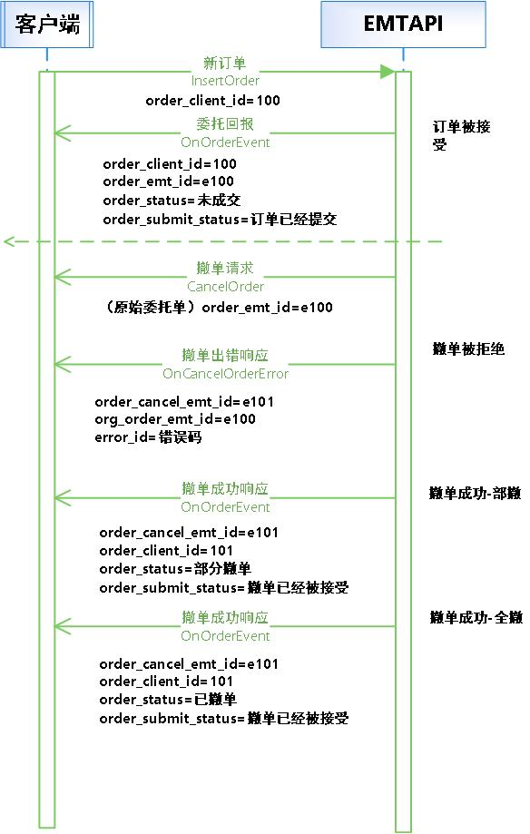

<font size="6">**东方财富证券极速交易系统交易API开发手册(Ver2.0.0)**</font>

<font size="6">文档说明</font>

| 日期     | api 版本 | 修订摘要              | 修订人     |
|:-------- |:-------- |:---------------------|:---------|
| 20210508 | 2.0.0    | 初版                 | 张锐、王程 |
| 20210517 | 2.0.0    | 增加两融业务接口      | 王程 |

<font size="6">前言</font>

本接口规范用以指导开发通过 EMTAPI 对接的方式访问东财快速交易系统，进行现货、两融、期权的相关业务。

本接口规范描述内容包括可开展的业务、必要的运行指导以及详细的数据交换格式

# 1. EMTTraderAPI介绍

本部分主要介绍现货极速交易系统的接口，包括：

* EMTTraderAPI简介。
* EMTTraderAPI运行模式。
* EMTTraderAPI编程接口

## 1.1. EMTTraderAPI简介

### 1.1.1. 背景

​&emsp;&emsp;为实现客户快速交易，东方财富证券推出了现货极速交易系统。客户端系统调用 EMTTraderAPI 即可完成与现货极速交易系统的对接，接收到极速交易系统的报单和成交回报后 EMTTraderAPI 将回调（Callback）客户端系统。

### 1.1.2. 简介

&emsp;&emsp;EMTTraderAPI是一个基于C++的类库，通过使用和扩展类库提供的接口来实现全部的交易功能，支持现货、两融、期权系统相关业务功能。包括资金账号登陆、报单的录入、报单的撤销、报单的查询、成交单查询、融资负债查询、负债合约查询、资金划转等功能。

&emsp;&emsp;该类库包含以下文件：

|文件路径        |文件名                    |文件描述                  |
|:--------------|:------------------------|:-------------------------|
|demo           |CMakeLists.txt           |示例编译文件               |
|               |emt_api_demo.cpp         |示例主函数                 |
|               |MySPI.cpp                |示例接口方法封装            |
|               |MySPI.h                  |示例接口方法头文件          |
|doc            |API开发手册               |                          |
|include        |emt_trader_api.h         |定义交易接口的头文件        |
|               |eoms_api_struct.h        |定义交易类相关数据结构      |
|               |emt_api_struct.h         |定义业务数据结构            |
|               |emt_api_struct_common.h  |定义业务公共数据结构        |
|               |eoms_api_fund_struct.h   |定义资金划拨相关结构体类型   |
|               |emt_api_data_type.h      |定义兼容数据基本类型        |
|lib/windows/x64|emt_api.dll              |Windows交易接口动态链接库   |
|               |emt_api.lib              |Windows交易接口导入库文件   |
|linux          |libemt_api.so            |Linux交易接口动态链接库     |

&emsp;&emsp;客户系统在开发过程中需注意<font color=red>"当前版本不开放的业务"</font>，同时在每个功能描述中的具体描述。

### 1.1.3. 发行的平台

目前发布了以下操作系统平台的版本：

* Intel X86/Windows10：包括.h文件、.dll文件和.lib文件。
* Intel Linux：包括.h文件和.so文件；在CentOS kernel 3.10.0-1127.el7.x86_64下完成编译。

如果需要其他操作系统版本，请联系交易专线。

## 1.2. 运行模式

### 1.2.1. 工作线程

&emsp;&emsp;客户系统应用程序至少由两个线程组成，一个是应用程序主线程，一个是API工作线程（EMTTraderAPI）。应用程序与极速交易系统的通信是由API工作线程驱动的。

&emsp;&emsp;TraderSpi提供的接口回调是由EMTTraderAPI工作线程驱动，通过实现SPI中的接口方法，从极速交易系统收取所需数据。

&emsp;&emsp;如果重载的客户系统的应用程序的某个回调函数阻塞，则等于阻塞了EMTTraderAPI工作线程，API与极速交易系统的通信会停止，因此通常应该迅速返回。在TraderSpi派生类的回调函数中，可以利用将数据放入缓冲区或通过Windows的消息机制来实现迅速返回。

### 1.2.2. 运行流程

客户系统和极速交易系统的交互过程分为2个阶段：

* 初始化阶段。
* 功能调用阶段。

#### 1.2.2.1. 初始化阶段

&emsp;&emsp;在初始化阶段，客户系统的程序必须完成如下步骤（具体代码请参考开发实例）：

|顺序    |客户系统    |调用方法|
|:------|:-----------|:-------|
|1    |创建一个TraderApi实例；              |TraderApi::CreateTraderApi
|2    |产生一个事件处理的实例；（步骤1返回）  |
|3    |注册一个事件处理的实例；              |TraderApi::RegisterSpi
|4    |订阅公共流                           |TraderApi::SubscribePublicTopic
|5    |设置开发代码1                        |相关业务实现及返回处理：<br/>TraderApi::InsertOrder<br/>TraderApi::CancelOrder<br/>TraderApi::QueryOrders <br/>…

&emsp;&emsp;<font color=red>*开发代码由我司人员提供，需客户申请。*</font>

#### 1.2.2.2. 功能调用阶段

&emsp;&emsp;在功能调用阶段，客户系统可以任意调用交易接口中的请求方法，如Login、InsertOrder等；同时提供回调函数以响应回报信息，如OnOrderEvent、OnTradeEvent等。

#### 1.2.2.3. 流程图示例


### 1.2.3. 时序示例

&emsp;&emsp;EMTTraderAPI提供了两个接口，分别为TraderApi和TraderSpi。

&emsp;&emsp;客户系统可以通过TraderApi发出操作请求，通过继承TraderSpi并重载回调函数来处理极速交易系统的回复或响应。

#### 1.2.3.1. 委托流程时序

&emsp;&emsp;对于提交的新订单，交易系统以执行报告消息作为响应。执行报告消息分为两类报文，一类报文用于**报单状态响应（OnOrderEvent）**，一类报文用于**新订单达成成交时的响应（OnTradeEvent）**。


#### 1.2.3.2. 撤单流程时序

&emsp;&emsp;撤单成功的响应是通过**报单状态响应（OnOrderEvent）**进行回报，撤单失败的响应是通过**撤单出错响应（OnCancelOrderError）**进行回报。



#### 1.2.3.3. 查询流程时序

&emsp;&emsp;各种查询功能，是通过不同的请求功能方法实现的，但大体流程基本相似。

&emsp;&emsp;查询多条数据，会分多次返回，包头中有 islast 作为标记是否为最后一条

&emsp;&emsp;以持仓查询为例：


### 1.2.4. 连接方式

#### 1.2.4.1. 支持多账户登录

&emsp;&emsp;同一个进程中只允许存在一个API。当用户多账户登录时，请确保程序中只Create了一次api(调用一次CreateTraderApi)。

&emsp;&emsp;Create时client_id的作用区别同一account在不同客户端登录时的场景，会返回不同的session_id(即对于同一account，相同的client_id只能保持一个session连接)。

&emsp;&emsp;多账户登录时，只需要在创建API后进行多次Login即可，Login后返回的session_id会不同，所以登录后请及时更新。一个Login建立一个socket连接，不会共享。

&emsp;&emsp;API中登录Login()接口为同步的，返回后，可以视为已经登录成功。

&emsp;&emsp;api不会自动帮用户重连。在服务器与客户端断线的时候会调用OnDisconnected()功能，用户可以在收到断线通知后选择不销毁api，不登出，继续登录login()，此时交易服务器会在用户重新登录后，从断点消息处续传。

#### 1.2.4.2. demo示例

```c like
#include <stdio.h>
#include <thread>
#include <string>
#include <atomic>
#include <map>
#include <vector>
#include "emt_trader_api.h"

std::atomic<uint32_t> m_nClientOrderID;

// 新订单委托回报返回处理
void OnOrderEvent(EMTOrderInfo* order_info, EMTRI* error_info, uint64_t session_id)
{
    auto& stOrder = *order_info;
    printf("[MySPI::%s], receive order event\n", __FUNCTION__); fflush(stdout);
}

// 新订单成交回报返回处理
void OnTradeEvent(EMTTradeReport* trade_info, uint64_t session_id)
{
    auto& stInfo = *trade_info;
    printf("[MySPI::%s], receive trade event\n", __FUNCTION__); fflush(stdout);
}

int main(int argc, char* argv[]) 
{
    TraderApi* m_pTraderApi;

    m_pTraderApi = TraderApi::CreateTraderApi(17, "./emt_api_log/emt.log", EMT_LOG_LEVEL_DEBUG);
    if (m_pTraderApi == nullptr) {
        printf("[%s:%d:%s]\n", __FILE__, __LINE__, __FUNCTION__);
        return -112;
    }

    //设定此软件的开发版本号，用户自定义
    m_pTraderApi->SetSoftwareVersion("1.0.0");
    
    // 注册事件处理实例
    m_pTraderApi->RegisterSpi(this);
    
    // 订阅公共流
    // 暂时不支EMTS_TERT_RESUME模式订阅
    m_pTraderApi->SubscribePublicTopic(EMT_TERT_QUICK);
    
    //设定用户的开发代码，在东财申请开户时，由我司人员提供
    m_pTraderApi->SetSoftwareKey("{ \"HtrsGroup\":3,\"HtrsMemID\" : 2 }");

    // 账户1登录,并返回session_id
    uint64_t m_nSessionID1 = m_pTraderApi->Login("10.205.48.149", 9088, "110110000031", "demo", EMT_PROTOCOL_TCP);
    if (m_nSessionID1 == 0) {
        // 登录失败，获取登录失败原因
        auto pstLastErr = m_pTraderApi->GetApiLastError();
        printf("Login Failed.[%d:%s]\n", pstLastErr->error_id, pstLastErr->error_msg);
        return -8958;
    }

    // 账户2登录,并返回session_id
    uint64_t m_nSessionID2 = m_pTraderApi->Login("10.205.48.149", 9088, "110110000032", "demo", EMT_PROTOCOL_TCP);
    if (m_nSessionID2 == 0) {
        // 登录失败，获取登录失败原因
        auto pstLastErr = m_pTraderApi->GetApiLastError();
        printf("Login Failed.[%d:%s]\n", pstLastErr->error_id, pstLastErr->error_msg);
        return -8958;
    }

    // 开始报单
    EMTOrderInsertInfo stOrder{0};
    stOrder.order_client_id = m_nClientOrderID++;
    memcpy(stOrder.ticker, "000001", 7);
    stOrder.market = EMT_MKT_SZ_A;
    stOrder.price = 15;
    stOrder.price_type = EMT_PRICE_LIMIT;
    stOrder.side = EMT_SIDE_BUY;
    stOrder.business_type = EMT_BUSINESS_TYPE_MARGIN;
    stOrder.quantity = 100;

    // 通过哪个session_id下单，注意下单账户对应的session
    auto nEMTID = m_pTraderApi->InsertOrder(&stOrder, m_nSessionID1);
    if (nEMTID == 0) {
        auto pstLastErr = m_pTraderApi->GetApiLastError();
        printf("OrderInsert Failed.[%d:%s]\n", pstLastErr->error_id, pstLastErr->error_msg);
        return -8959;
    }
}
```

# 2. EMTTraderAPI公共接口

## 2.1. 业务支持索引

|方法|描述|
|----|----|
|[CreateTraderApi](#CreateTraderApi)           |创建TraderApi|
|[RegisterSpi](#RegisterSpi)                   |注册回调接口|
|[SubscribePublicTopic](#SubscribePublicTopic) |订阅公共流|
|[Login](#Login)                               |用户登录请求|
|[OnDisconnected](#OnDisconnected)             |连接通讯断开回调处理|
|[GetTradingDay](#GetTradingDay)               |获取当前交易日|
|[GetApiLastError](#GetApiLastError)           |获取API的系统错误|

## 2.2. API接口描述

### 2.2.1. <span id="CreateTraderApi">创建TraderApi</span>

```c like
///创建TraderApi
///@param client_id （必须输入）客户端id，用于区分同一用户的不同客户端，由用户自定义
///@param save_file_path （必须输入）存贮订阅信息文件的目录，请设定一个真实存在的有可写权限的路径
///@param log_level 日志输出级别
///@return 创建出的UserApi
///@remark 如果一个账户需要在多个客户端登录，请使用不同的client_id，系统允许一个账户同时登录多个客户端，但是对于同一账户，相同的client_id只能保持一个session连接，后面的登录在前一个session存续期间，无法连接。系统不支持过夜，请确保每天开盘前重新启动
///@remark 管理端接口client_id必须大于255
static TraderApi *CreateTraderApi(uint16_t client_id, const char *save_file_path, EMT_LOG_LEVEL log_level = EMT_LOG_LEVEL_DEBUG);
```

### 2.2.2. <span id="RegisterSpi">注册回调接口</span>

```c like
///注册回调接口
///@param spi 派生自回调接口类的实例，请在登录之前设定
virtual void RegisterSpi(TraderSpi *spi) = 0;
```

### 2.2.3. <span id="SubscribePublicTopic">订阅公共流</span>

```c like
///订阅公共流。
///@param resume_type 公共流（订单响应、成交回报）重传方式  
///        EMT_TERT_RESTART:从本交易日开始重传
///        EMT_TERT_RESUME:(保留字段，此方式暂未支持)从上次收到的续传
///        EMT_TERT_QUICK:只传送登录后公共流的内容
///@remark 该方法要在Login方法前调用。若不调用则不会收到公共流的数据。注意在用户断线后，如果不登出就login()，公共流订阅方式不会起作用。用户只会收到断线后的所有消息。如果先logout()再login()，那么公共流订阅方式会起作用，用户收到的数据会根据用户的选择方式而定。
virtual void SubscribePublicTopic(EMT_TE_RESUME_TYPE resume_type) = 0;
```

### 2.2.4. <span id="Login">用户登录请求</span>

```c like
///用户登录请求
///@return session_id表明此资金账号登录是否成功，“0”表示登录失败，可以调用GetApiLastError()来获取错误代码，非“0”表示登录成功，此时需要记录下这个返回值session_id，与登录的资金账户对应
///@param ip 服务器地址，类似“127.0.0.1”
///@param port 服务器端口号
///@param user 登录用户名
///@param password 登录密码
///@param sock_type “1”代表TCP，“2”代表UDP，目前暂时只支持TCP
///@param local_ip 本地网卡地址，类似“127.0.0.1”
///@remark 此函数为同步阻塞式，不需要异步等待登录成功，当函数返回即可进行后续操作，此api可支持多个账户连接，但是同一个账户同一个client_id只能有一个session连接，后面的登录在前一个session存续期间，无法连接
virtual uint64_t Login(const char* ip, int port, const char* user, const char* password, EMT_PROTOCOL_TYPE sock_type, const char* local_ip = NULL) = 0;
```

### 2.2.5. <span id="OnDisconnected">连接通讯断开回调处理</span>

```c like
///当客户端的某个连接与交易后台通信连接断开时，该方法被调用。
///@param reason 错误原因，请与错误代码表对应
///@param session_id 资金账户对应的session_id，登录时得到
///@remark 用户主动调用logout导致的断线，不会触发此函数。api不会自动重连，当断线发生时，请用户自行选择后续操作，可以在此函数中调用Login重新登录，并更新session_id，此时用户收到的数据跟断线之前是连续的
virtual void OnDisconnected(uint64_t session_id, int reason) {};
```

### 2.2.6. <span id="GetTradingDay">获取当前交易日</span>

```c like
///获取当前交易日
///@return 获取到的交易日
///@remark 只有登录成功后,才能得到正确的交易日
virtual const char *GetTradingDay() = 0;

```

### 2.2.7. <span id="GetApiLastError">获取API的系统错误</span>

```c like
///获取API的系统错误
///@return 返回的错误信息，可以在Login、InsertOrder、CancelOrder返回值为0时调用，获取失败的原因
///@remark 可以在调用api接口失败时调用，例如login失败时
virtual EMTRI *GetApiLastError() = 0;
```

# 3. EMTTraderAPI业务接口

## 3.1. 业务支持索引

|请求方法(TraderApi)  |应答回调TraderSpi| 描述 |
|:----|:----|:---|
|[InsertOrder](#InsertOrder)  |[OnOrderEvent](#OnOrderEvent)<br>[OnTradeEvent](#OnTradeEvent)   |报单录入请求|
|[CancelOrder](#CancelOrder)  |[OnOrderEvent](#OnOrderEvent)<br>[OnCancelOrderError](#OnCancelOrderError)|撤单请求|
|[FundTransfer](#FundTransfer)|[OnFundTransfer](#OnFundTransfer)                                |资金划拨|
|[QueryFundTransfer](#QueryFundTransfer)|[OnQueryFundTransfer](#OnQueryFundTransfer)            |请求查询资金划拨(信用)|
|[QueryAsset](#QueryAsset)    |[OnQueryAsset](#OnQueryAsset)                                    |请求查询资产|
|[QueryPosition](#QueryPosition)  |[OnQueryPosition](#OnQueryPosition)                          |请求查询投资者持仓|
|[QueryPositionByPage](#QueryPositionByPage)  |[OnQueryPositionByPage](#OnQueryPositionByPage)  |请求查询投资者持仓分页(信用)|
|[QueryIPOInfoList](#QueryIPOInfoList) |[OnQueryIPOInfoList](#OnQueryIPOInfoList)               |请求查询今日新股申购信息列表|
|[QueryIPOQuotaInfo](#QueryIPOQuotaInfo) |[OnQueryIPOQuotaInfo](#OnQueryIPOQuotaInfo)           |请求查询用户新股申购额度信息(信用)|
|[QueryETFTickerBasket](#QueryETFTickerBasket) |[OnQueryETFBasket](#OnQueryETFBasket)           |请求查询ETF股票篮|
|[QueryOrders](#QueryOrders)     |[OnQueryOrder](#OnQueryOrder)                                 |请求查询报单|
|[QueryTrades](#QueryTrades)     |[OnQueryTrade](#OnQueryTrade)                                 |请求查询已成交|
|[QueryOrderByEMTID](#QueryOrderByEMTID)     |[OnQueryOrder](#OnQueryOrder)                     |根据报单ID请求查询报单(信用)|
|[QueryOrdersByPage](#QueryOrdersByPage)     |[OnQueryOrderByPage](#OnQueryOrderByPage)         |分页请求查询报单(信用)|
|[QueryTradesByEMTID](#QueryTradesByEMTID)   |[OnQueryTrade](#OnQueryTrade)                     |根据委托编号请求查询相关成交(信用)|
|[QueryTradesByPage](#QueryTradesByPage)     |[OnQueryTradeByPage](#OnQueryTradeByPage)         |分页请求查询成交回报(信用)|
|[CreditCashRepay](#CreditCashRepay)     |[OnCreditCashRepay](#OnCreditCashRepay)               |现金直接还款请求|
|[QueryCreditCashRepayInfo](#QueryCreditCashRepayInfo)|[OnQueryCreditCashRepayInfo](#OnQueryCreditCashRepayInfo)|请求查询融资融券业务中的现金直接还款报单|
|[QueryCreditFundInfo](#QueryCreditFundInfo)            |[OnQueryCreditFundInfo](#OnQueryCreditFundInfo)          |请求查询信用账户特有信息|
|[QueryCreditDebtInfo](#QueryCreditDebtInfo)            |[OnQueryCreditDebtInfo](#OnQueryCreditDebtInfo)          |请求查询信用账户负债合约信息|
|[QueryCreditDebtInfoByPage](#QueryCreditDebtInfoByPage)|[OnQueryCreditDebtInfoByPage](#OnQueryCreditDebtInfoByPage) |请求查询信用账户负债合约信息|
|[QueryCreditTickerDebtInfo](#QueryCreditTickerDebtInfo)|[OnQueryCreditTickerDebtInfo](#OnQueryCreditTickerDebtInfo)|请求查询指定证券负债未还信息|
|[QueryCreditAssetDebtInfo](#QueryCreditAssetDebtInfo)  |[OnQueryCreditAssetDebtInfo](#OnQueryCreditAssetDebtInfo)|请求查询信用账户待还资金信息|
|[QueryCreditTickerAssignInfo](#QueryCreditTickerAssignInfo)|[OnQueryCreditTickerAssignInfo](#OnQueryCreditTickerAssignInfo)|请求查询信用账户可融券头寸信息|
|[QueryCreditTickerAssignInfoByPage](#QueryCreditTickerAssignInfoByPage)|[OnQueryCreditTickerAssignInfoByPage](#OnQueryCreditTickerAssignInfoByPage)|分页请求信用账户证券头寸信息|
|[QueryCreditExcessStock](#QueryCreditExcessStock)      |[OnQueryCreditExcessStock](#OnQueryCreditExcessStock)    |融资融券业务中请求查询指定证券的余券|
|[QueryMulCreditExcessStock](#QueryMulCreditExcessStock)|[OnQueryMulCreditExcessStock](#OnQueryMulCreditExcessStock)|融资融券业务中请求查询余券|
|[CreditExtendDebtDate](#CreditExtendDebtDate)          |[OnCreditExtendDebtDate](#OnCreditExtendDebtDate)        |融资融券业务中请求负债合约展期|
|[QueryCreditExtendDebtDateOrders](#QueryCreditExtendDebtDateOrders)|[OnQueryCreditExtendDebtDateOrders](#OnQueryCreditExtendDebtDateOrders)|融资融券业务中请求查询负债合约展期|
|[QueryCreditFundExtraInfo](#QueryCreditFundExtraInfo)  |[OnQueryCreditFundExtraInfo](#OnQueryCreditFundExtraInfo)|请求查询融资融券业务中账戶的附加信息|
|[QueryCreditPositionExtraInfo](#QueryCreditPositionExtraInfo)|[OnQueryCreditPositionExtraInfo](#OnQueryCreditPositionExtraInfo)|请求查询融资融券业务中账戶指定证券的附加信息|
|[QueryCreditPledgeStkRate](#QueryCreditPledgeStkRate)|[OnQueryCreditPledgeStkRate](#OnQueryCreditPledgeStkRate)  |融资融券业务中请求查询担保品折算率|
|[QueryCreditMarginRate](#QueryCreditMarginRate)      |[OnQueryCreditMarginRate](#OnQueryCreditMarginRate)        |融资融券业务中请求查询保证金率|

## 3.2. API接口描述

### 3.2.1. <span id="InsertOrder">报单录入请求</span>

|接口名称 |InsertOrder     |                          ||
|:-------|:--|:--|:--|
|功能描述 |报单录入请求    |                             ||
|         |<b>名称</b>   |<b>类型及长度</b>                            |<b>描述</b>|
|入参     |新订单请求     |[EMTOrderInsertInfo](#EMTOrderInsertInfo)*  |类型参见入参结构体定义|
|         |会话号        |uint64_t  session_id                        |资金账户对应的session_id,登录时得到|
|出参     |函数返回值     |uint64_t                                    ||
|         |报单响应结构体 |[EMTOrderInfo](#EMTOrderInfo)*              |类型参见出参结构体定义；异步调用回调函数返回|
|         |报单成交结构体 |[EMTTradeReport](#EMTTradeReport)*          |类型参见出参结构体定义；订单成交时异步调用回调函数返回|
|         |错误响应结构体 |[EMTRspInfoStruct](#EMTRspInfoStruct)*      |类型参见出参结构体定义|
|备注信息  |              |                                            ||

### 3.2.2. <span id="CancelOrder">撤单请求</span>

|接口名称 |CancelOrder     |                          ||
|:-------|:--|:--|:--|
|功能描述 |撤单请求                           |                             ||
|         |<b>名称</b>                       |<b>类型及长度</b>                            |<b>描述</b>|
|入参     |需要撤销的委托单在EMT系统中的ID     |uint64_t  order_emt_id   |委托时返回序号|
|         |会话号                            |uint64_t  session_id     |资金账户对应的session_id,登录时得到|
|出参     |函数返回值                         |uint64_t                                    ||
|         |报单响应结构体                     |[EMTOrderInfo](#EMTOrderInfo)*              |类型参见出参结构体定义；（撤单成功）异步调用回调函数返回|
|         |撤单失败响应消息                   |[EMTOrderCancelInfo](#EMTOrderCancelInfo)*  |类型参见出参结构体定义；（撤单失败）异步调用回调函数返回|
|         |错误响应结构体                     |[EMTRspInfoStruct](#EMTRspInfoStruct)*      |类型参见出参结构体定义|
|备注信息  |                                  |                                            ||

### 3.2.3. <span id="FundTransfer">资金划拨</span>

|接口名称 |FundTransfer     |                          ||
|:-------|:--|:--|:--|
|功能描述 |资金划拨                           |                             ||
|         |<b>名称</b>   |<b>类型及长度</b>                            |<b>描述</b>|
|入参     |资金请求       |[EMTFundTransferReq](#EMTFundTransferReq)*  |类型参见入参结构体定义|
|         |会话号        |uint64_t  session_id                         |资金账户对应的session_id,登录时得到|
|出参     |函数返回值     |uint64_t                                    ||
|         |报单响应结构体 |[EMTFundTransferNotice](#EMTFundTransferNotice)* |类型参见出参结构体定义；异步调用回调函数返回|
|         |错误响应结构体 |[EMTRspInfoStruct](#EMTRspInfoStruct)*      |类型参见出参结构体定义|
|         |会话号        |uint64_t                                    |资金账户对应的session_id,登录时得到|
|备注信息  |              |                                            ||

### 3.2.4. <span id="QueryFundTransfer">请求查询资金划拨</span>

|接口名称 |QueryFundTransfer     |                          ||
|:-------|:--|:--|:--|
|功能描述 |请求查询资金划拨                           |                             ||
|         |<b>名称</b>   |<b>类型及长度</b>                            |<b>描述</b>|
|入参     |资金内转流水查询|[EMTQueryFundTransferLogReq](#EMTQueryFundTransferLogReq)*  |类型参见入参结构体定义|
|         |会话号        |uint64_t  session_id                         |资金账户对应的session_id,登录时得到|
|         |请求序号      |int       request_id                         |用于用户定位查询响应的ID，由用户自定义|
|出参     |函数返回值     |int                                         ||
|         |账户资金查询响应|[EMTFundTransferNotice](#EMTFundTransferNotice)* |类型参见出参结构体定义；异步调用回调函数返回|
|         |错误响应结构体 |[EMTRspInfoStruct](#EMTRspInfoStruct)*  |类型参见出参结构体定义|
|         |请求序号      |int       request_id                     |此消息响应函数对应的请求ID|
|         |结束标识      |bool      is_last                        |当为最后一个的时候为true，如果为false，表示还有其他后续消息响应|
|         |会话号        |uint64_t  session_id                     |资金账户对应的session_id,登录时得到|
|备注信息  |              |                                            ||

### 3.2.5. <span id="QueryAsset">请求查询资产</span>

|接口名称 |QueryAsset     |                          ||
|:-------|:--|:--|:--|
|功能描述 |请求查询资产                           |                             ||
|         |<b>名称</b>   |<b>类型及长度</b>                            |<b>描述</b>|
|入参     |会话号        |uint64_t  session_id                         |资金账户对应的session_id,登录时得到|
|         |请求序号      |int       request_id                         |用于用户定位查询响应的ID，由用户自定义|
|出参     |函数返回值     |int                                         ||
|         |账户资金查询响应|[EMTQueryAssetRsp](#EMTQueryAssetRsp)* |类型参见出参结构体定义；异步调用回调函数返回|
|         |错误响应结构体 |[EMTRspInfoStruct](#EMTRspInfoStruct)*  |类型参见出参结构体定义|
|         |请求序号      |int       request_id                     |此消息响应函数对应的请求ID|
|         |结束标识      |bool      is_last                        |当为最后一个的时候为true，如果为false，表示还有其他后续消息响应|
|         |会话号        |uint64_t  session_id                     |资金账户对应的session_id,登录时得到|
|备注信息  |              |                                            ||

### 3.2.6. <span id="QueryPosition">请求查询投资者持仓</span>

|接口名称 |QueryPosition     |                          ||
|:-------|:--|:--|:--|
|功能描述 |请求查询投资者持仓                           |                             ||
|         |<b>名称</b>   |<b>类型及长度</b>                            |<b>描述</b>|
|入参     |持仓合约代码   |const char * ticker                         |需要查询的持仓合约代码，可以为空，如果不为空，请不带空格，并以'\0'结尾|
|         |会话号        |uint64_t  session_id                         |资金账户对应的session_id,登录时得到|
|         |请求序号      |int       request_id                         |用于用户定位查询响应的ID，由用户自定义|
|         |市场类型      |enum      market                             |参考字典<br>[EMT_MARKET_TYPE](#EMT_MARKET_TYPE)|
|出参     |函数返回值     |int                                         ||
|         |账户资金查询响应|[EMTQueryStkPositionRsp](#EMTQueryStkPositionRsp)* |类型参见出参结构体定义；异步调用回调函数返回|
|         |错误响应结构体 |[EMTRspInfoStruct](#EMTRspInfoStruct)*              |类型参见出参结构体定义|
|         |请求序号      |int       request_id                                 |此消息响应函数对应的请求ID|
|         |结束标识      |bool      is_last                                    |当为最后一个的时候为true，如果为false，表示还有其他后续消息响应|
|         |会话号        |uint64_t  session_id                                 |资金账户对应的session_id,登录时得到|
|备注信息  |              |                                            ||

### 3.2.7. <span id="QueryPositionByPage">请求查询投资者持仓分页</span>

|接口名称 |QueryPositionByPage     |                          ||
|:-------|:--|:--|:--|
|功能描述 |请求查询投资者持仓分页        |                             ||
|         |<b>名称</b>   |<b>类型及长度</b>                            |<b>描述</b>|
|入参     |查询信用账户持仓信息-分页查询|[EMTQueryPositionByPageReq](#EMTQueryByPageReq)*  |类型参见入参结构体定义|
|         |会话号        |uint64_t  session_id                         |资金账户对应的session_id,登录时得到|
|         |请求序号      |int       request_id                         |用于用户定位查询响应的ID，由用户自定义|
|出参     |函数返回值     |int                                          ||
|         |查询股票持仓情况|[EMTQueryStkPositionRsp](#EMTQueryStkPositionRsp)* |类型参见出参结构体定义；异步调用回调函数返回|
|         |请求到的最大数量             |int64_t   req_count                   ||
|         |分页请求的当前回报数量       |int64_t   trade_sequence               ||
|         |当前报单信息所对应的查询索引  |int64_t   query_reference              |需要记录下来，在进行下一次分页查询的时候需要用到|
|         |请求序号                    |int       request_id                   |此消息响应函数对应的请求ID|
|         |结束标识                    |bool      is_last                      |当为最后一个的时候为true，如果为false，表示还有其他后续消息响应|
|         |会话号                      |uint64_t  session_id                   |资金账户对应的session_id,登录时得到|
|备注信息  |                            |                                     ||

### 3.2.8. <span id="QueryIPOInfoList">请求查询今日新股申购信息列表</span>

|接口名称 |QueryIPOInfoList     |                          ||
|:-------|:--|:--|:--|
|功能描述 |请求查询今日新股申购信息列表        |                             ||
|         |<b>名称</b>   |<b>类型及长度</b>                            |<b>描述</b>|
|入参     |会话号        |uint64_t  session_id                         |资金账户对应的session_id,登录时得到|
|         |请求序号      |int       request_id                         |用于用户定位查询响应的ID，由用户自定义|
|出参     |函数返回值     |int                                          ||
|         |当日可申购新股信息|[EMTQueryIPOTickerRsp](#EMTQueryIPOTickerRsp)*     |类型参见出参结构体定义；异步调用回调函数返回|
|         |错误响应结构体 |[EMTRspInfoStruct](#EMTRspInfoStruct)*              |类型参见出参结构体定义|
|         |请求序号      |int       request_id                                 |此消息响应函数对应的请求ID|
|         |结束标识      |bool      is_last                                    |当为最后一个的时候为true，如果为false，表示还有其他后续消息响应|
|         |会话号        |uint64_t  session_id                                 |资金账户对应的session_id,登录时得到|
|备注信息  |              |                                            ||

### 3.2.9. <span id="QueryIPOQuotaInfo">请求查询用户新股申购额度信息</span>

|接口名称 |QueryIPOQuotaInfo     |                          ||
|:-------|:--|:--|:--|
|功能描述 |请求查询用户新股申购额度信息        |                             ||
|         |<b>名称</b>   |<b>类型及长度</b>                            |<b>描述</b>|
|入参     |会话号        |uint64_t  session_id                         |资金账户对应的session_id,登录时得到|
|         |请求序号      |int       request_id                         |用于用户定位查询响应的ID，由用户自定义|
|出参     |函数返回值     |int                                          ||
|         |当日可申购新股信息|[EMTQueryIPOQuotaRsp](#EMTQueryIPOQuotaRsp)*     |类型参见出参结构体定义；异步调用回调函数返回|
|         |错误响应结构体 |[EMTRspInfoStruct](#EMTRspInfoStruct)*              |类型参见出参结构体定义|
|         |请求序号      |int       request_id                                 |此消息响应函数对应的请求ID|
|         |结束标识      |bool      is_last                                    |当为最后一个的时候为true，如果为false，表示还有其他后续消息响应|
|         |会话号        |uint64_t  session_id                                 |资金账户对应的session_id,登录时得到|
|备注信息  |              |                                            ||

### 3.2.10. <span id="QueryETF">请求查询ETF成分股</span>

|接口名称 |QueryETF     |                          ||
|:-------|:--|:--|:--|
|功能描述 |请求查询ETF成分股                           |                             ||
|         |<b>名称</b>   |<b>类型及长度</b>                            |<b>描述</b>|
|入参     |持仓合约代码   |[EMTQueryETFBaseReq](#EMTQueryETFBaseReq)*   |类型参见入参结构体定义|
|         |会话号        |uint64_t  session_id                         |资金账户对应的session_id,登录时得到|
|         |请求序号      |int       request_id                         |用于用户定位查询响应的ID，由用户自定义|
|出参     |函数返回值     |int                                    ||
|    |请求查询ETF股票篮的响应|[EMTQueryETFComponentRsp](#EMTQueryETFComponentRsp)* |类型参见出参结构体定义；异步调用回调函数返回|
|         |错误响应结构体 |[EMTRspInfoStruct](#EMTRspInfoStruct)*              |类型参见出参结构体定义|
|         |请求序号      |int       request_id                                 |此消息响应函数对应的请求ID|
|         |结束标识      |bool      is_last                                    |当为最后一个的时候为true，如果为false，表示还有其他后续消息响应|
|         |会话号        |uint64_t  session_id                                 |资金账户对应的session_id,登录时得到|
|备注信息  |              |                                            ||

### 3.2.11. <span id="QueryOrders">请求查询报单</span>

|接口名称 |QueryOrders     |                          ||
|:-------|:--|:--|:--|
|功能描述 |请求查询报单                           |                             ||
|         |<b>名称</b>   |<b>类型及长度</b>                            |<b>描述</b>|
|入参     |请求查询报单   |[EMTQueryOrderReq](#EMTQueryOrderReq)*   |类型参见入参结构体定义|
|         |会话号        |uint64_t  session_id                         |资金账户对应的session_id,登录时得到|
|         |请求序号      |int       request_id                         |用于用户定位查询响应的ID，由用户自定义|
|出参     |函数返回值     |int                                    ||
|         |报单查询响应结构体|[EMTQueryOrderRsp](#EMTOrderInfo)* |类型参见出参结构体定义；异步调用回调函数返回|
|         |错误响应结构体 |[EMTRspInfoStruct](#EMTRspInfoStruct)*              |类型参见出参结构体定义|
|         |请求序号      |int       request_id                                 |此消息响应函数对应的请求ID|
|         |结束标识      |bool      is_last                                    |当为最后一个的时候为true，如果为false，表示还有其他后续消息响应|
|         |会话号        |uint64_t  session_id                                 |资金账户对应的session_id,登录时得到|
|备注信息  |              |                                            ||

### 3.2.12. <span id="QueryOrderByEMTID">根据报单ID请求查询报单</span>

|接口名称 |QueryOrderByEMTID     |                          ||
|:-------|:--|:--|:--|
|功能描述 |根据报单ID请求查询报单                           |                             ||
|         |<b>名称</b>   |<b>类型及长度</b>                            |<b>描述</b>|
|入参     |需要查询的报单在emt系统中的ID   |const uint64_t order_emt_id  |即InsertOrder()成功时返回的order_emt_id|
|         |会话号        |uint64_t  session_id                         |资金账户对应的session_id,登录时得到|
|         |请求序号      |int       request_id                         |用于用户定位查询响应的ID，由用户自定义|
|出参     |函数返回值     |int                                          ||
|         |报单查询响应结构体|[EMTQueryOrderRsp](#EMTOrderInfo)*        |类型参见出参结构体定义；异步调用回调函数返回|
|         |错误响应结构体 |[EMTRspInfoStruct](#EMTRspInfoStruct)*      |类型参见出参结构体定义|
|         |请求序号      |int       request_id                         |此消息响应函数对应的请求ID|
|         |结束标识      |bool      is_last                            |当为最后一个的时候为true，如果为false，表示还有其他后续消息响应|
|         |会话号        |uint64_t  session_id                         |资金账户对应的session_id,登录时得到|
|备注信息  |              |                                            ||

### 3.2.13. <span id="QueryOrdersByPage">分页请求查询报单</span>

|接口名称 |QueryOrdersByPage     |                          ||
|:-------|:--|:--|:--|
|功能描述 |分页请求查询报单                           |                             ||
|         |<b>名称</b>   |<b>类型及长度</b>                            |<b>描述</b>|
|入参     |请求查询报单   |[EMTQueryOrderByPageReq](#EMTQueryByPageReq)*   |类型参见入参结构体定义|
|         |会话号        |uint64_t  session_id                         |资金账户对应的session_id,登录时得到|
|         |请求序号      |int       request_id                         |用于用户定位查询响应的ID，由用户自定义|
|出参     |函数返回值     |int                                          ||
|         |报单查询响应结构体|[EMTQueryOrderRsp](#EMTOrderInfo)*        |类型参见出参结构体定义；异步调用回调函数返回|
|         |错误响应结构体 |[EMTRspInfoStruct](#EMTRspInfoStruct)*      |类型参见出参结构体定义|
|         |请求序号      |int       request_id                         |此消息响应函数对应的请求ID|
|         |结束标识      |bool      is_last                            |当为最后一个的时候为true，如果为false，表示还有其他后续消息响应|
|         |会话号        |uint64_t  session_id                         |资金账户对应的session_id,登录时得到|
|备注信息  |              |                                            ||

### 3.2.14. <span id="QueryTrades">请求查询已成交</span>

|接口名称 |QueryTrades     |                          ||
|:-------|:--|:--|:--|
|功能描述 |请求查询已成交                           |                             ||
|         |<b>名称</b>   |<b>类型及长度</b>                            |<b>描述</b>|
|入参     |查询成交回报请求   |[EMTQueryTraderReq](#EMTQueryTraderReq)*   |类型参见入参结构体定义|
|         |会话号        |uint64_t  session_id                         |资金账户对应的session_id,登录时得到|
|         |请求序号      |int       request_id                         |用于用户定位查询响应的ID，由用户自定义|
|出参     |函数返回值     |int                                    ||
|         |成交回报查询响应结构体|[EMTQueryTradeRsp](#EMTTradeReport)* |类型参见出参结构体定义；异步调用回调函数返回|
|         |错误响应结构体 |[EMTRspInfoStruct](#EMTRspInfoStruct)*              |类型参见出参结构体定义|
|         |请求序号      |int       request_id                                 |此消息响应函数对应的请求ID|
|         |结束标识      |bool      is_last                                    |当为最后一个的时候为true，如果为false，表示还有其他后续消息响应|
|         |会话号        |uint64_t  session_id                                 |资金账户对应的session_id,登录时得到|
|备注信息  |              |                                            ||

### 3.2.15. <span id="QueryTradesByEMTID">根据委托编号请求查询相关成交</span>

|接口名称 |QueryTradesByEMTID     |                          ||
|:-------|:--|:--|:--|
|功能描述 |根据委托编号请求查询相关成交                           |                             ||
|         |<b>名称</b>   |<b>类型及长度</b>                            |<b>描述</b>|
|入参     |需要查询的报单在emt系统中的ID   |const uint64_t order_emt_id  |即InsertOrder()成功时返回的order_emt_id|
|         |会话号        |uint64_t  session_id                         |资金账户对应的session_id,登录时得到|
|         |请求序号      |int       request_id                         |用于用户定位查询响应的ID，由用户自定义|
|出参     |函数返回值     |int                                          ||
|         |成交回报查询响应结构体|[EMTTradeReport](#EMTTradeReport)*        |类型参见出参结构体定义；异步调用回调函数返回|
|         |错误响应结构体 |[EMTRspInfoStruct](#EMTRspInfoStruct)*      |类型参见出参结构体定义|
|         |请求序号      |int       request_id                         |此消息响应函数对应的请求ID|
|         |结束标识      |bool      is_last                            |当为最后一个的时候为true，如果为false，表示还有其他后续消息响应|
|         |会话号        |uint64_t  session_id                         |资金账户对应的session_id,登录时得到|
|备注信息  |              |                                            ||

### 3.2.16. <span id="QueryTradesByPage">分页请求查询成交回报</span>

|接口名称 |QueryTradesByPage     |                          ||
|:-------|:--|:--|:--|
|功能描述 |分页请求查询成交回报                           |                             ||
|         |<b>名称</b>   |<b>类型及长度</b>                            |<b>描述</b>|
|入参     |查询成交回报请求|[EMTQueryTraderReq](#EMTQueryTraderReq)*   |类型参见入参结构体定义|
|         |会话号        |uint64_t  session_id                         |资金账户对应的session_id,登录时得到|
|         |请求序号      |int       request_id                         |用于用户定位查询响应的ID，由用户自定义|
|出参     |函数返回值     |int                                          ||
|         |成交回报查询响应结构体|[EMTTradeReport](#EMTTradeReport)*        |类型参见出参结构体定义；异步调用回调函数返回|
|         |错误响应结构体 |[EMTRspInfoStruct](#EMTRspInfoStruct)*      |类型参见出参结构体定义|
|         |请求序号      |int       request_id                         |此消息响应函数对应的请求ID|
|         |结束标识      |bool      is_last                            |当为最后一个的时候为true，如果为false，表示还有其他后续消息响应|
|         |会话号        |uint64_t  session_id                         |资金账户对应的session_id,登录时得到|
|备注信息  |              |                                            ||

### 3.2.17. <span id="CreditCashRepay">融资融券业务中现金直接还款请求</span>

|接口名称 |CreditCashRepay     |                          ||
|:-------|:--|:--|:--|
|功能描述 |融资融券业务中现金直接还款请求                    |                             ||
|         |<b>名称</b>   |<b>类型及长度</b>                            |<b>描述</b>|
|入参     |现金还款的金额   |double  amount                            ||
|         |会话号        |uint64_t  session_id                         |资金账户对应的session_id,登录时得到|
|出参     |函数返回值     |uint64_t                                    ||
|         |成交回报查询响应结构体|[EMTCrdCashRepayRsp](#EMTCrdCashRepayRsp)* |类型参见出参结构体定义；异步调用回调函数返回|
|         |融资融券直接还款响应信息 |[EMTRspInfoStruct](#EMTRspInfoStruct)*  |类型参见出参结构体定义|
|         |会话号        |uint64_t  session_id                              |资金账户对应的session_id,登录时得到|
|备注信息  |              |                                            ||

### 3.2.18. <span id="QueryCreditCashRepayInfo">请求查询融资融券业务中的现金直接还款报单</span>

|接口名称 |QueryCreditCashRepayInfo     |                          ||
|:-------|:--|:--|:--|
|功能描述 |请求查询现金直接还款报单                           |                             ||
|         |<b>名称</b>   |<b>类型及长度</b>                            |<b>描述</b>|
|入参     |会话号        |uint64_t  session_id                         |资金账户对应的session_id,登录时得到|
|         |请求序号      |int       request_id                         |用于用户定位查询响应的ID，由用户自定义|
|出参     |函数返回值     |int                                    ||
|         |现金直接还款报单响应|[EMTCrdCashRepayInfo](#EMTCrdCashRepayInfo)* |类型参见出参结构体定义；异步调用回调函数返回|
|         |错误响应结构体 |[EMTRspInfoStruct](#EMTRspInfoStruct)*              |类型参见出参结构体定义|
|         |请求序号      |int       request_id                                 |此消息响应函数对应的请求ID|
|         |结束标识      |bool      is_last                                    |当为最后一个的时候为true，如果为false，表示还有其他后续消息响应|
|         |会话号        |uint64_t  session_id                                 |资金账户对应的session_id,登录时得到|
|备注信息  |              |                                            ||

### 3.2.19. <span id="QueryCreditFundInfo">请求查询信用账户特有信息</span>

|接口名称 |QueryCreditFundInfo     |                          ||
|:-------|:--|:--|:--|
|功能描述 |请求查询信用账户特有信息                           |                             ||
|         |<b>名称</b>   |<b>类型及长度</b>                            |<b>描述</b>|
|入参     |会话号        |uint64_t  session_id                         |资金账户对应的session_id,登录时得到|
|         |请求序号      |int       request_id                         |用于用户定位查询响应的ID，由用户自定义|
|出参     |函数返回值     |int                                    ||
|         |查询信用账户额外信息响应|[EMTCrdFundInfo](#EMTCrdFundInfo)* |类型参见出参结构体定义；异步调用回调函数返回|
|         |错误响应结构体 |[EMTRspInfoStruct](#EMTRspInfoStruct)*              |类型参见出参结构体定义|
|         |请求序号      |int       request_id                                 |此消息响应函数对应的请求ID|
|         |结束标识      |bool      is_last                                    |当为最后一个的时候为true，如果为false，表示还有其他后续消息响应|
|         |会话号        |uint64_t  session_id                                 |资金账户对应的session_id,登录时得到|
|备注信息  |              |                                            ||

### 3.2.20. <span id="QueryCreditDebtInfo">请求查询信用账户负债合约信息</span>

|接口名称 |QueryCreditDebtInfo     |                          ||
|:-------|:--|:--|:--|
|功能描述 |请求查询信用账户负债合约信息                           |                             ||
|         |<b>名称</b>   |<b>类型及长度</b>                            |<b>描述</b>|
|入参     |会话号        |uint64_t  session_id                         |资金账户对应的session_id,登录时得到|
|         |请求序号      |int       request_id                         |用于用户定位查询响应的ID，由用户自定义|
|出参     |函数返回值     |int                                    ||
|         |查询信用账户额外信息响应|[EMTCrdDebtInfo](#EMTCrdDebtInfo)* |类型参见出参结构体定义；异步调用回调函数返回|
|         |错误响应结构体 |[EMTRspInfoStruct](#EMTRspInfoStruct)*              |类型参见出参结构体定义|
|         |请求序号      |int       request_id                                 |此消息响应函数对应的请求ID|
|         |结束标识      |bool      is_last                                    |当为最后一个的时候为true，如果为false，表示还有其他后续消息响应|
|         |会话号        |uint64_t  session_id                                 |资金账户对应的session_id,登录时得到|
|备注信息  |              |                                            ||

### 3.2.21. <span id="QueryCreditDebtInfoByPage">分页请求信用账户负债合约信息</span>

|接口名称 |QueryCreditDebtInfoByPage     |                          ||
|:-------|:--|:--|:--|
|功能描述 |分页请求信用账户负债合约信息                           |                             ||
|         |<b>名称</b>   |<b>类型及长度</b>                            |<b>描述</b>|
|入参     |查询信用账户负债合约信息|[EMTQueryCreditDebtInfoByPageReq](#EMTQueryCreditDebtInfoByPageReq)*   |类型参见入参结构体定义|
|         |会话号        |uint64_t  session_id                         |资金账户对应的session_id,登录时得到|
|         |请求序号      |int       request_id                         |用于用户定位查询响应的ID，由用户自定义|
|出参     |函数返回值     |int                                    ||
|         |查询信用账户额外信息响应|[EMTCrdDebtInfo](#EMTCrdDebtInfo)* |类型参见出参结构体定义；异步调用回调函数返回|
|         |请求到的最大数量             |int64_t   req_count                   ||
|         |分页请求的当前回报数量       |int64_t   order_sequence               ||
|         |当前报单信息所对应的查询索引  |int64_t   query_reference              |需要记录下来，在进行下一次分页查询的时候需要用到|
|         |请求序号                    |int       request_id                   |此消息响应函数对应的请求ID|
|         |结束标识                    |bool      is_last                      |当为最后一个的时候为true，如果为false，表示还有其他后续消息响应|
|         |会话号                      |uint64_t  session_id                   |资金账户对应的session_id,登录时得到|
|备注信息  |                            |                                     ||

### 3.2.22. <span id="QueryCreditTickerDebtInfo">请求查询指定证券负债未还信息</span>

|接口名称 |QueryCreditTickerDebtInfo     |                          ||
|:-------|:--|:--|:--|
|功能描述 |请求查询指定证券负债未还信息                           |                             ||
|         |<b>名称</b>   |<b>类型及长度</b>                            |<b>描述</b>|
|入参     |负债未还数量请求|[EMTClientQueryCrdDebtStockReq](#EMTClientQueryCrdDebtStockReq)*|类型参见入参结构体定义
|         |会话号        |uint64_t  session_id                         |资金账户对应的session_id,登录时得到|
|         |请求序号      |int       request_id                         |用于用户定位查询响应的ID，由用户自定义|
|出参     |函数返回值     |int                                    ||
|         |查询信用账户额外信息响应|[EMTCrdDebtStockInfo](#EMTCrdDebtStockInfo)* |类型参见出参结构体定义；异步调用回调函数返回|
|         |错误响应结构体 |[EMTRspInfoStruct](#EMTRspInfoStruct)*              |类型参见出参结构体定义|
|         |请求序号      |int       request_id                                 |此消息响应函数对应的请求ID|
|         |结束标识      |bool      is_last                                    |当为最后一个的时候为true，如果为false，表示还有其他后续消息响应|
|         |会话号        |uint64_t  session_id                                 |资金账户对应的session_id,登录时得到|
|备注信息  |              |                                            ||

### 3.2.23. <span id="QueryCreditAssetDebtInfo">请求查询信用账户待还资金信息</span>

|接口名称 |QueryCreditAssetDebtInfo     |                          ||
|:-------|:--|:--|:--|
|功能描述 |请求查询信用账户待还资金信息                           |                             ||
|         |<b>名称</b>   |<b>类型及长度</b>                            |<b>描述</b>|
|入参     |会话号        |uint64_t  session_id                         |资金账户对应的session_id,登录时得到|
|         |请求序号      |int       request_id                         |用于用户定位查询响应的ID，由用户自定义|
|出参     |函数返回值     |int                                    ||
|         |信用账户待还资金|double remain_amount | 查询到的信用账户待还资金|
|         |错误响应结构体 |[EMTRspInfoStruct](#EMTRspInfoStruct)*              |类型参见出参结构体定义|
|         |请求序号      |int       request_id                                 |此消息响应函数对应的请求ID|
|         |会话号        |uint64_t  session_id                                 |资金账户对应的session_id,登录时得到|
|备注信息  |              |                                            ||

### 3.2.24. <span id="QueryCreditTickerAssignInfo">请求查询信用账户可融券头寸信息</span>

|接口名称 |QueryCreditTickerAssignInfo     |                          ||
|:-------|:--|:--|:--|
|功能描述 |请求查询信用账户可融券头寸信息                           |                             ||
|         |<b>名称</b>   |<b>类型及长度</b>                            |<b>描述</b>|
|入参     |融券头寸证券查询请求|[EMTClientQueryCrdPositionStockReq](#EMTClientQueryCrdPositionStockReq)*|类型参见入参结构体定义
|         |会话号        |uint64_t  session_id                         |资金账户对应的session_id,登录时得到|
|         |请求序号      |int       request_id                         |用于用户定位查询响应的ID，由用户自定义|
|出参     |函数返回值     |int                                    ||
|         |融券头寸证券信息|[EMTClientQueryCrdPositionStkInfo](#EMTClientQueryCrdPositionStkInfo)* |类型参见出参结构体定义；异步调用回调函数返回|
|         |错误响应结构体 |[EMTRspInfoStruct](#EMTRspInfoStruct)*              |类型参见出参结构体定义|
|         |请求序号      |int       request_id                                 |此消息响应函数对应的请求ID|
|         |结束标识      |bool      is_last                                    |当为最后一个的时候为true，如果为false，表示还有其他后续消息响应|
|         |会话号        |uint64_t  session_id                                 |资金账户对应的session_id,登录时得到|
|备注信息  |              |                                            ||

### 3.2.25. <span id="QueryCreditTickerAssignInfoByPage">分页请求信用账户证券头寸信息</span>

|接口名称 |QueryCreditTickerAssignInfoByPage     |                          ||
|:-------|:--|:--|:--|
|功能描述 |分页请求信用账户证券头寸信息                           |                             ||
|         |<b>名称</b>   |<b>类型及长度</b>                            |<b>描述</b>|
|入参     |融券头寸证券查询请求|[EMTQueryTickerAssignInfoByPageReq](#EMTQueryByPageReq)*|类型参见入参结构体定义
|         |会话号        |uint64_t  session_id                         |资金账户对应的session_id,登录时得到|
|         |请求序号      |int       request_id                         |用于用户定位查询响应的ID，由用户自定义|
|出参     |函数返回值     |int                                    ||
|         |融券头寸证券信息|[EMTClientQueryCrdPositionStkInfo](#EMTClientQueryCrdPositionStkInfo)* |类型参见出参结构体定义；异步调用回调函数返回|
|         |请求到的最大数量             |int64_t   req_count                   ||
|         |分页请求的当前回报数量       |int64_t   order_sequence               ||
|         |当前报单信息所对应的查询索引  |int64_t   query_reference              |需要记录下来，在进行下一次分页查询的时候需要用到|
|         |请求序号                    |int       request_id                   |此消息响应函数对应的请求ID|
|         |结束标识                    |bool      is_last                      |当为最后一个的时候为true，如果为false，表示还有其他后续消息响应|
|         |会话号                      |uint64_t  session_id                   |资金账户对应的session_id,登录时得到|
|备注信息  |                            |                                     ||

### 3.2.26. <span id="QueryCreditExcessStock">融资融券业务中请求查询指定证券的余券</span>

|接口名称 |QueryCreditExcessStock     |                          ||
|:-------|:--|:--|:--|
|功能描述 |请求查询指定证券余券                           |                             ||
|         |<b>名称</b>   |<b>类型及长度</b>                            |<b>描述</b>|
|入参     |信用业务余券查询请求|[EMTClientQueryCrdSurplusStkReqInfo](#EMTClientQueryCrdSurplusStkReqInfo)*|类型参见入参结构体定义
|         |会话号        |uint64_t  session_id                         |资金账户对应的session_id,登录时得到|
|         |请求序号      |int       request_id                         |用于用户定位查询响应的ID，由用户自定义|
|出参     |函数返回值     |int                                    ||
|         |融券头寸证券信息|[EMTClientQueryCrdSurplusStkRspInfo](#EMTClientQueryCrdSurplusStkRspInfo)* |类型参见出参结构体定义；异步调用回调函数返回|
|         |错误响应结构体 |[EMTRspInfoStruct](#EMTRspInfoStruct)*              |类型参见出参结构体定义|
|         |请求序号      |int       request_id                                 |此消息响应函数对应的请求ID|
|         |会话号        |uint64_t  session_id                                 |资金账户对应的session_id,登录时得到|
|备注信息  |              |                                            ||

### 3.2.27. <span id="QueryMulCreditExcessStock">融资融券业务中请求查询余券</span>

|接口名称 |QueryMulCreditExcessStock     |                          ||
|:-------|:--|:--|:--|
|功能描述 |请求查询余券                           |                             ||
|         |<b>名称</b>   |<b>类型及长度</b>                            |<b>描述</b>|
|入参     |信用业务余券查询请求|[EMTClientQueryCrdSurplusStkReqInfo](#EMTClientQueryCrdSurplusStkReqInfo)*|类型参见入参结构体定义
|         |会话号        |uint64_t  session_id                         |资金账户对应的session_id,登录时得到|
|         |请求序号      |int       request_id                         |用于用户定位查询响应的ID，由用户自定义|
|出参     |函数返回值     |int                                    ||
|         |融券头寸证券信息|[EMTClientQueryCrdSurplusStkRspInfo](#EMTClientQueryCrdSurplusStkRspInfo)* |类型参见出参结构体定义；异步调用回调函数返回|
|         |错误响应结构体 |[EMTRspInfoStruct](#EMTRspInfoStruct)*              |类型参见出参结构体定义|
|         |请求序号      |int       request_id                                 |此消息响应函数对应的请求ID|
|         |会话号        |uint64_t  session_id                                 |资金账户对应的session_id,登录时得到|
|         |结束标识      |bool      is_last                                    |当为最后一个的时候为true，如果为false，表示还有其他后续消息响应|
|备注信息  |              |                                            ||

### 3.2.28. <span id="CreditExtendDebtDate">融资融券业务中请求负债合约展期</span>

|接口名称 |CreditExtendDebtDate     |                          ||
|:-------|:--|:--|:--|
|功能描述 |请求负债合约展期                           |                             ||
|         |<b>名称</b>   |<b>类型及长度</b>                            |<b>描述</b>|
|入参     |用户展期请求|[EMTCreditDebtExtendReq](#EMTCreditDebtExtendReq)*|类型参见入参结构体定义
|         |会话号        |uint64_t  session_id                         |资金账户对应的session_id,登录时得到|
|出参     |函数返回值     |int                                    ||
|         |用户展期请求的响应|[EMTCreditDebtExtendNotice](#EMTCreditDebtExtendNotice)* |类型参见出参结构体定义；异步调用回调函数返回|
|         |错误响应结构体 |[EMTRspInfoStruct](#EMTRspInfoStruct)*              |类型参见出参结构体定义|
|         |请求序号      |int       request_id                                 |此消息响应函数对应的请求ID|
|         |会话号        |uint64_t  session_id                                 |资金账户对应的session_id,登录时得到|
|备注信息  |              |                                            ||

### 3.2.29. <span id="QueryCreditExtendDebtDateOrders">融资融券业务中请求查询负债合约展期</span>

|接口名称 |QueryCreditExtendDebtDateOrders     |                          ||
|:-------|:--|:--|:--|
|功能描述 |请求查询负债合约展期                           |                             ||
|         |<b>名称</b>   |<b>类型及长度</b>                            |<b>描述</b>|
|入参     |负债合约展期订单ID|uint64_t emt_id|需要查询的负债合约展期订单筛选条件，emt_id可以为0，则默认所有负债合约展期订单，如果不为0，则请求特定的负债合约展期订单
|         |会话号        |uint64_t  session_id                         |资金账户对应的session_id,登录时得到|
|         |请求序号      |int       request_id                         |用于用户定位查询响应的ID，由用户自定义|
|出参     |函数返回值     |int                                    ||
|         |用户展期请求的响应|[EMTCreditDebtExtendNotice](#EMTCreditDebtExtendNotice)* |类型参见出参结构体定义；异步调用回调函数返回|
|         |错误响应结构体 |[EMTRspInfoStruct](#EMTRspInfoStruct)*              |类型参见出参结构体定义|
|         |请求序号      |int       request_id                                 |此消息响应函数对应的请求ID|
|         |会话号        |uint64_t  session_id                                 |资金账户对应的session_id,登录时得到|
|         |结束标识      |bool      is_last                                    |当为最后一个的时候为true，如果为false，表示还有其他后续消息响应|
|备注信息  |              |                                            ||

### 3.2.30. <span id="QueryCreditFundExtraInfo">请求查询融资融券业务中账戶的附加信息</span>

|接口名称 |QueryCreditFundExtraInfo     |                          ||
|:-------|:--|:--|:--|
|功能描述 |请求查询账戶附加信息                           |                             ||
|         |<b>名称</b>   |<b>类型及长度</b>                            |<b>描述</b>|
|入参     |会话号        |uint64_t  session_id                         |资金账户对应的session_id,登录时得到|
|         |请求序号      |int       request_id                         |用于用户定位查询响应的ID，由用户自定义|
|出参     |函数返回值     |int                                    ||
|         |融资融券帐户附加信息|[EMTCrdFundExtraInfo](#EMTCrdFundExtraInfo)* |类型参见出参结构体定义；异步调用回调函数返回|
|         |错误响应结构体 |[EMTRspInfoStruct](#EMTRspInfoStruct)*              |类型参见出参结构体定义|
|         |请求序号      |int       request_id                                 |此消息响应函数对应的请求ID|
|         |会话号        |uint64_t  session_id                                 |资金账户对应的session_id,登录时得到|
|备注信息  |              |                                            ||

### 3.2.31. <span id="QueryCreditPositionExtraInfo">请求查询融资融券业务中账戶指定证券的附加信息</span>

|接口名称 |QueryCreditPositionExtraInfo     |                          ||
|:-------|:--|:--|:--|
|功能描述 |请求查询账戶指定证券的附加信息                           |                             ||
|         |<b>名称</b>   |<b>类型及长度</b>                            |<b>描述</b>|
|入参     |融资融券帐户持仓附加信息|[EMTClientQueryCrdPositionStockReq](#EMTClientQueryCrdPositionStockReq)*|类型参见入参结构体定义
|         |会话号        |uint64_t  session_id                         |资金账户对应的session_id,登录时得到|
|         |请求序号      |int       request_id                         |用于用户定位查询响应的ID，由用户自定义|
|出参     |函数返回值     |int                                    ||
|         |用户展期请求的响应|[EMTCrdPositionExtraInfo](#EMTCrdPositionExtraInfo)* |类型参见出参结构体定义；异步调用回调函数返回|
|         |错误响应结构体 |[EMTRspInfoStruct](#EMTRspInfoStruct)*              |类型参见出参结构体定义|
|         |请求序号      |int       request_id                                 |此消息响应函数对应的请求ID|
|         |会话号        |uint64_t  session_id                                 |资金账户对应的session_id,登录时得到|
|         |结束标识      |bool      is_last                                    |当为最后一个的时候为true，如果为false，表示还有其他后续消息响应|
|备注信息  |              |                                            ||

### 3.2.32. <span id="QueryCreditPledgeStkRate">融资融券业务中请求查询担保品折算率</span>

|接口名称 |QueryCreditPledgeStkRate     |                          ||
|:-------|:--|:--|:--|
|功能描述 |请求查询担保品折算率                           |                             ||
|         |<b>名称</b>   |<b>类型及长度</b>                            |<b>描述</b>|
|入参     |担保品折算率查询请求|[EMTClientQueryCreditPledgeStkRateReq](#EMTClientQueryCreditPledgeStkRateReq)*|类型参见入参结构体定义
|         |会话号        |uint64_t  session_id                         |资金账户对应的session_id,登录时得到|
|         |请求序号      |int       request_id                         |用于用户定位查询响应的ID，由用户自定义|
|出参     |函数返回值     |int                                    ||
|         |担保品折算率查询应答|[EMTClientQueryCreditPledgeStkRateRsp](#EMTClientQueryCreditPledgeStkRateRsp)* |类型参见出参结构体定义；异步调用回调函数返回|
|         |错误响应结构体 |[EMTRspInfoStruct](#EMTRspInfoStruct)*              |类型参见出参结构体定义|
|         |请求序号      |int       request_id                                 |此消息响应函数对应的请求ID|
|         |会话号        |uint64_t  session_id                                 |资金账户对应的session_id,登录时得到|
|         |结束标识      |bool      is_last                                    |当为最后一个的时候为true，如果为false，表示还有其他后续消息响应|
|备注信息  |              |                                            ||

### 3.2.33. <span id="QueryCreditMarginRate">融资融券业务中请求查询保证金率</span>

|接口名称 |QueryCreditMarginRate     |                          ||
|:-------|:--|:--|:--|
|功能描述 |请求查询保证金率                           |                             ||
|         |<b>名称</b>   |<b>类型及长度</b>                            |<b>描述</b>|
|入参     |保证金率查询请求|[EMTClientQueryCreditMarginRateReq](#EMTClientQueryCreditMarginRateReq)*|类型参见入参结构体定义
|         |会话号        |uint64_t  session_id                         |资金账户对应的session_id,登录时得到|
|         |请求序号      |int       request_id                         |用于用户定位查询响应的ID，由用户自定义|
|出参     |函数返回值     |int                                    ||
|         |保证金率查询应答|[EMTClientQueryCreditMarginRateRsp](#EMTClientQueryCreditMarginRateRsp)* |类型参见出参结构体定义；异步调用回调函数返回|
|         |错误响应结构体 |[EMTRspInfoStruct](#EMTRspInfoStruct)*              |类型参见出参结构体定义|
|         |请求序号      |int       request_id                                 |此消息响应函数对应的请求ID|
|         |会话号        |uint64_t  session_id                                 |资金账户对应的session_id,登录时得到|
|         |结束标识      |bool      is_last                                    |当为最后一个的时候为true，如果为false，表示还有其他后续消息响应|
|备注信息  |              |                                            ||

## 3.3. 入参结构体定义

### 3.3.1. <span id="EMTOrderInsertInfo">EMTOrderInsertInfo</span>

```c like
///新订单请求
struct EMTOrderInsertInfo
{
    ///EMT系统订单ID，无需用户填写，在EMT系统中唯一
    uint64_t                order_emt_id;
    ///报单引用，由客户自定义
    uint32_t                order_client_id;
    ///合约代码 客户端请求不带空格，以'\0'结尾
    char                    ticker[EMT_TICKER_LEN];
    ///交易市场
    EMT_MARKET_TYPE         market;
    ///价格
    double                  price;
    ///止损价（保留字段）
    double                  stop_price;
    ///数量(股票单位为股，逆回购单位为张)
    int64_t                 quantity;
    ///报单价格
    EMT_PRICE_TYPE          price_type;
    union{
        ///32位字段，用来兼容老版本api，用户无需关心
        uint32_t            u32;
        struct {
            ///买卖方向
            EMT_SIDE_TYPE               side;
            ///开平标志
            EMT_POSITION_EFFECT_TYPE    position_effect;
            ///预留字段1
            uint8_t                     reserved1;
            ///预留字段2
            uint8_t                     reserved2;
        };
    };
    ///业务类型
    EMT_BUSINESS_TYPE       business_type;
 };
```

|新订单请求|EMTOrderInsertInfo||||
|:----------------|:----------------|:----------------|:------------|:-----|
|<b>变量名称</b>   |<b>标识</b>      |<b>类型及长度</b> |<b>必要</b>  |<b>描述</b>|
|EMT系统订单ID     |order_emt_id     |uint64_t         |N            |无需用户填写|
|报单引用          |order_client_id  |uint32_t         |Y            |由客户自定义|
|合约代码          |ticker           |char[16]         |Y            |客户端请求不带空格，以'\0'结尾|
|交易市场          |market           |enum             |Y            |参见字典定义<br>[EMT_MARKET_TYPE](#EMT_MARKET_TYPE)|
|价格              |price            |double           |Y            ||
|止损价            |stop_price       |double           |N            |保留字段|
|数量              |quantity         |int64_t          |Y            |股票单位为股，逆回购单位为张|
|报单价格类型      |price_type       |enum             |Y            |参见字典定义<br>[EMT_PRICE_TYPE](#EMT_PRICE_TYPE)|
|用户私有信息      |u32              |uint32_t         |N            |用来兼容老版本api，用户无需关心|
|买卖方向          |side             |uint8_t          |Y            |参见字典定义<br>[EMT_SIDE_TYPE](#EMT_SIDE_TYPE)|
|开平标志          |position_effect  |uint8_t          |N            |参见字典定义<br>[EMT_POSITION_EFFECT_TYPE](#EMT_POSITION_EFFECT_TYPE)|
|预留字段1         |reserved1        |uint8_t          |N            ||
|预留字段2         |reserved2        |uint8_t          |N            ||
|业务类型          |business_type    |enum             |Y            |参见字典定义<br>[EMT_BUSINESS_TYPE](#EMT_BUSINESS_TYPE)|
|备注信息  |              |                                            ||

### 3.3.2. <span id="EMTFundTransferReq">EMTFundTransferReq</span>

```c like
///用户资金请求
/////////////////////////////////////////////////////////////////////////
struct EMTFundTransferReq
{
    ///资金内转编号，无需用户填写，类似于emt_id
    uint64_t                  serial_id;
    ///资金账户代码
    char                      fund_account[EMT_ACCOUNT_NAME_LEN];
    ///资金账户密码
    char                      password[EMT_ACCOUNT_PASSWORD_LEN];
    ///金额
    double                    amount;
    ///内转类型
    EMT_FUND_TRANSFER_TYPE    transfer_type;

};
```

|资金请求|EMTFundTransferReq||||
|:----------------|:----------------|:----------------|:------------|:-----|
|<b>变量名称</b>   |<b>标识</b>      |<b>类型及长度</b> |<b>必要</b>  |<b>描述</b>|
|资金内转编号     |serial_id     |uint64_t         |N            |无需用户填写，类似于emt_id|
|资金账户代码     |fund_account  |char[16]         |Y            |由客户自定义|
|资金账户密码     |password      |char[64]         |Y            |客户端请求不带空格，以'\0'结尾|
|金额            |amount         |double          |Y            ||
|内转类型        |transfer_type  |enum            |Y            |参见字典定义<br>[EMT_FUND_TRANSFER_TYPE](#EMT_FUND_TRANSFER_TYPE)|
|备注信息  |              |                                            ||

### 3.3.3. <span id="EMTQueryFundTransferLogReq">EMTQueryFundTransferLogReq</span>

```c like
///资金内转流水查询请求与响应
/////////////////////////////////////////////////////////////////////////
struct EMTQueryFundTransferLogReq {
    ///资金内转编号
    uint64_t    serial_id;

};
```

|资金内转流水查询|EMTQueryFundTransferLogReq||||
|:----------------|:----------------|:----------------|:------------|:-----|
|<b>变量名称</b>   |<b>标识</b>      |<b>类型及长度</b> |<b>必要</b>  |<b>描述</b>|
|资金内转编号     |serial_id     |uint64_t         |N            |资金内转请求时返回的序号|
|备注信息  |              |                                     ||

### 3.3.4. <span id="EMTQueryETFBaseReq">EMTQueryETFBaseReq</span>

```c like
///查询股票ETF合约基本情况--请求结构体,
///请求参数为多条件参数:1,不填则返回所有市场的ETF合约信息。
///                  2,只填写market,返回该交易市场下结果
///                   3,填写market及ticker参数,只返回该etf信息。
//////////////////////////////////////////////////////////////////////////
struct EMTQueryETFBaseReq
{
    ///交易市场
    EMT_MARKET_TYPE    market;
    ///ETF买卖代码
    char               ticker[EMT_TICKER_LEN];
};
```

|查询股票ETF合约基本情况|EMTQueryETFBaseReq||||
|:----------------|:----------------|:----------------|:------------|:-----|
|<b>变量名称</b>   |<b>标识</b>      |<b>类型及长度</b> |<b>必要</b>  |<b>描述</b>|
|交易市场          |market           |enum             |Y            |参见字典定义<br>[EMT_MARKET_TYPE](#EMT_MARKET_TYPE)|
|ETF买卖代码       |ticker           |char[16]         |Y            |客户端请求不带空格，以'\0'结尾|
|备注信息||||1,不填则返回所有市场的ETF合约信息。<br>2,只填写market,返回该交易市场下结果<br>3,填写market及ticker参数,只返回该etf信息。|

### 3.3.5. <span id="EMTQueryOrderReq">EMTQueryOrderReq</span>

```c like
///报单查询请求-条件查询
struct EMTQueryOrderReq
{
    ///证券代码，可以为空，如果为空，则默认查询时间段内的所有成交回报
    char      ticker[EMT_TICKER_LEN];
    ///格式为YYYYMMDDHHMMSSsss，为0则默认当前交易日0点
    int64_t   begin_time;
    ///格式为YYYYMMDDHHMMSSsss，为0则默认当前时间
    int64_t   end_time;  
};
```

|报单查询请求|EMTQueryOrderReq||||
|:----------------|:----------------|:----------------|:------------|:-----|
|<b>变量名称</b>   |<b>标识</b>      |<b>类型及长度</b> |<b>必要</b>  |<b>描述</b>|
|证券代码       |ticker          |char[16]       |Y            |客户端请求不带空格，以'\0'结尾|
|查询开始日期     |begin_time    |int64_t        |Y            |格式为YYYYMMDDHHMMSSsss，为0则默认当前交易日0点|
|查询结束日期     |end_time      |int64_t         |Y            |格式为YYYYMMDDHHMMSSsss，为0则默认当前交易日0点|
|备注信息  |根据入参条件进行匹配查询，如都不传，则查所有报单|       ||

### 3.3.6. <span id="EMTQueryTraderReq">EMTQueryTraderReq</span>

```c like
///查询成交回报请求-查询条件
struct EMTQueryTraderReq
{
    ///证券代码，可以为空，如果为空，则默认查询时间段内的所有成交回报
    char      ticker[EMT_TICKER_LEN];
    ///开始时间，格式为YYYYMMDDHHMMSSsss，为0则默认当前交易日0点
    int64_t   begin_time; 
    ///结束时间，格式为YYYYMMDDHHMMSSsss，为0则默认当前时间
    int64_t   end_time;  
};
```

|查询成交回报请求|EMTQueryTraderReq||||
|:----------------|:----------------|:----------------|:------------|:-----|
|<b>变量名称</b>   |<b>标识</b>      |<b>类型及长度</b> |<b>必要</b>  |<b>描述</b>|
|证券代码       |ticker          |char[16]       |Y            |客户端请求不带空格，以'\0'结尾|
|查询开始日期     |begin_time    |int64_t        |Y            |格式为YYYYMMDDHHMMSSsss，为0则默认当前交易日0点|
|查询结束日期     |end_time      |int64_t         |Y            |格式为YYYYMMDDHHMMSSsss，为0则默认当前交易日0点|
|备注信息  |根据入参条件进行匹配查询，如都不传，则查所有成交|       ||

### 3.3.7. <span id="EMTClientQueryCrdDebtStockReq">EMTClientQueryCrdDebtStockReq</span>

```c like
///融资融券指定证券上的负债未还数量请求结构体
//////////////////////////////////////////////////////////////////////////
typedef struct EMTClientQueryCrdDebtStockReq
{
    EMT_MARKET_TYPE market;                 ///< 市场
    char            ticker[EMT_TICKER_LEN]; ///< 证券代码
}EMTClientQueryCrdDebtStockReq;
```

|融资融券指定证券上的负债未还数量请求|EMTClientQueryCrdDebtStockReq||||
|:----------------|:----------------|:----------------|:------------|:-----|
|<b>变量名称</b>   |<b>标识</b>      |<b>类型及长度</b> |<b>必要</b>  |<b>描述</b>|
|市场              |market           |enum             |Y            |参见字典定义<br>[EMT_MARKET_TYPE](#EMT_MARKET_TYPE)|
|证券代码          |ticker           |char[16]         |Y            |客户端请求不带空格，以'\0'结尾|
|备注信息|

### 3.3.8. <span id="EMTClientQueryCrdPositionStockReq">EMTClientQueryCrdPositionStockReq</span>

```c like
///融券头寸证券查询请求结构体
//////////////////////////////////////////////////////////////////////////
typedef struct EMTClientQueryCrdPositionStockReq
{
    EMT_MARKET_TYPE market;                 ///< 证券市场
    char            ticker[EMT_TICKER_LEN]; ///< 证券代码
}EMTClientQueryCrdPositionStockReq;
```

|融资融券指定证券上的负债未还数量请求|EMTClientQueryCrdDebtStockReq||||
|:----------------|:----------------|:----------------|:------------|:-----|
|<b>变量名称</b>   |<b>标识</b>      |<b>类型及长度</b> |<b>必要</b>  |<b>描述</b>|
|证券市场          |market           |enum             |Y            |参见字典定义<br>[EMT_MARKET_TYPE](#EMT_MARKET_TYPE)|
|证券代码          |ticker           |char[16]         |Y            |客户端请求不带空格，以'\0'结尾|
|备注信息|

### 3.3.9. <span id="EMTClientQueryCrdSurplusStkReqInfo">EMTClientQueryCrdSurplusStkReqInfo</span>

```c like
/// 信用业务余券查询请求结构体
//////////////////////////////////////////////////////////////////////////
typedef struct EMTClientQueryCrdSurplusStkReqInfo
{
    EMT_MARKET_TYPE market;                 ///< 证券市场
    char            ticker[EMT_TICKER_LEN]; ///< 证券代码
}EMTClientQueryCrdSurplusStkReqInfo;
```

|信用业务余券查询请求|EMTClientQueryCrdSurplusStkReqInfo||||
|:----------------|:----------------|:----------------|:------------|:-----|
|<b>变量名称</b>   |<b>标识</b>      |<b>类型及长度</b> |<b>必要</b>  |<b>描述</b>|
|证券市场          |market           |enum             |Y            |参见字典定义<br>[EMT_MARKET_TYPE](#EMT_MARKET_TYPE)|
|证券代码          |ticker           |char[16]         |Y            |客户端请求不带空格，以'\0'结尾|
|备注信息|

### 3.3.10. <span id="EMTCreditDebtExtendReq">EMTCreditDebtExtendReq</span>

```c like
///用户展期请求
/////////////////////////////////////////////////////////////////////////
struct EMTCreditDebtExtendReq
{
    uint64_t    emtid;                                ///<emtid
    char        debt_id[EMT_CREDIT_DEBT_ID_LEN];    ///<负债合约编号
    uint32_t    defer_days;                            ///<展期天数
    char        fund_account[EMT_ACCOUNT_NAME_LEN];    ///<资金账号
    char        password[EMT_ACCOUNT_PASSWORD_LEN];    ///<资金账号密码
};
```

|用户展期请求|EMTCreditDebtExtendReq||||
|:----------------|:----------------|:----------------|:------------|:-----|
|<b>变量名称</b>   |<b>标识</b>      |<b>类型及长度</b> |<b>必要</b>  |<b>描述</b>|
|emtid            |emtid            |uint64_t         |Y            ||
|负债合约编号      |debt_id          |char[33]         |Y            ||
|展期天数          |defer_days      |uint32_t          |Y            ||
|资金账号          |fund_account     |char[16]         |Y            ||
|资金账号密码      |password         |char[64]          |Y            ||
|备注信息|

## 3.4. 出参结构体定义

### 3.4.1. <span id="EMTOrderInfo">EMTOrderInfo</span>

```c like
///报单查询响应结构体
typedef struct EMTOrderInfo EMTQueryOrderRsp;

///报单响应结构体
struct EMTOrderInfo
{
    ///EMT系统订单ID，在EMT系统中唯一
    uint64_t                order_emt_id;
    ///报单引用，用户自定义
    uint32_t                order_client_id;
    ///报单操作引用，用户自定义（暂未使用）
    uint32_t                order_cancel_client_id;
    ///撤单在EMT系统中的id，在EMT系统中唯一
    uint64_t                order_cancel_emt_id;
    ///合约代码
    char                    ticker[EMT_TICKER_LEN];
    ///交易市场
    EMT_MARKET_TYPE         market;
    ///价格
    double                  price;
    ///数量，此订单的报单数量
    int64_t                 quantity;
    ///报单价格条件
    EMT_PRICE_TYPE          price_type;
    union{
        ///32位字段，用来兼容老版本api，用户无需关心
        uint32_t            u32;
        struct {
            ///买卖方向
            EMT_SIDE_TYPE               side;
            ///开平标志，期权用户关注字段，其余用户填0即可
            EMT_POSITION_EFFECT_TYPE    position_effect;
            ///预留字段1
            uint8_t                     reserved1;
            ///预留字段2
            uint8_t                     reserved2;
        };
    };
    ///业务类型
    EMT_BUSINESS_TYPE       business_type;
    ///今成交数量，为此订单累计成交数量
    int64_t                 qty_traded;
    ///剩余数量，当撤单成功时，表示撤单数量
    int64_t                 qty_left;
    ///委托时间，格式为YYYYMMDDHHMMSSsss
    int64_t                 insert_time;
    ///最后修改时间，格式为YYYYMMDDHHMMSSsss
    int64_t                 update_time;
    ///撤销时间，格式为YYYYMMDDHHMMSSsss
    int64_t                 cancel_time;
    ///成交金额，为此订单的成交总金额
    double                  trade_amount;
    ///本地报单编号 OMS生成的单号，不等同于order_emt_id，为服务器传到报盘的单号
    char                    order_local_id[EMT_LOCAL_ORDER_LEN];
    ///报单状态，订单响应中没有部分成交状态的推送，在查询订单结果中，会有部分成交状态
    EMT_ORDER_STATUS_TYPE   order_status;
    ///报单提交状态，OMS内部使用，用户可用此字段来区分撤单和报单
    EMT_ORDER_SUBMIT_STATUS_TYPE   order_submit_status;
    ///报单类型
    TEMTOrderTypeType       order_type;
};

```

|报单响应结构体|EMTOrderInfo||||
|:----------------|:----------------|:----------------|:------------|:-----|
|<b>变量名称</b>   |<b>标识</b>             |<b>类型及长度</b>    |<b>必要</b>     |<b>描述</b>|
|EMT系统订单ID     |order_emt_id            |uint64_t            |Y     |EMT系统订单ID，在EMT系统中唯一|
|报单引用          |order_client_id         |uint32_t            |Y     |由客户自定义|
|撤单报单引用      |order_cancel_client_id  |uint32_t            |N     |委托回报中为0|
|撤单EMT系统订单ID |order_cancel_emt_id     |uint64_t            |N     |委托回报中为0|
|合约代码          |ticker                  |char[16]            |Y     |客户端请求不带空格，以'\0'结尾|
|交易市场          |market                  |enum                |Y     |参见字典定义<br>[EMT_MARKET_TYPE](#EMT_MARKET_TYPE)|
|价格              |price                   |double             |Y     |            |
|数量              |quantity                |int64_t            |Y     |股票单位为股，逆回购单位为张            |
|报单价格类型      |price_type               |enum               |Y     |参见字典定义<br>[EMT_PRICE_TYPE](#EMT_PRICE_TYPE)|
|用户私有信息      |u32                      |uint32_t           |N     |用来兼容老版本api，用户无需关心            |
|买卖方向          |side                    |uint8_t            |Y     |参见字典定义<br>[EMT_SIDE_TYPE](#EMT_SIDE_TYPE)|
|开平标志          |position_effect         |uint8_t            |N     |参见字典定义<br>[EMT_POSITION_EFFECT_TYPE](#EMT_POSITION_EFFECT_TYPE)|
|预留字段1         |reserved1               |uint8_t            |N     |            |
|预留字段2         |reserved2               |uint8_t            |N     |            |
|业务类型          |business_type           |enum               |Y     |参见字典定义<br>[EMT_BUSINESS_TYPE](#EMT_BUSINESS_TYPE)|
|今成交数量        |qty_traded              |int64_t            |N     |为此订单累计成交数量|
|剩余数量          |qty_left                |int64_t            |N     |当撤单成功时，表示撤单数量<br>目前为0|
|委托时间          |insert_time             |int64_t            |Y     |格式为YYYYMMDDHHMMSSsss|
|最后修改时间      |update_time             |int64_t            |Y     |格式为YYYYMMDDHHMMSSsss<br>目前为0|
|撤销时间          |cancel_time             |int64_t            |Y     |格式为YYYYMMDDHHMMSSsss<br>目前为0|
|成交金额          |trade_amount            |double             |N     |为此订单的成交总金额<br>目前为0|
|本地报单编号      |order_local_id          |char[11]           |Y     |OMS生成的单号，不等同于order_emt_id，为服务器传到报盘的单号|
|报单状态          |order_status            |enum               |Y     |订单响应中没有部分成交状态的推送，在查询订单结果中，会有部分成交状态<br>参见字典定义<br>[EMT_ORDER_STATUS_TYPE](#EMT_ORDER_STATUS_TYPE)|
|报单提交状态      |order_submit_status     |enum               |Y     |OMS内部使用，用户可用此字段来区分撤单和报单<br>参见字典定义<br>[EMT_ORDER_SUBMIT_STATUS_TYPE](#EMT_ORDER_SUBMIT_STATUS_TYPE)|
|报单类型          |order_type             |enum               |Y     |参见字典定义<br>[TEMTOrderTypeType](#TEMTOrderTypeType)|

### 3.4.2. <span id="EMTTradeReport">EMTTradeReport</span>

```c like
///成交回报查询响应结构体
typedef struct EMTTradeReport  EMTQueryTradeRsp;

///报单成交结构体
struct EMTTradeReport
{
    ///EMT系统订单ID，此成交回报相关的订单ID，在EMT系统中唯一
    uint64_t                 order_emt_id;
    ///报单引用
    uint32_t                 order_client_id;
    ///合约代码
    char                     ticker[EMT_TICKER_LEN];
    ///交易市场
    EMT_MARKET_TYPE          market;
    ///订单号，引入EMTID后，该字段实际和order_emt_id重复。接口中暂时保留。
    uint64_t                 local_order_id;
    ///成交编号，深交所唯一，上交所每笔交易唯一，当发现2笔成交回报拥有相同的exec_id，则可以认为此笔交易自成交
    char                     exec_id[EMT_EXEC_ID_LEN];
    ///价格，此次成交的价格
    double                   price;
    ///数量，此次成交的数量，不是累计数量
    int64_t                  quantity;
    ///成交时间，格式为YYYYMMDDHHMMSSsss
    int64_t                  trade_time;
    ///成交金额，此次成交的总金额 = price*quantity
    double                   trade_amount;
    ///成交序号 --回报记录号，对于单个账户来说，深交所每个平台（不同交易品种）唯一，上交所唯一，对于多账户来说，不唯一
    uint64_t                 report_index;
    ///报单编号 --交易所单号，上交所为空，深交所有此字段
    char                     order_exch_id[EMT_ORDER_EXCH_LEN];
    ///成交类型  --成交回报中的执行类型
    TEMTTradeTypeType        trade_type;
    union{
        ///32位字段，用来兼容老版本api，用户无需关心
        uint32_t            u32;
        struct {
            ///买卖方向
            EMT_SIDE_TYPE               side;
            ///开平标志
            EMT_POSITION_EFFECT_TYPE    position_effect;
            ///预留字段1
            uint8_t                     reserved1;
            ///预留字段2
            uint8_t                     reserved2;
        };
    };
    ///业务类型
    EMT_BUSINESS_TYPE        business_type;
    ///交易所交易员代码 
    char                     branch_pbu[EMT_BRANCH_PBU_LEN];
};
```

|报单成交结构体|EMTTradeReport||||
|:----------------|:----------------|:----------------|:------------|:-----|
|<b>变量名称</b>   |<b>标识</b>             |<b>类型及长度</b>    |<b>必要</b>     |<b>描述</b>|
|EMT系统订单ID     |order_emt_id       |uint64_t    |Y      |EMT系统订单ID，在EMT系统中唯一|
|报单引用          |order_client_id    |uint32_t    |Y      |由客户自定义|
|合约代码          |ticker             |char[16]    |Y      |客户端请求不带空格，以'\0'结尾|
|交易市场          |market             |enum        |Y      |参见字典定义<br>[EMT_MARKET_TYPE](#EMT_MARKET_TYPE)|
|订单号            |local_order_id     |uint64_t    |N      |该字段实际和order_emt_id重复。接口中暂时保留|
|成交编号          |exec_id            |char[11]    |Y      |深交所唯一，上交所每笔交易唯一|
|价格              |price              |double      |Y      ||
|数量              |quantity           |int64_t     |Y      |股票单位为股，逆回购单位为张|
|成交时间          |trade_time         |int64_t     |Y      |格式为YYYYMMDDHHMMSSsss|
|成交金额          |trade_amount       |double      |Y      |此次成交的总金额=price*quantity|
|成交序号          |report_index       |uint64_t    |Y      |回报记录号，对于单个账户来说，深交所每个平台（不同交易品种）唯一，上交所唯一，对于多账户来说，不唯一|
|报单编号          |order_exch_id      |char[17]    |Y      |交易所单号，上交所为空，深交所有此字段<br>目前为0|
|成交类型          |trade_type         |char        |Y      |参见字典定义<br>[TEMTTradeTypeType](#TEMTTradeTypeType)|
|用户私有信息      |u32                |uint32_t    |N      |用来兼容老版本api，用户无需关心|
|买卖方向          |side               |uint8_t     |Y      |参见字典定义<br>[EMT_SIDE_TYPE](#EMT_SIDE_TYPE)|
|开平标志          |position_effect    |uint8_t     |N      |参见字典定义<br>[EMT_POSITION_EFFECT_TYPE](#EMT_POSITION_EFFECT_TYPE)|
|预留字段1         |reserved1          |uint8_t     |N      ||
|预留字段2         |reserved2          |uint8_t     |N      ||
|业务类型          |business_type      |enum        |Y      |参见字典定义<br>[EMT_BUSINESS_TYPE](#EMT_BUSINESS_TYPE)|
|交易所交易员代码  |branch_pbu         |char[7]     |Y      ||

### 3.4.3. <span id="EMTRspInfoStruct">EMTRspInfoStruct</span>

```c like
///错误响应结构体
typedef struct EMTRspInfoStruct
{
    ///错误代码
    int32_t     error_id;
    ///错误信息
    char        error_msg[EMT_ERR_MSG_LEN];

    EMTRspInfoStruct() {
    error_id = 0;
    }
} EMTRI;
```

|错误响应结构体|EMTRspInfoStruct||||
|:----------------|:----------------|:----------------|:------------|:-----|
|<b>变量名称</b>   |<b>标识</b>             |<b>类型及长度</b>    |<b>必要</b>     |<b>描述</b>|
|错误代码          |error_id               |int32_t            |Y     |参见字典定义<br>错误编码列表            |
|错误信息          |error_msg              |char[124]          |Y     |            |

### 3.4.4. <span id="EMTOrderCancelInfo">EMTOrderCancelInfo</span>

```c like
///撤单失败响应消息
struct EMTOrderCancelInfo
{
    ///撤单EMTID
    uint64_t                 order_cancel_emt_id;
    ///原始订单EMTID
    uint64_t                 order_emt_id;
};
```

|撤单失败响应消息|EMTOrderCancelInfo||||
|:----------------|:----------------|:----------------|:------------|:-----|
|<b>变量名称</b>   |<b>标识</b>             |<b>类型及长度</b>    |<b>必要</b>     |<b>描述</b>|
|撤单EMTID         |order_cancel_emt_id   |uint64_t     |Y     |撤单系统委托编号|
|原始订单EMTID     |order_emt_id          |uint64_t     |Y     |原始系统委托编号|

### 3.4.5. <span id="EMTFundTransferNotice">EMTFundTransferNotice</span>

```c like
///资金内转流水通知
/////////////////////////////////////////////////////////////////////////
struct EMTFundTransferNotice
{
    ///资金内转编号
    uint64_t                serial_id;
    ///内转类型
    EMT_FUND_TRANSFER_TYPE  transfer_type;
    ///金额
    double                  amount;
    ///操作结果 
    EMT_FUND_OPER_STATUS    oper_status;
    ///操作时间
    uint64_t                transfer_time;
};
```

|资金划拨通知|EMTFundTransferNotice||||
|:----------------|:----------------|:----------------|:------------|:-----|
|<b>变量名称</b>   |<b>标识</b>      |<b>类型及长度</b> |<b>必要</b>  |<b>描述</b>|
|资金内转编号     |serial_id         |uint64_t     |Y         |资金内转编号|
|内转类型         |transfer_type     |enum         |Y         |参见字典定义<br>[EMT_FUND_TRANSFER_TYPE](#EMT_FUND_TRANSFER_TYPE)|
|金额             |amount            |double       |Y         |金额|
|操作结果         |oper_status       |enum         |Y         |参见字典定义<br>[EMT_FUND_OPER_STATUS](#EMT_FUND_OPER_STATUS)|
|操作时间         |transfer_time     |uint64_t     |Y         |格式为YYYYMMDDHHMMSSsss|

### 3.4.6. <span id="EMTQueryAssetRsp">EMTQueryAssetRsp</span>

```c like
///账户资金查询响应结构体
//////////////////////////////////////////////////////////////////////////
struct EMTQueryAssetRsp
{
    ///总资产（现货账户/期权账户参考公式：总资产 = 可用资金 + 证券资产（目前为0）+ 预扣的资金），（信用账户参考公式：总资产 = 可用资金 + 融券卖出所得资金余额 + 证券资产+ 预扣的资金）
    double total_asset;
    ///可用资金
    double buying_power;
    ///证券资产（保留字段，目前为0）
    double security_asset;
    ///累计买入成交证券占用资金（仅限现货账户/期权账户，信用账户暂不可用）
    double fund_buy_amount;
    ///累计买入成交交易费用（仅限现货账户/期权账户，信用账户暂不可用）
    double fund_buy_fee;
    ///累计卖出成交证券所得资金（仅限现货账户/期权账户，信用账户暂不可用）
    double fund_sell_amount;
    ///累计卖出成交交易费用（仅限现货账户/期权账户，信用账户暂不可用）
    double fund_sell_fee;
    ///EMT系统预扣的资金（包括买卖股票时预扣的交易资金+预扣手续费）
    double withholding_amount;
    ///账户类型
    EMT_ACCOUNT_TYPE account_type;

    ///冻结的保证金（仅限期权账户）
    double frozen_margin;
    ///行权冻结资金（仅限期权账户）
    double frozen_exec_cash;
    ///行权费用（仅限期权账户）
    double frozen_exec_fee;
    ///垫付资金（仅限期权账户）
    double pay_later;
    ///预垫付资金（仅限期权账户）
    double preadva_pay;
    ///昨日余额（仅限期权账户）
    double orig_banlance;
    ///当前余额（仅限期权账户）
    double banlance;
    ///当天出入金（仅限期权账户）
    double deposit_withdraw;
    ///当日交易资金轧差（仅限期权账户）
    double trade_netting;
    ///资金资产（仅限期权账户）
    double captial_asset;

    ///强锁资金（仅限期权账户）
    double force_freeze_amount;
    ///可取资金（仅限期权账户）
    double preferred_amount;

    // 信用业务新增字段开始（数量1）
    ///融券卖出所得资金余额（仅限信用账户，只能用于买券还券）
    double repay_stock_aval_banlance;

    // 信用业务新增字段结束（数量1）

    ///累计订单流量费
    double fund_order_data_charges;
    ///累计撤单流量费
    double fund_cancel_data_charges;
    //流量费统计新增字段结束（数量2）

    ///(保留字段)
    uint64_t unknown[43 - 12 - 1 - 2];
};
```

|账户资金查询响应|EMTQueryAssetRsp|||
|:----------------|:----------------|:----------------|:-----|
|<b>变量名称</b>   |<b>标识</b>      |<b>类型及长度</b> |<b>描述</b>|
|总资产                    |total_asset                |double       |当前总资产        |
|可用资金                  |buying_power               |double       |保留字段，目前为0 |
|证券资产                  |security_asset             |double       |保留字段，目前为0 |
|累计买入成交证券占用资金  |fund_buy_amount            |double       |保留字段，目前为0 |
|累计买入成交交易费用      |fund_buy_fee               |double       |保留字段，目前为0 |
|累计卖出成交证券所得资金  |fund_sell_amount           |double       |保留字段，目前为0 |
|累计卖出成交交易费用      |fund_sell_fee              |double       |保留字段，目前为0 |
|EMT系统预扣的资金         |withholding_amount         |double       |保留字段，目前为0 |
|账户类型                  |account_type               |enum         |参考字典<br>[EMT_ACCOUNT_TYPE](#EMT_ACCOUNT_TYPE)|
|冻结的保证金              |frozen_margin              |double       |保留字段，目前为0 |
|行权冻结资金              |frozen_exec_cash           |double       |保留字段，目前为0 |
|行权费用                  |frozen_exec_fee            |double       |保留字段，目前为0 |
|垫付资金                  |pay_later                  |double       |保留字段，目前为0 |
|预垫付资金                |preadva_pay                |double       |保留字段，目前为0 |
|昨日余额                  |orig_banlance              |double       |保留字段，目前为0 |
|当前余额                  |balance                    |double       |保留字段，目前为0 |
|当天出入金                |deposit_withdraw           |double       |保留字段，目前为0 |
|当日交易资金轧差          |trade_netting              |double       |保留字段，目前为0 |
|资金资产                  |captial_asset              |double       |保留字段，目前为0 |
|强锁资金                  |force_freeze_amount        |double       |保留字段，目前为0 |
|可取资金                  |preferred_amount           |double       |保留字段，目前为0 |
|融券卖出所得资金余额      |repay_stock_aval_banlance  |double       |保留字段，目前为0 |
|累计订单流量费            |fund_order_data_charges    |double       |保留字段，目前为0 |
|累计撤单流量费            |fund_cancel_data_charges   |double       |保留字段，目前为0 |
|保留字段                  |unknown                    |uint64_t[28] |保留字段，目前为0 |

### 3.4.7. <span id="EMTQueryStkPositionRsp">EMTQueryStkPositionRsp</span>

```c like
///查询股票持仓情况
//////////////////////////////////////////////////////////////////////////
struct EMTQueryStkPositionRsp
{
    ///证券代码
    char                ticker[EMT_TICKER_LEN];
    ///证券名称
    char                ticker_name[EMT_TICKER_NAME_LEN];
    ///交易市场
    EMT_MARKET_TYPE     market;
    ///总持仓
    int64_t             total_qty;
    ///可卖持仓
    int64_t             sellable_qty;
    ///持仓成本
    double              avg_price;
    ///浮动盈亏（保留字段）
    double              unrealized_pnl;
    ///昨日持仓
    int64_t             yesterday_position;
    ///今日申购赎回数量（申购和赎回数量不可能同时存在，因此可以共用一个字段）
    int64_t             purchase_redeemable_qty;

    //以下为期权用户关心字段
    /// 持仓方向
    EMT_POSITION_DIRECTION_TYPE      position_direction;
    ///保留字段1
    uint32_t            reserved1;
    /// 可行权合约
    int64_t             executable_option;
    /// 可锁定标的
    int64_t             lockable_position;
    /// 可行权标的
    int64_t             executable_underlying;
    /// 已锁定标的
    int64_t             locked_position;
    /// 可用已锁定标的
    int64_t             usable_locked_position;


    ///(保留字段)
    uint64_t unknown[50 - 6];
};
```

|查询股票持仓情况|EMTQueryStkPositionRsp|||
|:----------------|:----------------|:----------------|:-----|
|<b>变量名称</b>   |<b>标识</b>      |<b>类型及长度</b> |<b>描述</b>|
|证券代码                |ticker                  |char[16]       |证券代码|
|证券名称                |ticker_name             |char[64]       |保留字段，目前为not_ready|
|交易市场                |market                  |enum           |参照字典<br>[EMT_MARKET_TYPE](#EMT_MARKET_TYPE)|
|总持仓                  |total_qty               |int64_t        |总持仓|
|可卖持仓                |sellable_qty            |int64_t        |可卖持仓|
|持仓成本                |avg_price               |double         |持仓成本|
|浮动盈亏                |unrealized_pnl          |double         |保留字段，目前为0|
|昨日持仓                |yesterday_position      |int64_t        |昨日持仓|
|今日申购赎回数量        |purchase_redeemable_qty |int64_t        |保留字段，目前为0|
|持仓方向                |position_direction      |enum           |参照字典<br>[EMT_POSITION_DIRECTION_TYPE](#EMT_POSITION_DIRECTION_TYPE)|
|保留字段1               |reserved1               |uint32_t       |保留字段，目前为0|
|可行权合约              |executable_option       |int64_t        |保留字段，目前为0|
|可锁定标的              |lockable_position       |int64_t        |保留字段，目前为0|
|可行权标的              |executable_underlying   |int64_t        |保留字段，目前为0|
|已锁定标的              |locked_position         |int64_t        |保留字段，目前为0|
|可用已锁定标的          |usable_locked_position  |int64_t        |保留字段，目前为0|
|保留字段                |unknown                 |uint64_t[28]   |保留字段，目前为0|

### 3.4.8. <span id="EMTQueryByPageReq">EMTQueryByPageReq</span>

```c like
///查询订单请求-分页查询
typedef  EMTQueryByPageReq EMTQueryOrderByPageReq;
///查询成交回报请求-分页查询
typedef  EMTQueryByPageReq EMTQueryTraderByPageReq;

//typedef  EMTQueryByPageReq EMTQueryCreditDebtInfoByPageReq;
///查询信用账户持仓信息-分页查询
typedef  EMTQueryByPageReq EMTQueryPositionByPageReq;
///查询信用账户头寸信息-分页查询
typedef  EMTQueryByPageReq EMTQueryTickerAssignInfoByPageReq;

///分页查询订单请求
struct EMTQueryByPageReq
{
    ///需要查询的订单条数
    int64_t         req_count;
    ///上一次收到的查询订单结果中带回来的索引，如果是从头查询，请置0
    int64_t         reference;
    ///保留字段
    int64_t         reserved;
};
```

|分页查询订单请求|EMTQueryByPageReq|||
|:----------------|:----------------|:----------------|:-----|
|<b>变量名称</b>   |<b>标识</b>      |<b>类型及长度</b> |<b>描述</b>|
|需要查询的订单条数                   |req_count        |int64_t       ||
|上一次收到的查询订单结果中带回来的索引 |reference        |int64_t       ||
|保留字段                            |reserved         |int64_t       ||

### 3.4.9. <span id="EMTQueryCreditDebtInfoByPageReq">EMTQueryCreditDebtInfoByPageReq</span>

```c like
///查询信用账户负债合约信息-分页查询
struct EMTQueryCreditDebtInfoByPageReq
{
    ///需要查询的订单条数
    int64_t         req_count;
    ///上一次收到的查询订单结果中带回来的索引，如果是从头查询，请置0
    int64_t         reference;
    ///保留字段
    union {
        ///32位字段，用来兼容老版本api，用户无需关心
        uint64_t            u64;
        struct {
            //合约类型  0 : 全量查询  | 1 : 融资合约 | 2 : 融券合约
            uint8_t                     debttype;
            ///预留字段
            uint8_t                     reserved[7];
        };
    };
};
```

|查询信用账户负债合约信息-分页查询|EMTQueryCreditDebtInfoByPageReq|||
|:----------------|:----------------|:----------------|:-----|
|<b>变量名称</b>   |<b>标识</b>      |<b>类型及长度</b> |<b>描述</b>|
|需要查询的订单条数                   |req_count        |int64_t       ||
|上一次收到的查询订单结果中带回来的索引 |reference        |int64_t       ||
|兼容老版本api                       |u64              |uint64_t      |32位字段，用来兼容老版本api，用户无需关心|
|合约类型                            |debttype         |uint8_t       ||
|保留字段                            |reserved         |uint8_t       ||

### 3.4.10. <span id="EMTQueryETFComponentRsp">EMTQueryETFComponentRsp</span>

```c like
///查询股票ETF成分股信息--响应结构体
//////////////////////////////////////////////////////////////////////////
struct EMTQueryETFComponentRsp
{
    ///交易市场
    EMT_MARKET_TYPE     market;
    ///ETF代码
    char                ticker[EMT_TICKER_LEN];
    ///成份股代码
    char                component_ticker[EMT_TICKER_LEN];
    ///成份股名称
    char                component_name[EMT_TICKER_NAME_LEN];
    ///成份股数量
    int64_t             quantity;
    ///成份股交易市场
    EMT_MARKET_TYPE     component_market;
    ///成份股替代标识
    ETF_REPLACE_TYPE    replace_type;
    ///溢价比例
    double              premium_ratio;
    ///成分股替代标识为必须现金替代时候的总金额
    double              amount;
    ///申购溢价比例
    double              creation_premium_ratio;
    ///赎回溢价比例
    double              redemption_discount_ratio;
    ///申购时，成分股替代标识为必须现金替代时候的总金额
    double              creation_amount;
    ///赎回时，成分股替代标识为必须现金替代时候的总金额
    double              redemption_amount;

};
```

|查询股票ETF成分股信息|EMTQueryETFComponentRsp|||
|:----------------|:----------------|:----------------|:-----|
|<b>变量名称</b>   |<b>标识</b>      |<b>类型及长度</b> |<b>描述</b>|
|交易市场          |market                    |enum       |参照字典<br>[EMT_MARKET_TYPE](#EMT_MARKET_TYPE)|
|ETF代码           |ticker                    |char[16]   |ETF代码|
|成份股代码        |component_ticker          |char[16]   |成份股代码|
|成份股名称        |component_name            |char[64]   |参照字典<br>[EMT_TICKER_TYPE](#EMT_TICKER_TYPE)|
|成份股数量        |quantity                  |int64_t    |成份股数量|
|成份股交易市场    |component_market          |enum       |参照字典<br>[EMT_MARKET_TYPE](#EMT_MARKET_TYPE)<br>保留字段，目前为0|
|成份股替代标识    |replace_type              |enum       |保留字段，目前为0|
|溢价比例          |premium_ratio             |           |保留字段，目前为0|
|总金额            |amount                    |           |保留字段，目前为0|
|申购溢价比例      |creation_premium_ratio    |           |保留字段，目前为0|
|赎回溢价比例      |redemption_discount_ratio |           |保留字段，目前为0|
|申购总金额        |creation_amount           |           |保留字段，目前为0|
|赎回总金额        |redemption_amount         |           |保留字段，目前为0|

### 3.4.11. <span id="EMTQueryIPOTickerRsp">EMTQueryIPOTickerRsp</span>

```c like
///查询当日可申购新股信息
//////////////////////////////////////////////////////////////////////////
struct EMTQueryIPOTickerRsp {
    ///交易市场
    EMT_MARKET_TYPE     market;
    ///申购代码
    char                ticker[EMT_TICKER_LEN];
    ///申购股票名称
    char                ticker_name[EMT_TICKER_NAME_LEN]; 
    /// 证券类别
    EMT_TICKER_TYPE     ticker_type;
    ///申购价格
    double              price;
    ///申购单元         
    int32_t             unit;
    ///最大允许申购数量
    int32_t             qty_upper_limit;
};
```

|查询当日可申购新股信息|EMTQueryIPOTickerRsp|||
|:----------------|:----------------|:----------------|:-----|
|<b>变量名称</b>   |<b>标识</b>      |<b>类型及长度</b> |<b>描述</b>|
|交易市场            |market             |enum         |参照字典<br>[EMT_MARKET_TYPE](#EMT_MARKET_TYPE)|
|申购代码            |ticker             |char[16]     ||
|申购股票名称        |ticker_name        |char[64]     |保留字段，目前为not_ready|
|证券类别            |ticker_type        |enum         |参照字典<br>[EMT_TICKER_TYPE](#EMT_TICKER_TYPE)|
|申购价格            |price              |double       ||
|申购单元            |unit               |int32_t      |保留字段，目前为0|
|最大允许申购数量    |qty_upper_limit    |int32_t      ||

### 3.4.12. <span id="EMTQueryIPOQuotaRsp">EMTQueryIPOQuotaRsp</span>

```c like
///查询用户申购额度-包含创业板额度
//////////////////////////////////////////////////////////////////////////
struct EMTQueryIPOQuotaRsp {
    ///交易市场
    EMT_MARKET_TYPE     market;
    ///可申购额度
    int32_t             quantity;
    /// 上海科创板额度
    int32_t             tech_quantity;
    /// 保留
    int32_t             unused;
};
```

|查询用户申购额度-包含创业板额度|EMTQueryIPOQuotaRsp|||
|:----------------|:----------------|:----------------|:-----|
|<b>变量名称</b>   |<b>标识</b>      |<b>类型及长度</b> |<b>描述</b>|
|交易市场          |market             |enum         |参照字典<br>[EMT_MARKET_TYPE](#EMT_MARKET_TYPE)|
|可申购额度        |quantity    |int32_t      ||
|上海科创板额度    |tech_quantity    |int32_t      ||
|保留             |unused    |int32_t      ||

### 3.4.13. <span id="EMTCrdCashRepayRsp">EMTCrdCashRepayRsp</span>

```c like
///融资融券直接还款响应信息
//////////////////////////////////////////////////////////////////////////
struct EMTCrdCashRepayRsp
{
    int64_t emt_id;             ///< 直接还款操作的EMTID
    double  request_amount;     ///< 直接还款的申请金额
    double  cash_repay_amount;  ///< 实际还款使用金额
};
```

|直接还款响应信息|EMTCrdCashRepayRsp|||
|:----------------|:----------------|:----------------|:-----|
|<b>变量名称</b>   |<b>标识</b>      |<b>类型及长度</b> |<b>描述</b>|
|直接还款操作的EMTID |emt_id             |int64_t    ||
|直接还款的申请金额  |request_amount      |double    ||
|实际还款使用金额    |cash_repay_amount   |double    ||

### 3.4.14. <span id="EMTCrdCashRepayDebtInterestFeeRsp">EMTCrdCashRepayDebtInterestFeeRsp</span>

```c like
///融资融券现金还息费响应信息
//////////////////////////////////////////////////////////////////////////
struct EMTCrdCashRepayDebtInterestFeeRsp
{
    int64_t emt_id;             ///< 直接还款操作的EMTID
    double  request_amount;     ///< 直接还款的申请金额
    double  cash_repay_amount;  ///< 实际还款使用金额
    char    debt_compact_id[EMT_CREDIT_DEBT_ID_LEN]; ///< 指定的负债合约编号
    char    unknow[32];            ///< 保留字段
};
```

|现金还息费响应信息|EMTCrdCashRepayDebtInterestFeeRsp|||
|:----------------|:----------------|:----------------|:-----|
|<b>变量名称</b>   |<b>标识</b>      |<b>类型及长度</b> |<b>描述</b>|
|直接还款操作的EMTID |emt_id             |int64_t       ||
|直接还款的申请金额  |request_amount      |double       ||
|实际还款使用金额    |cash_repay_amount   |double       ||
|指定的负债合约编号   |debt_compact_id    |char[33]      ||
|保留字段            |unknow             |char[32]      ||

### 3.4.15. <span id="EMTCrdCashRepayInfo">EMTCrdCashRepayInfo</span>

```c like
///单条融资融券直接还款记录信息
//////////////////////////////////////////////////////////////////////////
struct EMTCrdCashRepayInfo
{
    int64_t                     emt_id;             ///< 直接还款操作的EMTID
    EMT_CRD_CR_STATUS           status;             ///< 直接还款处理状态
    double                      request_amount;     ///< 直接还款的申请金额
    double                      cash_repay_amount;  ///< 实际还款使用金额
    EMT_POSITION_EFFECT_TYPE    position_effect;    ///< 强平标志
    EMTRI                        error_info;            ///< 直接还款发生错误时的错误信息
};
```

|直接还款记录信息|EMTCrdCashRepayInfo|||
|:----------------|:----------------|:----------------|:-----|
|<b>变量名称</b>   |<b>标识</b>      |<b>类型及长度</b> |<b>描述</b>|
|直接还款操作的EMTID |emt_id              |int64_t       ||
|直接还款处理状态    |status              |enum          |参照字典<br>[EMT_CRD_CR_STATUS](#EMT_CRD_CR_STATUS)|
|直接还款的申请金额  |request_amount      |double       ||
|实际还款使用金额    |cash_repay_amount   |double       ||
|强平标志           |debt_compact_id     |enum          |参照字典<br>[EMT_POSITION_EFFECT_TYPE](#EMT_POSITION_EFFECT_TYPE)|
|直接还款发生错误时的错误信息 |error_info  |struct        |结构体<br>[EMTRI](#EMTRI)|

### 3.4.16. <span id="EMTCrdFundInfo">EMTCrdFundInfo</span>

```c like
///融资融券特有帐户数据
//////////////////////////////////////////////////////////////////////////
typedef struct EMTCrdFundInfo
{
    double maintenance_ratio;       ///< 维持担保品比例
    double all_asset;               ///< 总资产
    double all_debt;                ///< 总负债
    double line_of_credit;          ///< 两融授信额度
    double guaranty;                ///< 两融保证金可用数
    double position_amount;         ///< 融资头寸可用金额，内部接口，正式版本需要删除
}EMTCrdFundInfo;
```

|融资融券特有帐户数据|EMTCrdFundInfo|||
|:----------------|:----------------|:----------------|:-----|
|<b>变量名称</b>   |<b>标识</b>      |<b>类型及长度</b> |<b>描述</b>|
|维持担保品比例    |maintenance_ratio |double       ||
|总资产           |all_asset         |double       ||
|总负债           |all_debt          |double       ||
|两融授信额度      |line_of_credit   |double       ||
|两融保证金可用数  |guaranty         |double        ||
|融资头寸可用金额  |position_amount  |double        |内部接口，正式版本需要删除|

### 3.4.17. <span id="EMTCrdDebtInfo">EMTCrdDebtInfo</span>

```c like
///单条融资融券负债记录信息
//////////////////////////////////////////////////////////////////////////
typedef struct EMTCrdDebtInfo
{
    int32_t             debt_type;              ///< 负债合约类型：0为融资，1为融券，2未知
    char                debt_id[33];            ///< 负债合约编号
    int64_t             position_id;            ///< 负债对应两融头寸编号
    uint64_t            order_emt_id;           ///< 生成负债的订单编号，非当日负债无此项
    int32_t             debt_status;            ///< 负债合约状态：0为未偿还或部分偿还，1为已偿还，2为过期未平仓，3未知
    EMT_MARKET_TYPE     market;                 ///< 市场
    char                ticker[EMT_TICKER_LEN]; ///< 证券代码
    uint64_t            order_date;             ///< 委托日期
    uint64_t            end_date;               ///< 负债截止日期
    uint64_t            orig_end_date;          ///< 负债原始截止日期
    bool                is_extended;            ///< 当日是否接收到展期请求：false为没收到，true为收到
    double              remain_amt;             ///< 未偿还金额
    int64_t             remain_qty;             ///< 未偿还融券数量
    double              remain_principal;       ///< 未偿还本金金额
    int64_t             due_right_qty;          ///< 应偿还权益数量
    double              trans_righs_amt;        ///< 在途权益金额
    int64_t             trans_righs_qty;        ///< 在途权益数量
}EMTCrdDebtInfo;
```

|单条融资融券负债记录信息|EMTCrdDebtInfo|||
|:----------------|:----------------|:----------------|:-----|
|<b>变量名称</b>   |<b>标识</b>      |<b>类型及长度</b> |<b>描述</b>|
|负债合约类型            |debt_type             |int32_t           |0-融资<br>1-融券<br>2-未知|
|负债合约编号            |debt_id[33]           |char              ||
|负债对应两融头寸编号    |position_id           |int64_t           ||
|生成负债的订单编号      |order_emt_id          |uint64_t          |非当日负债无此项 |
|负债合约状态            |debt_status           |int32_t           |0-未偿还或部分偿还<br>1-已偿还<br>2-过期未平仓<br>3-未知|
|市场                    |market                |enum              |参照字典<br>[EMT_MARKET_TYPE](#EMT_MARKET_TYPE)|
|证券代码                |ticker                |char[16]          ||
|委托日期                |order_date            |uint64_t          ||
|负债截止日期            |end_date              |uint64_t          ||
|负债原始截止日期        |orig_end_date         |uint64_t          ||
|当日是否接收到展期请求  |is_extended           |bool              |false-未收到<br>true-收到|
|未偿还金额              |remain_amt            |double            ||
|未偿还融券数量          |remain_qty            |int64_t           ||
|未偿还本金金额          |remain_principal      |double            ||
|应偿还权益数量          |due_right_qty         |int64_t           ||
|在途权益金额            |trans_righs_amt       |double            ||
|在途权益数量            |trans_righs_qty       |int64_t           ||

### 3.4.18. <span id="EMTCrdDebtStockInfo">EMTCrdDebtStockInfo</span>

```c like
///融资融券指定证券的融券负债相关信息
//////////////////////////////////////////////////////////////////////////
typedef struct EMTCrdDebtStockInfo
{
    EMT_MARKET_TYPE market;                     ///< 市场
    char            ticker[EMT_TICKER_LEN];     ///< 证券代码
    int64_t         stock_repay_quantity;       ///< 融券负债可还券数量
    int64_t         stock_total_quantity;       ///< 融券负债未还总数量
}EMTCrdDebtStockInfo;
```

|指定证券的融券负债相关信息|EMTCrdDebtStockInfo|||
|:----------------|:----------------|:----------------|:-----|
|<b>变量名称</b>   |<b>标识</b>      |<b>类型及长度</b> |<b>描述</b>|
|市场                    |market                |enum              |参照字典<br>[EMT_MARKET_TYPE](#EMT_MARKET_TYPE)|
|证券代码                |ticker                |char[16]          ||
|融券负债可还券数量       |stock_repay_quantity  |int64_t           ||
|融券负债未还总数量       |stock_total_quantity  |int64_t           ||

### 3.4.19. <span id="EMTClientQueryCrdPositionStkInfo">EMTClientQueryCrdPositionStkInfo</span>

```c like
///融券头寸证券信息
//////////////////////////////////////////////////////////////////////////
typedef struct EMTClientQueryCrdPositionStkInfo 
{
    EMT_MARKET_TYPE market;                 ///< 证券市场
    char            ticker[EMT_TICKER_LEN]; ///< 证券代码
    int64_t         limit_qty;              ///< 融券限量
    int64_t         yesterday_qty;          ///< 昨日日融券数量
    int64_t         left_qty;               ///< 剩余可融券数量
    int64_t         frozen_qty;             ///< 冻结融券数量
    int32_t         end_date;               ///< 融券头寸到期日
}EMTClientQueryCrdPositionStkInfo;
```

|融券头寸证券信息|EMTClientQueryCrdPositionStkInfo|||
|:----------------|:----------------|:----------------|:-----|
|<b>变量名称</b>   |<b>标识</b>      |<b>类型及长度</b> |<b>描述</b>|
|市场                |market               |enum              |参照字典<br>[EMT_MARKET_TYPE](#EMT_MARKET_TYPE)|
|证券代码            |ticker               |char[16]          ||
|融券限量            |limit_qty            |int64_t           ||
|昨日日融券数量       |yesterday_qty       |int64_t           ||
|剩余可融券数量       |left_qty            |int64_t           ||
|冻结融券数量         |frozen_qty          |int64_t           ||
|融券头寸到期日       |end_date            |int64_t           ||

### 3.4.20. <span id="EMTClientQueryCrdSurplusStkRspInfo">EMTClientQueryCrdSurplusStkRspInfo</span>

```c like
///信用业务余券信息
//////////////////////////////////////////////////////////////////////////
typedef struct EMTClientQueryCrdSurplusStkRspInfo
{
    EMT_MARKET_TYPE market;                 ///< 证券市场
    char            ticker[EMT_TICKER_LEN]; ///< 证券代码
    int64_t         transferable_quantity;  ///< 可划转数量
    int64_t         transferred_quantity;   ///< 已划转数量
}EMTClientQueryCrdSurplusStkRspInfo;
```

|信用业务余券信息|EMTClientQueryCrdSurplusStkRspInfo|||
|:----------------|:----------------|:----------------|:-----|
|<b>变量名称</b>   |<b>标识</b>      |<b>类型及长度</b> |<b>描述</b>|
|市场             |market                |enum              |参照字典<br>[EMT_MARKET_TYPE](#EMT_MARKET_TYPE)|
|证券代码         |ticker                |char[16]          ||
|可划转数量       |transferable_quantity  |int64_t           ||
|已划转数量       |transferred_quantity  |int64_t           ||

### 3.4.21. <span id="EMTCreditDebtExtendNotice">EMTCreditDebtExtendNotice</span>

```c like
///用户展期请求的响应结构
/////////////////////////////////////////////////////////////////////////
typedef struct EMTCreditDebtExtendNotice EMTCreditDebtExtendAck;

///用户展期请求的通知
/////////////////////////////////////////////////////////////////////////
struct EMTCreditDebtExtendNotice
{
    uint64_t                           emtid;                                ///<EMT系统订单ID，无需用户填写，在EMT系统中唯一
    char                               debt_id[EMT_CREDIT_DEBT_ID_LEN];      ///<负债合约编号
    EMT_DEBT_EXTEND_OPER_STATUS        oper_status;                          ///<展期请求操作状态
    uint64_t                           oper_time;                            ///<操作时间
};
```

|用户展期请求的通知|EMTCreditDebtExtendNotice|||
|:----------------|:----------------|:----------------|:-----|
|<b>变量名称</b>   |<b>标识</b>      |<b>类型及长度</b> |<b>描述</b>|
|EMT系统订单ID    |emtid             |uint64_t         |无需用户填写，在EMT系统中唯一|
|负债合约编号      |debt_id          |char[33]          ||
|展期请求操作状态  |oper_status       |enum              |参照字典<br>[EMT_DEBT_EXTEND_OPER_STATUS](#EMT_DEBT_EXTEND_OPER_STATUS)|
|操作时间         |oper_time         |uint64_t           ||

### 3.4.22. <span id="EMTCrdFundExtraInfo">EMTCrdFundExtraInfo</span>

```c like
/// 融资融券帐户附加信息
//////////////////////////////////////////////////////////////////////////
typedef struct EMTCrdFundExtraInfo
{
    double    mf_rs_avl_used;  ///<当前资金账户购买货币基金使用的融券卖出所得资金占用
    char      reserve[64];     ///<预留空间
}EMTCrdFundExtraInfo;
```

|融资融券帐户附加信息|EMTCrdFundExtraInfo|||
|:----------------|:----------------|:----------------|:-----|
|<b>变量名称</b>   |<b>标识</b>      |<b>类型及长度</b> |<b>描述</b>|
|融券卖出所得资金   |mf_rs_avl_used   |double          |当前资金账户购买货币基金使用的融券卖出所得资金占用|
|预留空间          |reserve          |char[64]        ||

### 3.4.23. <span id="EMTCrdPositionExtraInfo">EMTCrdPositionExtraInfo</span>

```c like
///融资融券帐户持仓附加信息
//////////////////////////////////////////////////////////////////////////
typedef struct EMTCrdPositionExtraInfo
{
    EMT_MARKET_TYPE market;                 ///<证券市场
    char            ticker[EMT_TICKER_LEN]; ///<证券代码
    double          mf_rs_avl_used;         ///<购买货币基金使用的融券卖出所得资金占用
    char            reserve[64];            ///<预留空间
}EMTCrdPositionExtraInfo;
```

|融资融券帐户持仓附加信息|EMTCrdPositionExtraInfo|||
|:----------------|:----------------|:----------------|:-----|
|<b>变量名称</b>   |<b>标识</b>      |<b>类型及长度</b> |<b>描述</b>|
|证券市场             |market                |enum              |参照字典<br>[EMT_MARKET_TYPE](#EMT_MARKET_TYPE)|
|证券代码             |ticker                |char[16]          ||
|融券卖出所得资金占用  |transferable_quantity  |double           ||
|预留空间             |transferred_quantity  |char[64]          ||

### 3.4.24. <span id="EMTClientQueryCreditPledgeStkRateReq">EMTClientQueryCreditPledgeStkRateReq</span>

```c like
///担保品折算率查询请求结构体
//////////////////////////////////////////////////////////////////////////
typedef struct EMTClientQueryCreditPledgeStkRateReq
{
    EMT_MARKET_TYPE market;                 ///< 证券市场
    char            ticker[EMT_TICKER_LEN]; ///< 证券代码
} EMTClientQueryCreditPledgeStkRateReq;
```

|担保品折算率查询请求结构体|EMTClientQueryCreditPledgeStkRateReq|||
|:----------------|:----------------|:----------------|:-----|
|<b>变量名称</b>   |<b>标识</b>      |<b>类型及长度</b> |<b>描述</b>|
|证券市场             |market                |enum              |参照字典<br>[EMT_MARKET_TYPE](#EMT_MARKET_TYPE)|
|证券代码             |ticker                |char[16]          ||

### 3.4.25. <span id="EMTClientQueryCreditPledgeStkRateRsp">EMTClientQueryCreditPledgeStkRateRsp</span>

```c like
///担保品折算率查询应答结构体
//////////////////////////////////////////////////////////////////////////
typedef struct EMTClientQueryCreditPledgeStkRateRsp
{
    EMT_MARKET_TYPE market;      ///< 证券市场
    char ticker[EMT_TICKER_LEN]; ///< 证券代码
    double pledge_rate;          ///< 担保品折算率
} EMTClientQueryCreditPledgeStkRateRsp;
```

|担保品折算率查询应答结构体|EMTClientQueryCreditPledgeStkRateRsp|||
|:----------------|:----------------|:----------------|:-----|
|<b>变量名称</b>   |<b>标识</b>      |<b>类型及长度</b> |<b>描述</b>|
|证券市场             |market                |enum              |参照字典<br>[EMT_MARKET_TYPE](#EMT_MARKET_TYPE)|
|证券代码             |ticker                |char[16]          ||
|担保品折算率         |pledge_rate           |double            ||

### 3.4.26. <span id="EMTClientQueryCreditMarginRateReq">EMTClientQueryCreditMarginRateReq</span>

```c like
///保证金率查询请求结构体
//////////////////////////////////////////////////////////////////////////
typedef struct EMTClientQueryCreditMarginRateReq
{
    EMT_MARKET_TYPE market;                 ///< 证券市场
    char            ticker[EMT_TICKER_LEN]; ///< 证券代码
} EMTClientQueryCreditMarginRateReq;
```

|保证金率查询请求结构体|EMTClientQueryCreditMarginRateReq|||
|:----------------|:----------------|:----------------|:-----|
|<b>变量名称</b>   |<b>标识</b>      |<b>类型及长度</b> |<b>描述</b>|
|证券市场             |market                |enum              |参照字典<br>[EMT_MARKET_TYPE](#EMT_MARKET_TYPE)|
|证券代码             |ticker                |char[16]          ||

### 3.4.27. <span id="EMTClientQueryCreditMarginRateRsp">EMTClientQueryCreditMarginRateRsp</span>

```c like
///保证金率查询应答结构体
//////////////////////////////////////////////////////////////////////////
typedef struct EMTClientQueryCreditMarginRateRsp
{
    EMT_MARKET_TYPE market;                     ///< 证券市场
    char ticker[EMT_TICKER_LEN];                ///< 证券代码
    EMT_CREDIT_FUND_CTRL_TYPE  credit_fund_ctrl;///< 融资状态
    double margin_rate_fund;                    ///< 融资保证金比例
    EMT_CREDIT_STK_CTRL_TYPE   credit_stk_ctrl; ///< 融券状态
    double margin_rate_stk;                     ///< 融券保证金比例
} EMTClientQueryCreditMarginRateRsp;
```

|保证金率查询应答结构体|EMTClientQueryCreditMarginRateRsp|||
|:----------------|:----------------|:----------------|:-----|
|<b>变量名称</b>   |<b>标识</b>      |<b>类型及长度</b> |<b>描述</b>|
|证券市场             |market                |enum              |参照字典<br>[EMT_MARKET_TYPE](#EMT_MARKET_TYPE)|
|证券代码             |ticker                |char[16]          ||
|融资状态             |credit_fund_ctrl      |enum              |参照字典<br>[EMT_CREDIT_FUND_CTRL_TYPE](#EMT_CREDIT_FUND_CTRL_TYPE)|
|融资保证金比例       |margin_rate_fund       |double           ||
|融券状态             |credit_stk_ctrl       |enum              |参照字典<br>[EMT_CREDIT_STK_CTRL_TYPE](#EMT_CREDIT_STK_CTRL_TYPE)|
|融券保证金比例       |margin_rate_stk       |double            ||

# 4. EMTTraderSPI业务返回接口

## 4.1. SPI接口描述

### 4.1.1. <span id="OnDisconnected">OnDisconnected</span>

```c like
///当客户端的某个连接与交易后台通信连接断开时，该方法被调用。
///@param reason 错误原因，请与错误代码表对应
///@param session_id 资金账户对应的session_id，登录时得到
///@remark 用户主动调用logout导致的断线，不会触发此函数。api不会自动重连，当断线发生时，请用户自行选择后续操作，可以在此函数中调用Login重新登录，并更新session_id，此时用户收到的数据跟断线之前是连续的
virtual void OnDisconnected(uint64_t session_id, int reason) {};
```

### 4.1.2. <span id="OnError">OnError</span>

```c like
///错误应答
///@param error_info 当服务器响应发生错误时的具体的错误代码和错误信息,当error_info为空，或者error_info.error_id为0时，表明没有错误
///@remark 此函数只有在服务器发生错误时才会调用，一般无需用户处理
virtual void OnError(EMTRI *error_info) {};
```

### 4.1.3. <span id="OnOrderEvent">OnOrderEvent</span>

```c like
///报单通知
///@param order_info 订单响应具体信息，用户可以通过order_info.order_emt_id来管理订单，通过GetClientIDByEMTID() == client_id来过滤自己的订单，order_info.qty_left字段在订单为未成交、部成、全成、废单状态时，表示此订单还没有成交的数量，在部撤、全撤状态时，表示此订单被撤的数量。order_info.order_cancel_emt_id为其所对应的撤单ID，不为0时表示此单被撤成功
///@param error_info 订单被拒绝或者发生错误时错误代码和错误信息，当error_info为空，或者error_info.error_id为0时，表明没有错误
///@param session_id 资金账户对应的session_id，登录时得到
///@remark 每次订单状态更新时，都会被调用，需要快速返回，否则会堵塞后续消息，当堵塞严重时，会触发断线，在订单未成交、全部成交、全部撤单、部分撤单、已拒绝这些状态时会有响应，对于部分成交的情况，请由订单的成交回报来自行确认。所有登录了此用户的客户端都将收到此用户的订单响应
virtual void OnOrderEvent(EMTOrderInfo *order_info, EMTRI *error_info, uint64_t session_id) {};
```

### 4.1.4. <span id="OnTradeEvent">OnTradeEvent</span>

```c like
///成交通知
///@param trade_info 成交回报的具体信息，用户可以通过trade_info.order_emt_id来管理订单，通过GetClientIDByEMTID() == client_id来过滤自己的订单。对于上交所，exec_id可以唯一标识一笔成交。当发现2笔成交回报拥有相同的exec_id，则可以认为此笔交易自成交了。对于深交所，exec_id是唯一的，暂时无此判断机制。report_index+market字段可以组成唯一标识表示成交回报。
///@param session_id 资金账户对应的session_id，登录时得到
///@remark 订单有成交发生的时候，会被调用，需要快速返回，否则会堵塞后续消息，当堵塞严重时，会触发断线。所有登录了此用户的客户端都将收到此用户的成交回报。相关订单为部成状态，需要用户通过成交回报的成交数量来确定，OnOrderEvent()不会推送部成状态。
virtual void OnTradeEvent(EMTTradeReport *trade_info, uint64_t session_id) {};
```

### 4.1.5. <span id="OnCancelOrderError">OnCancelOrderError</span>

```c like
///撤单出错响应
///@param cancel_info 撤单具体信息，包括撤单的order_cancel_emt_id和待撤单的order_emt_id
///@param error_info 撤单被拒绝或者发生错误时错误代码和错误信息，需要快速返回，否则会堵塞后续消息，当堵塞严重时，会触发断线，当error_info为空，或者error_info.error_id为0时，表明没有错误
///@param session_id 资金账户对应的session_id，登录时得到
///@remark 此响应只会在撤单发生错误时被回调
virtual void OnCancelOrderError(EMTOrderCancelInfo *cancel_info, EMTRI *error_info, uint64_t session_id) {};
```

### 4.1.6. <span id="OnQueryOrder">OnQueryOrder</span>

```c like
///请求查询报单响应
///@param order_info 查询到的一个报单
///@param error_info 查询报单时发生错误时，返回的错误信息，当error_info为空，或者error_info.error_id为0时，表明没有错误
///@param request_id 此消息响应函数对应的请求ID
///@param is_last 此消息响应函数是否为request_id这条请求所对应的最后一个响应，当为最后一个的时候为true，如果为false，表示还有其他后续消息响应
///@param session_id 资金账户对应的session_id，登录时得到
///@remark 由于支持分时段查询，一个查询请求可能对应多个响应，需要快速返回，否则会堵塞后续消息，当堵塞严重时，会触发断线
virtual void OnQueryOrder(EMTQueryOrderRsp *order_info, EMTRI *error_info, int request_id, bool is_last, uint64_t session_id) {};
```

### 4.1.7. <span id="OnQueryOrderByPage">OnQueryOrderByPage</span>

```c like
///分页请求查询报单响应
///@param order_info 查询到的一个报单
///@param req_count 请求到的最大数量
///@param order_sequence 分页请求的当前回报数量
///@param query_reference 当前报单信息所对应的查询索引，需要记录下来，在进行下一次分页查询的时候需要用到
///@param request_id 此消息响应函数对应的请求ID
///@param is_last 此消息响应函数是否为request_id这条请求所对应的最后一个响应，当为最后一个的时候为true，如果为false，表示还有其他后续消息响应
///@param session_id 资金账户对应的session_id，登录时得到
///@remark 当order_sequence为0，表明当次查询没有查到任何记录，当is_last为true时，如果order_sequence等于req_count，那么表示还有报单，可以进行下一次分页查询，如果不等，表示所有报单已经查询完毕。一个查询请求可能对应多个响应，需要快速返回，否则会堵塞后续消息，当堵塞严重时，会触发断线。
virtual void OnQueryOrderByPage(EMTQueryOrderRsp *order_info, int64_t req_count, int64_t order_sequence, int64_t query_reference, int request_id, bool is_last, uint64_t session_id) {};
```

### 4.1.8. <span id="OnQueryTrade">OnQueryTrade</span>

```c like
///请求查询成交响应
///@param trade_info 查询到的一个成交回报
///@param error_info 查询成交回报发生错误时返回的错误信息，当error_info为空，或者error_info.error_id为0时，表明没有错误
///@param request_id 此消息响应函数对应的请求ID
///@param is_last 此消息响应函数是否为request_id这条请求所对应的最后一个响应，当为最后一个的时候为true，如果为false，表示还有其他后续消息响应
///@param session_id 资金账户对应的session_id，登录时得到
///@remark 由于支持分时段查询，一个查询请求可能对应多个响应，需要快速返回，否则会堵塞后续消息，当堵塞严重时，会触发断线
virtual void OnQueryTrade(EMTQueryTradeRsp *trade_info, EMTRI *error_info, int request_id, bool is_last, uint64_t session_id) {};
```

### 4.1.9. <span id="OnQueryTradeByPage">OnQueryTradeByPage</span>

```c like
///分页请求查询成交响应
///@param trade_info 查询到的一个成交信息
///@param req_count 请求到的最大数量
///@param trade_sequence 分页请求的当前回报数量
///@param query_reference 当前报单信息所对应的查询索引，需要记录下来，在进行下一次分页查询的时候需要用到
///@param request_id 此消息响应函数对应的请求ID
///@param is_last 此消息响应函数是否为request_id这条请求所对应的最后一个响应，当为最后一个的时候为true，如果为false，表示还有其他后续消息响应
///@param session_id 资金账户对应的session_id，登录时得到
///@remark 当trade_sequence为0，表明当次查询没有查到任何记录，当is_last为true时，如果trade_sequence等于req_count，那么表示还有回报，可以进行下一次分页查询，如果不等，表示所有回报已经查询完毕。一个查询请求可能对应多个响应，需要快速返回，否则会堵塞后续消息，当堵塞严重时，会触发断线。
virtual void OnQueryTradeByPage(EMTQueryTradeRsp *trade_info, int64_t req_count, int64_t trade_sequence, int64_t query_reference, int request_id, bool is_last, uint64_t session_id) {};
```

### 4.1.10. <span id="OnQueryPosition">OnQueryPosition</span>

```c like
///请求查询投资者持仓响应
///@param position 查询到的一只股票的持仓情况
///@param error_info 查询账户持仓发生错误时返回的错误信息，当error_info为空，或者error_info.error_id为0时，表明没有错误
///@param request_id 此消息响应函数对应的请求ID
///@param is_last 此消息响应函数是否为request_id这条请求所对应的最后一个响应，当为最后一个的时候为true，如果为false，表示还有其他后续消息响应
///@param session_id 资金账户对应的session_id，登录时得到
///@remark 由于用户可能持有多个股票，一个查询请求可能对应多个响应，需要快速返回，否则会堵塞后续消息，当堵塞严重时，会触发断线
virtual void OnQueryPosition(EMTQueryStkPositionRsp *position, EMTRI *error_info, int request_id, bool is_last, uint64_t session_id) {};
```

### 4.1.11. <span id="OnQueryPositionByPage">OnQueryPositionByPage</span>

```c like
///分页请求查询持仓响应
///@param trade_info 查询到的一个持仓信息
///@param req_count 请求到的最大数量
///@param trade_sequence 分页请求的当前回报数量
///@param query_reference 当前报单信息所对应的查询索引，需要记录下来，在进行下一次分页查询的时候需要用到
///@param request_id 此消息响应函数对应的请求ID
///@param is_last 此消息响应函数是否为request_id这条请求所对应的最后一个响应，当为最后一个的时候为true，如果为false，表示还有其他后续消息响应
///@param session_id 资金账户对应的session_id，登录时得到
///@remark 当trade_sequence为0，表明当次查询没有查到任何记录，当is_last为true时，如果trade_sequence等于req_count，那么表示还有回报，可以进行下一次分页查询，如果不等，表示所有回报已经查询完毕。一个查询请求可能对应多个响应，需要快速返回，否则会堵塞后续消息，当堵塞严重时，会触发断线。
virtual void OnQueryPositionByPage(EMTQueryStkPositionRsp *trade_info, int64_t req_count, int64_t trade_sequence, int64_t query_reference, int request_id, bool is_last, uint64_t session_id) {};
```

### 4.1.12. <span id="OnQueryAsset">OnQueryAsset</span>

```c like
///请求查询资金账户响应，需要快速返回，否则会堵塞后续消息，当堵塞严重时，会触发断线
///@param asset 查询到的资金账户情况
///@param error_info 查询资金账户发生错误时返回的错误信息，当error_info为空，或者error_info.error_id为0时，表明没有错误
///@param request_id 此消息响应函数对应的请求ID
///@param is_last 此消息响应函数是否为request_id这条请求所对应的最后一个响应，当为最后一个的时候为true，如果为false，表示还有其他后续消息响应
///@param session_id 资金账户对应的session_id，登录时得到
///@remark 需要快速返回，否则会堵塞后续消息，当堵塞严重时，会触发断线
virtual void OnQueryAsset(EMTQueryAssetRsp *asset, EMTRI *error_info, int request_id, bool is_last, uint64_t session_id) {};
```

### 4.1.13. <span id="OnQueryStructuredFund">OnQueryStructuredFund</span>

```c like
///请求查询分级基金信息响应，需要快速返回，否则会堵塞后续消息，当堵塞严重时，会触发断线
///@param fund_info 查询到的分级基金情况
///@param error_info 查询分级基金发生错误时返回的错误信息，当error_info为空，或者error_info.error_id为0时，表明没有错误
///@param request_id 此消息响应函数对应的请求ID
///@param is_last 此消息响应函数是否为request_id这条请求所对应的最后一个响应，当为最后一个的时候为true，如果为false，表示还有其他后续消息响应
///@param session_id 资金账户对应的session_id，登录时得到
///@remark 需要快速返回，否则会堵塞后续消息，当堵塞严重时，会触发断线
virtual void OnQueryStructuredFund(EMTStructuredFundInfo *fund_info, EMTRI *error_info, int request_id, bool is_last, uint64_t session_id) {};
```

### 4.1.14. <span id="OnQueryFundTransfer">OnQueryFundTransfer</span>

```c like
///请求查询资金划拨订单响应，需要快速返回，否则会堵塞后续消息，当堵塞严重时，会触发断线
///@param fund_transfer_info 查询到的资金账户情况
///@param error_info 查询资金账户发生错误时返回的错误信息，当error_info为空，或者error_info.error_id为0时，表明没有错误
///@param request_id 此消息响应函数对应的请求ID
///@param is_last 此消息响应函数是否为request_id这条请求所对应的最后一个响应，当为最后一个的时候为true，如果为false，表示还有其他后续消息响应
///@param session_id 资金账户对应的session_id，登录时得到
///@remark 需要快速返回，否则会堵塞后续消息，当堵塞严重时，会触发断线
virtual void OnQueryFundTransfer(EMTFundTransferNotice *fund_transfer_info, EMTRI *error_info, int request_id, bool is_last, uint64_t session_id) {};
```

### 4.1.15. <span id="OnFundTransfer">OnFundTransfer</span>

```c like
///资金划拨通知
///@param fund_transfer_info 资金划拨通知的具体信息，用户可以通过fund_transfer_info.serial_id来管理订单，通过GetClientIDByEMTID() == client_id来过滤自己的订单。
///@param error_info 资金划拨订单被拒绝或者发生错误时错误代码和错误信息，当error_info为空，或者error_info.error_id为0时，表明没有错误。当资金划拨方向为一号两中心节点之间划拨，且error_info.error_id=11000384时，error_info.error_msg为结点中可用于划拨的资金（以整数为准），用户需进行stringToInt的转化，可据此填写合适的资金，再次发起划拨请求
///@param session_id 资金账户对应的session_id，登录时得到
///@remark 当资金划拨订单有状态变化的时候，会被调用，需要快速返回，否则会堵塞后续消息，当堵塞严重时，会触发断线。所有登录了此用户的客户端都将收到此用户的资金划拨通知。
virtual void OnFundTransfer(EMTFundTransferNotice *fund_transfer_info, EMTRI *error_info, uint64_t session_id) {};
```

### 4.1.16. <span id="OnQueryETF">OnQueryETF</span>

```c like
///请求查询ETF清单文件的响应，需要快速返回，否则会堵塞后续消息，当堵塞严重时，会触发断线
///@param etf_info 查询到的ETF清单文件情况
///@param error_info 查询ETF清单文件发生错误时返回的错误信息，当error_info为空，或者error_info.error_id为0时，表明没有错误
///@param request_id 此消息响应函数对应的请求ID
///@param is_last 此消息响应函数是否为request_id这条请求所对应的最后一个响应，当为最后一个的时候为true，如果为false，表示还有其他后续消息响应
///@param session_id 资金账户对应的session_id，登录时得到
///@remark 需要快速返回，否则会堵塞后续消息，当堵塞严重时，会触发断线
virtual void OnQueryETF(EMTQueryETFBaseRsp *etf_info, EMTRI *error_info, int request_id, bool is_last, uint64_t session_id) {};
```

### 4.1.17. <span id="OnQueryETFBasket">OnQueryETFBasket</span>

```c like
///请求查询ETF股票篮的响应，需要快速返回，否则会堵塞后续消息，当堵塞严重时，会触发断线
///@param etf_component_info 查询到的ETF合约的相关成分股信息
///@param error_info 查询ETF股票篮发生错误时返回的错误信息，当error_info为空，或者error_info.error_id为0时，表明没有错误
///@param request_id 此消息响应函数对应的请求ID
///@param is_last 此消息响应函数是否为request_id这条请求所对应的最后一个响应，当为最后一个的时候为true，如果为false，表示还有其他后续消息响应
///@param session_id 资金账户对应的session_id，登录时得到
///@remark 需要快速返回，否则会堵塞后续消息，当堵塞严重时，会触发断线
virtual void OnQueryETFBasket(EMTQueryETFComponentRsp *etf_component_info, EMTRI *error_info, int request_id, bool is_last, uint64_t session_id) {};
```

### 4.1.18. <span id="OnQueryIPOInfoList">OnQueryIPOInfoList</span>

```c like
///请求查询今日新股申购信息列表的响应，需要快速返回，否则会堵塞后续消息，当堵塞严重时，会触发断线
///@param ipo_info 查询到的今日新股申购的一只股票信息
///@param error_info 查询今日新股申购信息列表发生错误时返回的错误信息，当error_info为空，或者error_info.error_id为0时，表明没有错误
///@param request_id 此消息响应函数对应的请求ID
///@param is_last 此消息响应函数是否为request_id这条请求所对应的最后一个响应，当为最后一个的时候为true，如果为false，表示还有其他后续消息响应
///@param session_id 资金账户对应的session_id，登录时得到
///@remark 需要快速返回，否则会堵塞后续消息，当堵塞严重时，会触发断线
virtual void OnQueryIPOInfoList(EMTQueryIPOTickerRsp *ipo_info, EMTRI *error_info, int request_id, bool is_last, uint64_t session_id) {};
```

### 4.1.19. <span id="OnQueryIPOQuotaInfo">OnQueryIPOQuotaInfo</span>

```c like
///请求查询用户新股申购额度信息的响应，需要快速返回，否则会堵塞后续消息，当堵塞严重时，会触发断线
///@param quota_info 查询到的用户某个市场的今日新股申购额度信息
///@param error_info 查查询用户新股申购额度信息发生错误时返回的错误信息，当error_info为空，或者error_info.error_id为0时，表明没有错误
///@param request_id 此消息响应函数对应的请求ID
///@param is_last 此消息响应函数是否为request_id这条请求所对应的最后一个响应，当为最后一个的时候为true，如果为false，表示还有其他后续消息响应
///@param session_id 资金账户对应的session_id，登录时得到
///@remark 需要快速返回，否则会堵塞后续消息，当堵塞严重时，会触发断线
virtual void OnQueryIPOQuotaInfo(EMTQueryIPOQuotaRsp *quota_info, EMTRI *error_info, int request_id, bool is_last, uint64_t session_id) {};
```

### 4.1.20. <span id="OnQueryOptionAuctionInfo">OnQueryOptionAuctionInfo</span>

```c like
///请求查询期权合约的响应，需要快速返回，否则会堵塞后续消息，当堵塞严重时，会触发断线
///@param option_info 查询到的期权合约情况
///@param error_info 查询期权合约发生错误时返回的错误信息，当error_info为空，或者error_info.error_id为0时，表明没有错误
///@param request_id 此消息响应函数对应的请求ID
///@param is_last 此消息响应函数是否为request_id这条请求所对应的最后一个响应，当为最后一个的时候为true，如果为false，表示还有其他后续消息响应
///@param session_id 资金账户对应的session_id，登录时得到
///@remark 需要快速返回，否则会堵塞后续消息，当堵塞严重时，会触发断线
virtual void OnQueryOptionAuctionInfo(EMTQueryOptionAuctionInfoRsp *option_info, EMTRI *error_info, int request_id, bool is_last, uint64_t session_id) {};
```

### 4.1.21. <span id="OnCreditCashRepay">OnCreditCashRepay</span>

```c like
///融资融券业务中现金直接还款的响应
///@param cash_repay_info 现金直接还款通知的具体信息，用户可以通过cash_repay_info.emt_id来管理订单，通过GetClientIDByEMTID() == client_id来过滤自己的订单。
///@param error_info 现金还款发生错误时返回的错误信息，当error_info为空，或者error_info.error_id为0时，表明没有错误
///@param session_id 资金账户对应的session_id，登录时得到
///@remark 需要快速返回，否则会堵塞后续消息，当堵塞严重时，会触发断线
virtual void OnCreditCashRepay(EMTCrdCashRepayRsp *cash_repay_info, EMTRI *error_info, uint64_t session_id) {};
```

### 4.1.22. <span id="OnCreditCashRepayDebtInterestFee">OnCreditCashRepayDebtInterestFee</span>

```c like
///融资融券业务中现金还息的响应
///@param cash_repay_info 现金还息通知的具体信息，用户可以通过cash_repay_info.emt_id来管理订单，通过GetClientIDByEMTID() == client_id来过滤自己的订单。
///@param error_info 现金还息发生错误时返回的错误信息，当error_info为空，或者error_info.error_id为0时，表明没有错误
///@param session_id 资金账户对应的session_id，登录时得到
///@remark 需要快速返回，否则会堵塞后续消息，当堵塞严重时，会触发断线
virtual void OnCreditCashRepayDebtInterestFee(EMTCrdCashRepayDebtInterestFeeRsp *cash_repay_info, EMTRI *error_info, uint64_t session_id) {};
```

### 4.1.23. <span id="OnQueryCreditCashRepayInfo">OnQueryCreditCashRepayInfo</span>

```c like
///请求查询融资融券业务中的现金直接还款报单的响应
///@param cash_repay_info 查询到的某一笔现金直接还款通知的具体信息
///@param error_info 查询现金直接报单发生错误时返回的错误信息，当error_info为空，或者error_info.error_id为0时，表明没有错误
///@param request_id 此消息响应函数对应的请求ID
///@param is_last 此消息响应函数是否为request_id这条请求所对应的最后一个响应，当为最后一个的时候为true，如果为false，表示还有其他后续消息响应
///@param session_id 资金账户对应的session_id，登录时得到
///@remark 需要快速返回，否则会堵塞后续消息，当堵塞严重时，会触发断线
virtual void OnQueryCreditCashRepayInfo(EMTCrdCashRepayInfo *cash_repay_info, EMTRI *error_info, int request_id, bool is_last, uint64_t session_id) {};
```

### 4.1.24. <span id="OnQueryCreditFundInfo">OnQueryCreditFundInfo</span>

```c like
///请求查询信用账户额外信息的响应，需要快速返回，否则会堵塞后续消息，当堵塞严重时，会触发断线
///@param fund_info 查询到的信用账户额外信息情况
///@param error_info 查询信用账户额外信息发生错误时返回的错误信息，当error_info为空，或者error_info.error_id为0时，表明没有错误
///@param request_id 此消息响应函数对应的请求ID
///@param session_id 资金账户对应的session_id，登录时得到
///@remark 需要快速返回，否则会堵塞后续消息，当堵塞严重时，会触发断线
virtual void OnQueryCreditFundInfo(EMTCrdFundInfo *fund_info, EMTRI *error_info, int request_id, uint64_t session_id) {};
```

### 4.1.25. <span id="OnQueryCreditDebtInfo">OnQueryCreditDebtInfo</span>

```c like
///请求查询信用账户负债信息的响应，需要快速返回，否则会堵塞后续消息，当堵塞严重时，会触发断线
///@param debt_info 查询到的信用账户合约负债情况
///@param error_info 查询信用账户负债信息发生错误时返回的错误信息，当error_info为空，或者error_info.error_id为0时，表明没有错误
///@param request_id 此消息响应函数对应的请求ID
///@param is_last 此消息响应函数是否为request_id这条请求所对应的最后一个响应，当为最后一个的时候为true，如果为false，表示还有其他后续消息响应
///@param session_id 资金账户对应的session_id，登录时得到
///@remark 需要快速返回，否则会堵塞后续消息，当堵塞严重时，会触发断线
virtual void OnQueryCreditDebtInfo(EMTCrdDebtInfo *debt_info, EMTRI *error_info, int request_id, bool is_last, uint64_t session_id) {};
```

### 4.1.26. <span id="OnQueryCreditDebtInfoByPage">OnQueryCreditDebtInfoByPage</span>

```c like
///分页请求查询负债信息响应
///@param order_info 查询到的一个负债信息
///@param req_count 请求到的最大数量
///@param order_sequence 分页请求的当前回报数量
///@param query_reference 当前负债信息信息所对应的查询索引，需要记录下来，在进行下一次分页查询的时候需要用到
///@param request_id 此消息响应函数对应的请求ID
///@param is_last 此消息响应函数是否为request_id这条请求所对应的最后一个响应，当为最后一个的时候为true，如果为false，表示还有其他后续消息响应
///@param session_id 资金账户对应的session_id，登录时得到
///@remark 当order_sequence为0，表明当次查询没有查到任何记录，当is_last为true时，如果order_sequence等于req_count，那么表示还有负债信息，可以进行下一次分页查询，如果不等，表示所有负债信息已经查询完毕。一个查询请求可能对应多个响应，需要快速返回，否则会堵塞后续消息，当堵塞严重时，会触发断线。
virtual void OnQueryCreditDebtInfoByPage(EMTCrdDebtInfo *debt_info, int64_t req_count, int64_t order_sequence, int64_t query_reference, int request_id, bool is_last, uint64_t session_id) {};
```

### 4.1.27. <span id="OnQueryCreditTickerDebtInfo">OnQueryCreditTickerDebtInfo</span>

```c like
///请求查询信用账户指定证券负债未还信息响应，需要快速返回，否则会堵塞后续消息，当堵塞严重时，会触发断线
///@param debt_info 查询到的信用账户指定证券负债未还信息情况
///@param error_info 查询信用账户指定证券负债未还信息发生错误时返回的错误信息，当error_info为空，或者error_info.error_id为0时，表明没有错误
///@param request_id 此消息响应函数对应的请求ID
///@param is_last 此消息响应函数是否为request_id这条请求所对应的最后一个响应，当为最后一个的时候为true，如果为false，表示还有其他后续消息响应
///@param session_id 资金账户对应的session_id，登录时得到
///@remark 需要快速返回，否则会堵塞后续消息，当堵塞严重时，会触发断线
virtual void OnQueryCreditTickerDebtInfo(EMTCrdDebtStockInfo *debt_info, EMTRI *error_info, int request_id, bool is_last, uint64_t session_id) {};
```

### 4.1.28. <span id="OnQueryCreditAssetDebtInfo">OnQueryCreditAssetDebtInfo</span>

```c like
///请求查询信用账户待还资金的响应，需要快速返回，否则会堵塞后续消息，当堵塞严重时，会触发断线
///@param remain_amount 查询到的信用账户待还资金
///@param error_info 查询信用账户待还资金发生错误时返回的错误信息，当error_info为空，或者error_info.error_id为0时，表明没有错误
///@param request_id 此消息响应函数对应的请求ID
///@param session_id 资金账户对应的session_id，登录时得到
///@remark 需要快速返回，否则会堵塞后续消息，当堵塞严重时，会触发断线
virtual void OnQueryCreditAssetDebtInfo(double remain_amount, EMTRI *error_info, int request_id, uint64_t session_id) {};
```

### 4.1.29. <span id="OnQueryCreditTickerAssignInfo">OnQueryCreditTickerAssignInfo</span>

```c like
///请求查询信用账户可融券头寸信息的响应，需要快速返回，否则会堵塞后续消息，当堵塞严重时，会触发断线
///@param assign_info 查询到的信用账户可融券头寸信息
///@param error_info 查询信用账户可融券头寸信息发生错误时返回的错误信息，当error_info为空，或者error_info.error_id为0时，表明没有错误
///@param request_id 此消息响应函数对应的请求ID
///@param is_last 此消息响应函数是否为request_id这条请求所对应的最后一个响应，当为最后一个的时候为true，如果为false，表示还有其他后续消息响应
///@param session_id 资金账户对应的session_id，登录时得到
///@remark 需要快速返回，否则会堵塞后续消息，当堵塞严重时，会触发断线
virtual void OnQueryCreditTickerAssignInfo(EMTClientQueryCrdPositionStkInfo *assign_info, EMTRI *error_info, int request_id, bool is_last, uint64_t session_id) {};
```

### 4.1.30. <span id="OnQueryCreditTickerAssignInfoByPage">OnQueryCreditTickerAssignInfoByPage</span>

```c like
///分页请求查询证券头寸信息响应
///@param order_info 查询到的一个证券头寸信息
///@param req_count 请求到的最大数量
///@param order_sequence 分页请求的当前回报数量
///@param query_reference 当前证券头寸信息信息所对应的查询索引，需要记录下来，在进行下一次分页查询的时候需要用到
///@param request_id 此消息响应函数对应的请求ID
///@param is_last 此消息响应函数是否为request_id这条请求所对应的最后一个响应，当为最后一个的时候为true，如果为false，表示还有其他后续消息响应
///@param session_id 资金账户对应的session_id，登录时得到
///@remark 当order_sequence为0，表明当次查询没有查到任何记录，当is_last为true时，如果order_sequence等于req_count，那么表示还有证券头寸信息，可以进行下一次分页查询，如果不等，表示所有证券头寸信息已经查询完毕。一个查询请求可能对应多个响应，需要快速返回，否则会堵塞后续消息，当堵塞严重时，会触发断线。
virtual void OnQueryCreditTickerAssignInfoByPage(EMTClientQueryCrdPositionStkInfo* debt_info, int64_t req_count, int64_t order_sequence, int64_t query_reference, int request_id, bool is_last, uint64_t session_id) {};
```

### 4.1.31. <span id="OnQueryCreditExcessStock">OnQueryCreditExcessStock</span>

```c like
///融资融券业务中请求查询指定余券信息的响应，需要快速返回，否则会堵塞后续消息，当堵塞严重时，会触发断线
///@param stock_info 查询到的余券信息
///@param error_info 查询信用账户余券信息发生错误时返回的错误信息，当error_info为空，或者error_info.error_id为0时，表明没有错误
///@param request_id 此消息响应函数对应的请求ID
///@param session_id 资金账户对应的session_id，登录时得到
///@remark 需要快速返回，否则会堵塞后续消息，当堵塞严重时，会触发断线
virtual void OnQueryCreditExcessStock(EMTClientQueryCrdSurplusStkRspInfo* stock_info, EMTRI *error_info, int request_id, uint64_t session_id) {};
```

### 4.1.32. <span id="OnQueryMulCreditExcessStock">OnQueryMulCreditExcessStock</span>

```c like
///融资融券业务中请求查询余券信息的响应，需要快速返回，否则会堵塞后续消息，当堵塞严重时，会触发断线
///@param stock_info 查询到的余券信息
///@param error_info 查询信用账户余券信息发生错误时返回的错误信息，当error_info为空，或者error_info.error_id为0时，表明没有错误
///@param request_id 此消息响应函数对应的请求ID
///@param session_id 资金账户对应的session_id，登录时得到
///@param is_last 此消息响应函数是否为request_id这条请求所对应的最后一个响应，当为最后一个的时候为true，如果为false，表示还有其他后续消息响应
///@remark 需要快速返回，否则会堵塞后续消息，当堵塞严重时，会触发断线
virtual void OnQueryMulCreditExcessStock(EMTClientQueryCrdSurplusStkRspInfo* stock_info, EMTRI *error_info, int request_id, uint64_t session_id, bool is_last) {};
```

### 4.1.33. <span id="OnCreditExtendDebtDate">OnCreditExtendDebtDate</span>

```c like
///融资融券业务中负债合约展期的通知
///@param debt_extend_info 负债合约展期通知的具体信息，用户可以通过debt_extend_info.emtid来管理订单，通过GetClientIDByEMTID() == client_id来过滤自己的订单。
///@param error_info 负债合约展期订单被拒绝或者发生错误时错误代码和错误信息，当error_info为空，或者error_info.error_id为0时，表明没有错误。
///@param session_id 资金账户对应的session_id，登录时得到
///@remark 当负债合约展期订单有状态变化的时候，会被调用，需要快速返回，否则会堵塞后续消息，当堵塞严重时，会触发断线。所有登录了此用户的客户端都将收到此用户的负债合约展期通知。
virtual void OnCreditExtendDebtDate(EMTCreditDebtExtendNotice *debt_extend_info, EMTRI *error_info, uint64_t session_id) {};
```

### 4.1.34. <span id="OnQueryCreditExtendDebtDateOrders">OnQueryCreditExtendDebtDateOrders</span>

```c like
///查询融资融券业务中负债合约展期订单响应，需要快速返回，否则会堵塞后续消息，当堵塞严重时，会触发断线
///@param debt_extend_info 查询到的负债合约展期情况
///@param error_info 查询负债合约展期发生错误时返回的错误信息，当error_info为空，或者error_info.error_id为0时，表明没有错误。当error_info.error_id=11000350时，表明没有记录，当为其他非0值时，表明合约发生拒单时的错误原因
///@param request_id 此消息响应函数对应的请求ID
///@param is_last 此消息响应函数是否为request_id这条请求所对应的最后一个响应，当为最后一个的时候为true，如果为false，表示还有其他后续消息响应
///@param session_id 资金账户对应的session_id，登录时得到
///@remark 需要快速返回，否则会堵塞后续消息，当堵塞严重时，会触发断线
virtual void OnQueryCreditExtendDebtDateOrders(EMTCreditDebtExtendNotice *debt_extend_info, EMTRI *error_info, int request_id, bool is_last, uint64_t session_id) {};
```

### 4.1.35. <span id="OnQueryCreditFundExtraInfo">OnQueryCreditFundExtraInfo</span>

```c like
///查询融资融券业务中信用账户附加信息的响应，需要快速返回，否则会堵塞后续消息，当堵塞严重时，会触发断线
///@param fund_info 信用账户附加信息
///@param error_info 查询信用账户附加信息发生错误时返回的错误信息，当error_info为空，或者error_info.error_id为0时，表明没有错误
///@param request_id 此消息响应函数对应的请求ID
///@param session_id 资金账户对应的session_id，登录时得到
///@remark 需要快速返回，否则会堵塞后续消息，当堵塞严重时，会触发断线
virtual void OnQueryCreditFundExtraInfo(EMTCrdFundExtraInfo *fund_info, EMTRI *error_info, int request_id, uint64_t session_id) {};
```

### 4.1.36. <span id="OnQueryCreditPositionExtraInfo">OnQueryCreditPositionExtraInfo</span>

```c like
///查询融资融券业务中信用账户指定证券的附加信息的响应，需要快速返回，否则会堵塞后续消息，当堵塞严重时，会触发断线
///@param fund_info 信用账户指定证券的附加信息
///@param error_info 查询信用账户附加信息发生错误时返回的错误信息，当error_info为空，或者error_info.error_id为0时，表明没有错误
///@param request_id 此消息响应函数对应的请求ID
///@param is_last 此消息响应函数是否为request_id这条请求所对应的最后一个响应，当为最后一个的时候为true，如果为false，表示还有其他后续消息响应
///@param session_id 资金账户对应的session_id，登录时得到
///@remark 需要快速返回，否则会堵塞后续消息，当堵塞严重时，会触发断线
virtual void OnQueryCreditPositionExtraInfo(EMTCrdPositionExtraInfo *fund_info, EMTRI *error_info, int request_id, bool is_last, uint64_t session_id) {};
```

### 4.1.37. <span id="OnOptionCombinedOrderEvent">OnOptionCombinedOrderEvent</span>

```c like
///期权组合策略报单通知
///@param order_info 订单响应具体信息，用户可以通过order_info.order_emt_id来管理订单，通过GetClientIDByEMTID() == client_id来过滤自己的订单，order_info.qty_left字段在订单为未成交、部成、全成、废单状态时，表示此订单还没有成交的数量，在部撤、全撤状态时，表示此订单被撤的数量。order_info.order_cancel_emt_id为其所对应的撤单ID，不为0时表示此单被撤成功
///@param error_info 订单被拒绝或者发生错误时错误代码和错误信息，当error_info为空，或者error_info.error_id为0时，表明没有错误
///@param session_id 资金账户对应的session_id，登录时得到
///@remark 每次订单状态更新时，都会被调用，需要快速返回，否则会堵塞后续消息，当堵塞严重时，会触发断线，在订单未成交、全部成交、全部撤单、部分撤单、已拒绝这些状态时会有响应，对于部分成交的情况，请由订单的成交回报来自行确认。所有登录了此用户的客户端都将收到此用户的订单响应
virtual void OnOptionCombinedOrderEvent(EMTOptCombOrderInfo *order_info, EMTRI *error_info, uint64_t session_id) {};
```

### 4.1.38. <span id="OnOptionCombinedTradeEvent">OnOptionCombinedTradeEvent</span>

```c like
///期权组合策略成交通知
///@param trade_info 成交回报的具体信息，用户可以通过trade_info.order_emt_id来管理订单，通过GetClientIDByEMTID() == client_id来过滤自己的订单。对于上交所，exec_id可以唯一标识一笔成交。当发现2笔成交回报拥有相同的exec_id，则可以认为此笔交易自成交了。对于深交所，exec_id是唯一的，暂时无此判断机制。report_index+market字段可以组成唯一标识表示成交回报。
///@param session_id 资金账户对应的session_id，登录时得到
///@remark 订单有成交发生的时候，会被调用，需要快速返回，否则会堵塞后续消息，当堵塞严重时，会触发断线。所有登录了此用户的客户端都将收到此用户的成交回报。相关订单为部成状态，需要用户通过成交回报的成交数量来确定，OnOrderEvent()不会推送部成状态。
virtual void OnOptionCombinedTradeEvent(EMTOptCombTradeReport *trade_info, uint64_t session_id) {};
```

### 4.1.39. <span id="OnCancelOptionCombinedOrderError">OnCancelOptionCombinedOrderError</span>

```c like
///期权组合策略撤单出错响应
///@param cancel_info 撤单具体信息，包括撤单的order_cancel_emt_id和待撤单的order_emt_id
///@param error_info 撤单被拒绝或者发生错误时错误代码和错误信息，需要快速返回，否则会堵塞后续消息，当堵塞严重时，会触发断线，当error_info为空，或者error_info.error_id为0时，表明没有错误
///@param session_id 资金账户对应的session_id，登录时得到
///@remark 此响应只会在撤单发生错误时被回调
virtual void OnCancelOptionCombinedOrderError(EMTOptCombOrderCancelInfo *cancel_info, EMTRI *error_info, uint64_t session_id) {};
```

### 4.1.40. <span id="OnQueryOptionCombinedOrders">OnQueryOptionCombinedOrders</span>

```c like
///请求查询期权组合策略报单响应
///@param order_info 查询到的一个报单
///@param error_info 查询报单时发生错误时，返回的错误信息，当error_info为空，或者error_info.error_id为0时，表明没有错误
///@param request_id 此消息响应函数对应的请求ID
///@param is_last 此消息响应函数是否为request_id这条请求所对应的最后一个响应，当为最后一个的时候为true，如果为false，表示还有其他后续消息响应
///@param session_id 资金账户对应的session_id，登录时得到
///@remark 由于支持分时段查询，一个查询请求可能对应多个响应，需要快速返回，否则会堵塞后续消息，当堵塞严重时，会触发断线。此对应的请求函数不建议轮询使用，当报单量过多时，容易造成用户线路拥堵，导致api断线
virtual void OnQueryOptionCombinedOrders(EMTQueryOptCombOrderRsp *order_info, EMTRI *error_info, int request_id, bool is_last, uint64_t session_id) {};
```

### 4.1.41. <span id="OnQueryOptionCombinedOrdersByPage">OnQueryOptionCombinedOrdersByPage</span>

```c like
///分页请求查询期权组合策略报单响应
///@param order_info 查询到的一个报单
///@param req_count 请求到的最大数量
///@param order_sequence 分页请求的当前回报数量
///@param query_reference 当前报单信息所对应的查询索引，需要记录下来，在进行下一次分页查询的时候需要用到
///@param request_id 此消息响应函数对应的请求ID
///@param is_last 此消息响应函数是否为request_id这条请求所对应的最后一个响应，当为最后一个的时候为true，如果为false，表示还有其他后续消息响应
///@param session_id 资金账户对应的session_id，登录时得到
///@remark 当order_sequence为0，表明当次查询没有查到任何记录，当is_last为true时，如果order_sequence等于req_count，那么表示还有报单，可以进行下一次分页查询，如果不等，表示所有报单已经查询完毕。一个查询请求可能对应多个响应，需要快速返回，否则会堵塞后续消息，当堵塞严重时，会触发断线。
virtual void OnQueryOptionCombinedOrdersByPage(EMTQueryOptCombOrderRsp *order_info, int64_t req_count, int64_t order_sequence, int64_t query_reference, int request_id, bool is_last, uint64_t session_id) {};
```

### 4.1.42. <span id="OnQueryOptionCombinedTrades">OnQueryOptionCombinedTrades</span>

```c like
///请求查询期权组合策略成交响应
///@param trade_info 查询到的一个成交回报
///@param error_info 查询成交回报发生错误时返回的错误信息，当error_info为空，或者error_info.error_id为0时，表明没有错误
///@param request_id 此消息响应函数对应的请求ID
///@param is_last 此消息响应函数是否为request_id这条请求所对应的最后一个响应，当为最后一个的时候为true，如果为false，表示还有其他后续消息响应
///@param session_id 资金账户对应的session_id，登录时得到
///@remark 由于支持分时段查询，一个查询请求可能对应多个响应，需要快速返回，否则会堵塞后续消息，当堵塞严重时，会触发断线。此对应的请求函数不建议轮询使用，当报单量过多时，容易造成用户线路拥堵，导致api断线
virtual void OnQueryOptionCombinedTrades(EMTQueryOptCombTradeRsp *trade_info, EMTRI *error_info, int request_id, bool is_last, uint64_t session_id) {};
```

### 4.1.43. <span id="OnQueryOptionCombinedTradesByPage">OnQueryOptionCombinedTradesByPage</span>

```c like
///分页请求查询期权组合策略成交响应
///@param trade_info 查询到的一个成交信息
///@param req_count 请求到的最大数量
///@param trade_sequence 分页请求的当前回报数量
///@param query_reference 当前报单信息所对应的查询索引，需要记录下来，在进行下一次分页查询的时候需要用到
///@param request_id 此消息响应函数对应的请求ID
///@param is_last 此消息响应函数是否为request_id这条请求所对应的最后一个响应，当为最后一个的时候为true，如果为false，表示还有其他后续消息响应
///@param session_id 资金账户对应的session_id，登录时得到
///@remark 当trade_sequence为0，表明当次查询没有查到任何记录，当is_last为true时，如果trade_sequence等于req_count，那么表示还有回报，可以进行下一次分页查询，如果不等，表示所有回报已经查询完毕。一个查询请求可能对应多个响应，需要快速返回，否则会堵塞后续消息，当堵塞严重时，会触发断线。
virtual void OnQueryOptionCombinedTradesByPage(EMTQueryOptCombTradeRsp *trade_info, int64_t req_count, int64_t trade_sequence, int64_t query_reference, int request_id, bool is_last, uint64_t session_id) {};
```

### 4.1.44. <span id="OnQueryOptionCombinedPosition">OnQueryOptionCombinedPosition</span>

```c like
///请求查询期权组合策略持仓响应
///@param position_info 查询到的一个持仓信息
///@param error_info 查询持仓发生错误时返回的错误信息，当error_info为空，或者error_info.error_id为0时，表明没有错误
///@param request_id 此消息响应函数对应的请求ID
///@param is_last 此消息响应函数是否为request_id这条请求所对应的最后一个响应，当为最后一个的时候为true，如果为false，表示还有其他后续消息响应
///@param session_id 资金账户对应的session_id，登录时得到
///@remark 一个查询请求可能对应多个响应，需要快速返回，否则会堵塞后续消息，当堵塞严重时，会触发断线。
virtual void OnQueryOptionCombinedPosition(EMTQueryOptCombPositionRsp *position_info, EMTRI *error_info, int request_id, bool is_last, uint64_t session_id) {};
```

### 4.1.45. <span id="OnQueryOptionCombinedStrategyInfo">OnQueryOptionCombinedStrategyInfo</span>

```c like
///请求查询期权组合策略信息响应
///@param strategy_info 查询到的一个组合策略信息
///@param error_info 查询成交回报发生错误时返回的错误信息，当error_info为空，或者error_info.error_id为0时，表明没有错误
///@param request_id 此消息响应函数对应的请求ID
///@param is_last 此消息响应函数是否为request_id这条请求所对应的最后一个响应，当为最后一个的时候为true，如果为false，表示还有其他后续消息响应
///@param session_id 资金账户对应的session_id，登录时得到
///@remark 一个查询请求可能对应多个响应，需要快速返回，否则会堵塞后续消息，当堵塞严重时，会触发断线。
virtual void OnQueryOptionCombinedStrategyInfo(EMTQueryCombineStrategyInfoRsp *strategy_info, EMTRI *error_info, int request_id, bool is_last, uint64_t session_id) {};
```

### 4.1.46. <span id="OnQueryCreditPledgeStkRate">OnQueryCreditPledgeStkRate</span>

```c like
///查询融资融券业务中担保品折算率的响应
///@param pledge_stk_rate_info 担保品折算率信息，查询发生错误时返回空
///@param error_info 查询担保品折算率发生错误时返回的错误信息，当error_info为空，或者error_info.error_id为0时，表明没有错误
///@param request_id 此消息响应函数对应的请求ID
///@param is_last 此消息响应函数是否为request_id这条请求所对应的最后一个响应，当为最后一个的时候为true，如果为false，表示还有其他后续消息响应
///@param session_id 资金账户对应的session_id，登录时得到
virtual void OnQueryCreditPledgeStkRate(EMTClientQueryCreditPledgeStkRateRsp *pledge_stk_rate_info, EMTRI *error_info, int request_id, bool is_last, uint64_t session_id) {};
```

### 4.1.47. <span id="OnQueryOptionCombinedExecPosition">OnQueryOptionCombinedExecPosition</span>

```c like
virtual void OnQueryOptionCombinedExecPosition(EMTQueryOptCombExecPosRsp *position_info, EMTRI *error_info, int request_id, bool is_last, uint64_t session_id) {};
```

### 4.1.48. <span id="OnQueryCreditMarginRate">OnQueryCreditMarginRate</span>

```c like
///查询融资融券保证金率
///@param margin_rate_info 融资融券保证金率信息，查询发生错误时返回空
///@param error_info 查询融资融券保证金率发生错误时返回的错误信息，当error_info为空，或者error_info.error_id为0时，表明没有错误
///@param request_id 此消息响应函数对应的请求ID
///@param is_last 此消息响应函数是否为request_id这条请求所对应的最后一个响应，当为最后一个的时候为true，如果为false，表示还有其他后续消息响应
///@param session_id 资金账户对应的session_id，登录时得到
virtual void OnQueryCreditMarginRate(EMTClientQueryCreditMarginRateRsp *margin_rate_info, EMTRI *error_info, int request_id, bool is_last, uint64_t session_id) {};
```

# 5. 附录

## 5.1. 字典定义

### 5.1.1. <span id="EMT_MARKET_TYPE">市场代码-EMT_MARKET_TYPE</span>

|枚举|取值|定义说明|
|:----|:----|:----|
|EMT_MKT_INIT         |0         |初始化值或者未知|
|EMT_MKT_SZ_A         |1         |深圳A股|
|EMT_MKT_SH_A         |2         |上海A股|
|EMT_MKT_UNKNOWN      |3         |未知交易市场类型|

### 5.1.2. <span id="EMT_PRICE_TYPE">报单价格类型- EMT_PRICE_TYPE</span>

|枚举    |取值    |定义说明|
|:--------|:-------|:-------|
|EMT_PRICE_LIMIT                  |1    |限价单-沪/深/沪期权/深期权（除普通股票业务外，其余未特指的业务均使用此种类型）|
|EMT_PRICE_BEST_OR_CANCEL         |2    |即时成交剩余转撤销，市价单-深/沪期权/深期权|
|EMT_PRICE_BEST5_OR_LIMIT         |3    |最优五档即时成交剩余转限价，市价单-沪|
|EMT_PRICE_BEST5_OR_CANCEL        |4    |最优5档即时成交剩余转撤销，市价单-沪深/深期权|
|EMT_PRICE_ALL_OR_CANCEL          |5    |全部成交或撤销市价单-深/沪期权/深期权|
|EMT_PRICE_FORWARD_BEST           |6    |本方最优，市价单-深/深期权/沪科创板|
|EMT_PRICE_REVERSE_BEST_LIMIT     |7    |对方最优剩余转限价，市价单-深/沪期权/深期权/沪科创板|
|EMT_PRICE_LIMIT_OR_CANCEL        |8    |期权限价申报FOK|
|EMT_PRICE_TYPE_UNKNOWN           |9    |未知或者无效价格类型|

### 5.1.3. <span id="EMT_SIDE_TYPE">买卖方向- EMT_SIDE_TYPE</span>

|宏定义   |取值   |定义说明|
|:--------|:-------|:-------|
|EMT_SIDE_BUY                      |1     |买（新股申购，ETF买，配股，信用交易中担保品买）|
|EMT_SIDE_SELL                     |2     |卖（逆回购，ETF卖，信用交易中担保品卖）|
|EMT_SIDE_PURCHASE                 |7     |申购|
|EMT_SIDE_REDEMPTION               |8     |赎回|
|EMT_SIDE_SPLIT                    |9     |拆分|
|EMT_SIDE_MERGE                    |10    |合并|
|EMT_SIDE_COVER                    |11    |改版之后的side的备兑，暂不支持|
|EMT_SIDE_FREEZE                   |12    |改版之后的side锁定（对应开平标识为开）/解锁（对应开平标识为平）|
|EMT_SIDE_MARGIN_TRADE             |21    |融资买入|
|EMT_SIDE_SHORT_SELL               |22    |融券卖出|
|EMT_SIDE_REPAY_MARGIN             |23    |卖券还款|
|EMT_SIDE_REPAY_STOCK              |24    |买券还券|
|EMT_SIDE_CASH_REPAY_MARGIN        |25    |现金还款（不放在普通订单协议，另加请求和查询协议）|
|EMT_SIDE_STOCK_REPAY_STOCK        |26    |现券还券|
|EMT_SIDE_SURSTK_TRANS             |27    |余券划转|
|EMT_SIDE_GRTSTK_TRANSIN           |28    |担保品转入|
|EMT_SIDE_GRTSTK_TRANSOUT          |29    |担保品转出|
|EMT_SIDE_OPT_COMBINE              |31    |组合策略的组合|
|EMT_SIDE_OPT_SPLIT                |32    |组合策略的拆分|
|EMT_SIDE_OPT_SPLIT_FORCE          |33    |组合策略的管理员强制拆分|
|EMT_SIDE_OPT_SPLIT_FORCE_EXCH     |34    |组合策略的交易所强制拆分|
|EMT_SIDE_UNKNOWN                  |50    |未知或者无效买卖方向|

### 5.1.4. <span id="EMT_BUSINESS_TYPE">业务类型- EMT_BUSINESS_TYPE</span>

|枚举    |取值    |定义说明|
|:--------|:-------|:-------|
|EMT_BUSINESS_TYPE_CASH                                  |0    |普通股票业务（股票买卖，ETF买卖，沪市交易型货币基金等）|
|EMT_BUSINESS_TYPE_IPOS                                  |1    |新股申购业务（对应的pricetype需选择限价类型）|
|EMT_BUSINESS_TYPE_REPO                                  |2    |回购业务（国债逆回购业务对应的pricetype填为限价，side填为卖）|
|EMT_BUSINESS_TYPE_ETF                                   |3    |ETF申赎业务|
|EMT_BUSINESS_TYPE_MARGIN                                |4    |融资融券业务|
|EMT_BUSINESS_TYPE_DESIGNATION                           |5    |转托管（未支持）|
|EMT_BUSINESS_TYPE_ALLOTMENT                             |6    |配股业务（对应的pricetype需选择限价类型side填为买）|
|EMT_BUSINESS_TYPE_STRUCTURED_FUND_PURCHASE_REDEMPTION   |7    |分级基金申赎业务|
|EMT_BUSINESS_TYPE_STRUCTURED_FUND_SPLIT_MERGE           |8    |分级基金拆分合并业务|
|EMT_BUSINESS_TYPE_MONEY_FUND                            |9    |货币基金申赎业务（暂未支持，沪市交易型货币基金的买卖请使用普通股票业务）|
|EMT_BUSINESS_TYPE_OPTION                                |10   |期权业务|
|EMT_BUSINESS_TYPE_EXECUTE                               |11   |行权|
|EMT_BUSINESS_TYPE_FREEZE                                |12   |锁定解锁，暂不支持|
|EMT_BUSINESS_TYPE_OPTION_COMBINE                        |13   |期权组合策略组合和拆分业务|
|EMT_BUSINESS_TYPE_FIXPRICE                              |14   |盘后固定定价交易|
|EMT_BUSINESS_TYPE_UNKNOWN                               |15   |未知类型|

### 5.1.5. <span id="EMT_ORDER_ACTION_STATUS_TYPE">报单操作状态类型-EMT_ORDER_ACTION_STATUS_TYPE</span>

|枚举    |取值    |定义说明|
|:------|:-------|:--------|
|EMT_ORDER_ACTION_STATUS_SUBMITTED                 |1    |已经提交|
|EMT_ORDER_ACTION_STATUS_ACCEPTED                 |2    |已经接受|
|EMT_ORDER_ACTION_STATUS_REJECTED               |3    |已经被拒绝|

### 5.1.6. <span id="EMT_ORDER_STATUS_TYPE">报单状态- EMT_ORDER_STATUS_TYPE</span>

|枚举    |取值    |定义说明|
|:--------|:-------|:-------|
|EMT_ORDER_STATUS_INIT                      |0    |初始化|
|EMT_ORDER_STATUS_ALLTRADED                 |1    |全部成交|
|EMT_ORDER_STATUS_PARTTRADEDQUEUEING        |2    |部分成交|
|EMT_ORDER_STATUS_PARTTRADEDNOTQUEUEING     |3    |部分撤单|
|EMT_ORDER_STATUS_NOTRADEQUEUEING           |4    |未成交|
|EMT_ORDER_STATUS_CANCELED                  |5    |已撤单|
|EMT_ORDER_STATUS_REJECTED                  |6    |已拒绝|
|EMT_ORDER_STATUS_UNKNOWN                   |7    |未知订单状态|

### 5.1.7. <span id="EMT_ORDER_SUBMIT_STATUS_TYPE">报单提交状态- EMT_ORDER_SUBMIT_STATUS_TYPE</span>

|枚举    |取值    |定义说明|
|:--------|:-------|:-------|
|EMT_ORDER_SUBMIT_STATUS_INSERT_SUBMITTED     |1    |订单已经提交|
|EMT_ORDER_SUBMIT_STATUS_INSERT_ACCEPTED      |2    |订单已经被接受|
|EMT_ORDER_SUBMIT_STATUS_INSERT_REJECTED      |3    |订单已经被拒绝|
|EMT_ORDER_SUBMIT_STATUS_CANCEL_SUBMITTED     |4    |撤单已经提交|
|EMT_ORDER_SUBMIT_STATUS_CANCEL_REJECTED      |5    |撤单已经被拒绝|
|EMT_ORDER_SUBMIT_STATUS_CANCEL_ACCEPTED      |6    |撤单已经被接受|

### 5.1.8. <span id="TEMTOrderTypeType">保单类型- TEMTOrderTypeType</span>

|宏定义    |取值    |定义说明|
|:--------|:-------|:-------|
|EMT_ORDT_Normal                   |'0'    |正常|
|EMT_ORDT_DeriveFromQuote          |'1'    |报价衍生|
|EMT_ORDT_DeriveFromCombination    |'2'    |组合衍生|
|EMT_ORDT_Combination              |'3'    |组合报单|
|EMT_ORDT_ConditionalOrder         |'4'    |条件单|
|EMT_ORDT_Swap                     |'5'    |互换单|

### 5.1.9. <span id="TEMTTradeTypeType">成交类型- TEMTTradeTypeType</span>

|宏定义   |取值   |定义说明|
|:--------|:-------|:-------|
|EMT_TRDT_COMMON             |'0'    |普通成交|
|EMT_TRDT_CASH               |'1'    |现金替代|
|EMT_TRDT_PRIMARY            |'2'    |一级市场成交|
|EMT_TRDT_CROSS_MKT_CASH     |'3'    |跨市场资金成交|

### 5.1.10. <span id="EMT_TICKER_TYPE">证券类别-EMT_TICKER_TYPE</span>

|枚举    |取值    |定义说明|
|:--------|:-------|:-------|
|EMT_TICKER_TYPE_STOCK          |0    |普通股票|
|EMT_TICKER_TYPE_INDEX          |1    |指数|
|EMT_TICKER_TYPE_FUND           |2    |基金|
|EMT_TICKER_TYPE_BOND           |3    |债券|
|EMT_TICKER_TYPE_OPTION         |4    |期权|
|EMT_TICKER_TYPE_TECH_STOCK     |5    |科创板股票（上海）|
|EMT_TICKER_TYPE_UNKNOWN        |6    |未知类型|

### 5.1.11. <span id="ETF_REPLACE_TYPE">现金替代标识-ETF_REPLACE_TYPE</span>

|枚举    |取值    |定义说明|
|:------|:-------|:--------|
|ERT_CASH_FORBIDDEN                |0    |禁止现金替代|
|ERT_CASH_OPTIONAL                 |1    |可以现金替代|
|ERT_CASH_MUST                     |2    |必须现金替代|
|ERT_CASH_RECOMPUTE_INTER_SZ       |3    |深市退补现金替代|
|ERT_CASH_MUST_INTER_SZ            |4    |深市必须现金替代|
|ERT_CASH_RECOMPUTE_INTER_OTHER    |5    |非沪深市场成分证券退补现金替代（不适用于跨沪深港ETF产品）|
|ERT_CASH_MUST_INTER_OTHER         |6    |表示非沪深市场成份证券必须现金替代（不适用于跨沪深港ETF产品）|
|ERT_CASH_RECOMPUTE_INTER_HK       |7    |港市退补现金替代（仅适用于跨沪深港ETF产品）|
|ERT_CASH_MUST_INTER_HK            |8    |港市必须现金替代（仅适用于跨沪深港ETF产品）|
|EPT_INVALID                       |9    |无效值|

### 5.1.12. <span id="EMT_POSITION_EFFECT_TYPE">开平标志-EMT_POSITION_EFFECT_TYPE</span>

|宏定义    |取值    |定义说明|
|:-------|:--------|:--------|
|EMT_POSITION_EFFECT_INIT                  |0        |初始值或未知值开平标识，除期权外，均使用此值|
|EMT_POSITION_EFFECT_OPEN                  |1        |开|
|EMT_POSITION_EFFECT_CLOSE                 |2        |平|
|EMT_POSITION_EFFECT_FORCECLOSE            |3        |强平|
|EMT_POSITION_EFFECT_CLOSETODAY            |4        |平今|
|EMT_POSITION_EFFECT_CLOSEYESTERDAY        |5        |平昨|
|EMT_POSITION_EFFECT_FORCEOFF              |6        |强减|
|EMT_POSITION_EFFECT_LOCALFORCECLOSE       |7        |本地强平|
|EMT_POSITION_EFFECT_CREDIT_FORCE_COVER    |8        |信用业务追保强平|
|EMT_POSITION_EFFECT_CREDIT_FORCE_CLEAR    |9        |信用业务清偿强平|
|EMT_POSITION_EFFECT_CREDIT_FORCE_DEBT     |10       |信用业务合约到期强平|
|EMT_POSITION_EFFECT_CREDIT_FORCE_UNCOND   |11       |信用业务无条件强平|
|EMT_POSITION_EFFECT_UNKNOWN               |12       |未知的开平标识类型|

### 5.1.13. <span id="EMT_FUND_TRANSFER_TYPE">资金流转方向类型-EMT_FUND_TRANSFER_TYPE</span>

|枚举    |取值    |定义说明|
|:------|:-------|:--------|
|EMT_FUND_TRANSFER_OUT           |0    |转出 从EMT转出到柜台|
|EMT_FUND_TRANSFER_IN            |1    |转入 从柜台转入EMT|
|EMT_FUND_INTER_TRANSFER_OUT     |2    |跨节点转出 从本EMT节点1，转出到对端EMT节点2，EMT服务器之间划拨，只能跨账户用户使用|
|EMT_FUND_INTER_TRANSFER_IN      |3    |跨节点转入 从对端EMT节点2，转入到本EMT节点1，EMT服务器之间划拨，只能跨账户用户使用|
|EMT_FUND_TRANSFER_UNKNOWN       |4    |未知类型|

### 5.1.14. <span id="EMT_ACCOUNT_TYPE">账户类型-EMT_ACCOUNT_TYPE</span>

|枚举    |取值    |定义说明|
|:------|:-------|:--------|
|EMT_ACCOUNT_NORMAL           |0    |普通账户|
|EMT_ACCOUNT_CREDIT           |1    |信用账户|
|EMT_ACCOUNT_DERIVE           |2    |衍生品账户|
|EMT_ACCOUNT_UNKNOWN          |3    |未知账户类型|

### 5.1.15. <span id="EMT_FUND_OPER_STATUS">柜台资金操作结果-EMT_FUND_OPER_STATUS</span>

|枚举    |取值    |定义说明|
|:------|:-------|:--------|
|EMT_FUND_OPER_PROCESSING           |0    |EMT已收到，正在处理中|
|EMT_FUND_OPER_SUCCESS              |1    |成功|
|EMT_FUND_OPER_FAILED               |2    |失败|
|EMT_FUND_OPER_SUBMITTED            |3    |已提交到集中柜台处理|
|EMT_FUND_OPER_UNKNOWN              |4    |未知|

### 5.1.16. <span id="EMT_LOG_LEVEL">日志输出级别类型-EMT_LOG_LEVEL</span>

|枚举    |取值    |定义说明|
|:------|:-------|:--------|
|EMT_LOG_LEVEL_FATAL                 |0    |严重错误级别|
|EMT_LOG_LEVEL_ERROR                 |1    |错误级别|
|EMT_LOG_LEVEL_WARNING               |2    |警告级别|
|EMT_LOG_LEVEL_INFO                  |3    |info级别|
|EMT_LOG_LEVEL_DEBUG                 |4    |debug级别|
|EMT_LOG_LEVEL_TRACE                 |5    |trace级别|

### 5.1.17. <span id="EMT_PROTOCOL_TYPE">通讯传输协议方式-EMT_PROTOCOL_TYPE</span>

|枚举    |取值    |定义说明|
|:------|:-------|:--------|
|EMT_PROTOCOL_TCP                 |1    |采用TCP方式传输|
|EMT_PROTOCOL_UDP                 |2    |采用UDP方式传输(仅行情接口支持)|

### 5.1.18. <span id="EMT_EXCHANGE_TYPE">交易所类型-EMT_EXCHANGE_TYPE</span>

|枚举    |取值    |定义说明|
|:------|:-------|:--------|
|EMT_EXCHANGE_SH                 |1    |上证|
|EMT_EXCHANGE_SZ                 |2    |深证|
|EMT_EXCHANGE_UNKNOWN            |3    |不存在的交易所类型|

### 5.1.19. <span id="EMT_DEBT_TYPE">合约类型-EMT_DEBT_TYPE</span>

|枚举    |取值    |定义说明|
|:------|:-------|:--------|
|EMT_DEBT_TYPE_MONEY                 |1    |融资|
|EMT_DEBT_TYPE_STOCK                 |2    |融券|
|EMT_DEBT_TYPE_UNKNOWN               |3    |未知|

### 5.1.20. <span id="EMT_TE_RESUME_TYPE">公有流重传方式-EMT_TE_RESUME_TYPE</span>

|枚举    |取值    |定义说明|
|:------|:-------|:--------|
|EMT_TERT_RESTART                 |1    |从本交易日开始重传|
|EMT_TERT_RESUME                  |2    |从从上次收到的续传（暂未支持）|
|EMT_TERT_QUICK                   |3    |只传送登录后公有流（订单响应、成交回报）的内容|

### 5.1.21. <span id="EMT_DEBT_EXTEND_OPER_STATUS">柜台负债展期操作状态-EMT_DEBT_EXTEND_OPER_STATUS</span>

|枚举    |取值    |定义说明|
|:------|:-------|:--------|
|EMT_TERT_RESTART                 |1    |从本交易日开始重传|
|EMT_TERT_RESUME                  |2    |从从上次收到的续传（暂未支持）|
|EMT_TERT_QUICK                   |3    |只传送登录后公有流（订单响应、成交回报）的内容|

### 5.1.22. <span id="EMT_CREDIT_FUND_CTRL_TYPE">融资状态枚举类型-EMT_CREDIT_FUND_CTRL_TYPE</span>

|枚举    |取值    |定义说明|
|:------|:-------|:--------|
|EMT_CREDIT_FUND_CTRL_PERMIT                 |0    |融资状态|
|EMT_CREDIT_FUND_CTRL_FORBID                 |1    |禁止融资|

### 5.1.23. <span id="EMT_CREDIT_STK_CTRL_TYPE">融券状态枚举类型-EMT_CREDIT_STK_CTRL_TYPE</span>

|枚举    |取值    |定义说明|
|:------|:-------|:--------|
|EMT_CREDIT_STK_CTRL_PERMIT                 |0    |融券状态|
|EMT_CREDIT_STK_CTRL_FORBID                 |1    |禁止融券|

## 5.2. 错误编码列表

### 5.2.1. 现货错误码

|错误编号    |错误原因  |
|------------|---------|
|0           |成功|
|6001        |登录失败|
|6002        |未知交易所|
|6003        |资金账户不存在|
|6004        |资金不存在|
|6005        |股东代码不存在|
|6006        |持仓不存在|
|6007        |营业部不存在|
|6008        |交易标的不存在|
|6009        |价格超出涨跌幅限制|
|6010        |价格的最小变动单位不合法|
|6011        |限价申报数量不合法
|6012        |市价申报数量不合法
|6013        |买订单的申报数量不合法
|6014        |卖订单的申报数量不合法
|6015        |资金不足
|6016        |持仓不足
|6017        |申请委托内存失败
|6018        |该机构当日申报编号已用完
|6019        |申请委托内存失败
|6020        |委托不存在
|6021        |客户委托号无效
|6022        |订单不可撤消
|6023        |交易所拒绝
|6024        |授信白名单不存该帐户
|6025        |非ETF不允许申赎交易
|6026        |该ETF不允许申购交易
|6027        |该ETF不允许赎回交易
|6028        |申购数量不合法
|6029        |赎回数量不合法
|6030        |申购数量超出单个证券账户累计申购总额限制
|6031        |成份股不足
|6032        |赎回数量超出单个证券账户累计申购总额限制
|6033        |业务类型无效
|6034        |申报数量超过上限
|6035        |禁止买入
|6036        |禁止卖出
|6037        |禁止融资买入
|6038        |禁止融券卖出
|6039        |无市价委托权限
|6040        |非债券合格投资者
|6041        |无退市证券买入权限
|6042        |无风险警示证券买入权限
|6043        |无此ETF申赎权限
|6044        |无此ETF申赎权限
|6045        |无此ETF申赎权限|
|6046        |无创业板交易权限
|6047        |无存托凭证交易权限
|6048        |无创新企业股票交易权限
|6049        |无科创板交易权限
|6050        |委托号无效
|6051        |无当日报单号可用
|6052        |非分级基金合格投资者
|6053        |不支持市价交易
|6054        |无效的交易所代码
|6055        |无效的委托类型
|6056        |报盘：数据库操作失败
|6057        |报盘：无效业务类型
|6058        |报盘：发送失败
|6059        |报盘：委托校验失败
|6060        |柜台资金划拨处理失败
|6061        |用户交易通道关闭
|6062        |科创板产品保护限价无效
|6063        |不足1个标准交易单位数量证券需一次性卖出
|6064        |资金账户所在设备未授权
|6065        |委托源(终端)标识未定义
|6066        |查询：资金账户不匹配
|6067        |查询：证券代码不存在
|6068        |无效的买卖类型
|6069        |该产品不支持该项业务
|6070        |风险警示股票当日委买数量超过规定数量
|6071        |申报数量不合法
|6072        |无注册制创业板股票交易权限
|6073        |无效的持仓操作类型
|6074        |委托重复
|6075        |委托已撤销
|6076        |无效金额
|6077        |暂不支持该项业务
|6078        |查询：未查到相关信息
|6079        |报盘：该项业务不可撤单
|6080        |无可转债交易权限
|6081        |数据发送失败
|6082        |请求超时
|6083        |未登录，请求拒绝
|6084        |无效撤单方式
|6085        |本交易节点不支持该帐户该交易所业务
|6086        |该帐户无该交易该标的权限
|            |
|202         |无效操作员代码
|203         |无效证券代码
|204         |申报时间为该证券的非交易时间
|208         |无效买卖标志，非B或者S
|209         |交易品种不对
|211         |此账号不能进行该证券交易
|212         |价格申报出错
|213         |证券已被挂起
|214         |该股票不参与集合竞价
|215         |无效帐号
|216         |该帐号未指定在你席位
|217         |帐号已被挂起
|218         |无效申报价格
|219         |申报价不能为零
|220         |申报价格不符合最小价格步长要求
|222         |申报价格超出范围
|223         |申报买入数量必须是1000的整数倍
|224         |无效的申报数量
|225         |申报数量必须大于0
|226         |新股申报数量至少1000
|227         |申报数量不符合最小步长要求
|228         |申报数量超过单笔最大允许申报的上限
|231         |账号可卖出的余额不足
|234         |股票持有量超出限量
|236         |PBU没有买入权限
|237         |PBU没有卖出权限
|243         |基金帐号机构帐号不能买卖此证券
|244         |帐号不能买入
|245         |不能撤销指定（有卖空股票，请先补回卖空股票）
|246         |不能撤销指定（有申报）
|247         |不能撤销指定（公司卖空）
|248         |中国证券登记结算公司不允许撤销指定
|250         |B股结算会员代码（数据库接口中的firmid）错，可从中登公司上海分公司查询。
|252         |无效操作员代码
|253         |操作员权限不够
|257         |操作员申报的rec_num序号不连续
|263         |市价订单不参加集合竞价
|264         |最优五档即时成交剩余撤销市价订单对手方无未成交订单
|265         |最优五档即时成交剩余转限价市价订单对手方和本方均无未成交订单
|266         |该券种不允许做市价订单
|267         |帐户没有权限进行账户式质押回购的交易及出入库
|268         |场内报盘对于出入库申报的统一出错代码
|269         |申报类型错误
|270         |申报类型错误
|271         |该帐号已指定在你席位
|272         |未做指定不能交易
|273         |帐号不能通过场内申报进行交易
|274         |信用交易的申报帐户必须是E 帐户
|275         |普通交易的申报帐户必须不是E 帐户
|276         |该证券不允许担保品买入
|277         |信用卖出权限不足
|278         |该证券不允许融资买入
|279         |卖券还款或融资平仓权限不足
|280         |买券还券或融券平仓权限不足
|281         |该证券不允许融券卖出
|282         |融券卖出申报价格低于最新成交价
|283         |买券还券、融券卖出、融券平仓申报的信用帐户必须配置证券公司融券专用帐户
|401         |无效操作员代码
|403         |无效申报序号
|404         |撤单对应申报序号检验失败
|405         |撤单对应的证券帐号检验失败
|406         |撤单对应的股票代码检验失败
|407         |撤单对应的买卖方向检验失败
|408         |对应的申报已经被撤单
|409         |只能通过买799998撤销指定
|410         |只能通过买799999重新指定
|411         |对应的申报已成交，不能撤单
|412         |不允许撤单
|413         |撤单失败,对应的申报已成交或者已经被撤单
|499         |无申报可撤
|731         |基金公司未上传ETF申购赎回清单
|732         |ETF状态不对
|733         |ETF投资者持股不足
|734         |ETF现金替代比例超过基金公司规定的比例
|735         |ETF基金账号持股余额不足，投资者不能赎回
|736         |ETF基金账户不能申购或赎回
|752         |账户中没有现券
|753         |账户中现券余额不足
|754         |账户中没有标准券
|755         |账户中标准券余额不足
|756         |账户没有质押券
|757         |账户的质押券余额不足
|758         |标准券折算率未初始化
|759         |标准券代码不存在
|            |
|1005        |登录主机失败
|1021        |rec_num 必须连续递增
|1022        |股票代码错误或者非本市场产品
|1023        |账号错误
|1024        |买卖方向错误
|1025        |价格错误
|1026        |数量错误
|1027        |日期错误
|1028        |申报单或撤消单的标志错误
|1029        |结算会员代码错误
|1030        |撤消单的ordrec域错误
|1031        |撤消单的ordrec域大于等于撤消单的rec_num域
|1034        |撤消的申报单是失败的数据单
|1039        |刚读入待处理的单子的status是P或p
|1040        |刚读入待处理的单子的status不是R，也不是P
|1042        |底层通讯接收时发生错
|1043        |接收到的数据包内容错误
|1050        |撤消的申报单不存在或者撤单申报的证券代码错误
|1100        |申报号太大
|1101        |记录不匹配
|1102        |营业部代码格式错误，格式必须为1到65535的整数
|            |
|2000        |与交易所的网络连接出错
|2001        |被撤单的日期不是今天
|2004        |被撤单的帐号不是本人
|2006        |撤单记录中被撤单的股票代码与被撤单不一致
|2007        |撤单记录中被撤单的股票价格不正确，与被撤单不一致
|2008        |只有申报才可被撤单
|2101        |撤单记录和被撤单记录的股票买卖方向不同
|2102        |撤单记录和被撤单记录的股票数量不同
|10000       |内部错误，请联系上交所
|10100       |无效的产品子类型
|10252       |该交易时段内禁用该功能
|10262       |融券卖出不允许申报市价订单
|10508       |PBU状态为停止状态
|10512       |PBU交易标识为未激活（暂停状态，权限不足）
|10516       |交易员处于不活动状态
|10596       |申报价格不符合最小价格步长要求
|10708       |投资者帐户类型对该产品无效
|10796       |该帐户类型不允许指定
|10804       |该帐号已指定在其它席位
|10806       |该帐户类型不允许撤销指定
|10930       |不正确的市场状态
|10932       |该交易时段内禁用此业务申报
|11034       |该产品此非交易类型业务今日不开放
|11038       |无效的分红选择
|11040       |无效的转托管来源或目的
|11042       |该业务申报不可用
|11068       |该PBU无权限交易此产品
|11080       |投资者对该产品没有买权限
|11082       |投资者对该产品没有卖权限
|11128       |投资者无此非交易类型业务权限
|11130       |该产品此非交易类型业务已经被暂停
|11150       |无效的转换基金
|11152       |正在进行撤销指定
|11166       |该帐号已指定在其它席位
|11218       |不正确的信用标签类型
|11236       |该PBU无融资买入权限
|11238       |该PBU无融券卖出权限
|11240       |集合竞价最后五分钟不允许删除订单
|11266       |投资者无此类型产品买权限
|11268       |投资者无此类型产品卖权限
|13304       |产品未到上市日
|13338       |无效的订单类型和产品组合
|13360       |不能在集合竞价时输入国债分销买单
|13398       |禁止限价订单交易
|13424       |超过集合竞价最大订单配置量
|13440       |该证券不允许买券还券或融券平仓
|13448       |该证券不允许进行担保品卖出/卖券还款/平仓卖出
|13454       |不允许撤销非交易订单
|13456       |ETF申赎上限超出
|13458       |交易主机繁忙
|20001       |账户为未开户账户
|20002       |账户是一个无效账户（已注销、挂失等等）
|20003       |账户无对应业务产品的交易权限
|20005       |证券的业务开关关闭|
|20006       |当前阶段不允许申报该类委托|
|20007       |证券停牌，不允许该类申报委托|
|20008       |委托价格不是价格档位的整数倍;网上发行认购价格不等于发行价;配股认购价格不等于配 股价|
|20009       |委托价格超过涨跌幅限制；盘后定价大宗交易委托价格不为指定价格；转融通证券出借委托 的费率与公布的不一致
|20010       |委托数量不是数量单位的整数倍；分级基金分拆合并委托数量非配比的整数倍|
|20011       |委托数量和金额都未满足最低交易门槛要求；委托数量或金额超过上限;开放式基金申购未 满足最低申购金额要求|
|20012       |对折算率为 0 的证券不允许申报质押式回购质押申报;对非A股证券，成交申报业务子类别必须为 非受限股份转让|
|20013       |融资融券标的不存在或业务被禁止；申报转融通证券出借委托，证券代码和期限不在当天发 布的标的范围内;证券代码不在当天发布的港 股通标的范围内;证券代码不在股票质押式回 购业务标的范围内
|20014       |证券当天集中竞价没有成交，不能申报以成交量加权平均价交易的委托
|20015       |融券卖出禁止申报市价委托
|20016       |融券卖出委托价格不满足提价检查要求
|20017       |信用账户只能买入担保品证券|
|20018       |非信用账户申报融资融券委托
|20019       |债券分销业务中，卖委托的交易单元非承销商交易单元
|20020       |债券分销业务中，卖委托的证券账户非承销商证券账户或者买委托的证券账户为承销商证 券账户
|20021       |债券分销业务中，自行挂牌量超出自行挂牌总量|
|20022       |持有股份不足;质押式报价回购初始交易数量大于可用标准券数量|
|20023       |委托的交易单元不存在；黄金 ETF 投资者交易单元找不到托管单元|
|20024       |委托的交易单元无对应产品的交易权限|
|20025       |委托的交易单元无对应业务的交易权限|
|20026       |信用账户必须通过信用交易单元申报；非信用账户必须通过非信用交易单元申报|
|20027       |QFII 账户未从指定交易单元申报
|20028       |交易单元无对应产品的业务权限|
|20029       |市场参与者业务资格被限制|
|20030       |协议交易成交申报约定号重复|
|20031       |交易双方申报要素不匹配|
|20032       |B 股协议交易境内账户和境外账户不能成交|
|20033       |协议交易点击成交申报约定号错误，未找到对应的定价申报|
|20034       |委托中的金额必须为金额单位的整数倍|
|20035       |申购 ETF 时投资者成份股不足|
|20036       |赎回 ETF 时基金公司成份股不足|
|20037       |现金替代部分超过上限|
|20038       |合约账户标识码与申报交易单元对应的结算账号不一致；保证金查询指令中的结算账号与交易单元不匹配或交易单元无对应|
|20039       |网上发行重复认购|
|20040       |非证券金融公司专用交易单元申报借入委托；证券金融公司专用交易单元申报出借委托；非金交所专用交易单元申报委托|
|20041       |解押业务中对应的已质押股份不足|
|20042       |解押业务中对应的标准券不足|
|20046       |市价委托不满足成交条件撤单|
|20047       |基金累计申购或赎回总规模超限；质押式报价回购总规模超限;国际市场互联额度不可用|
|20048       |单个账户基金累计申购或赎回规模超限|
|20049       |基金净申购或净赎回总规模超限|
|20050       |单个账户基金净申购或净赎回规模超限|
|20051       |回购天数超过业务限制|
|20055       |会员无对应业务的交易权限|
|20056       |非业务指定交易的证券账户|
|20059       |当日净买入金额超出设定限额|
|20060       |期权平仓检查时，可平数量不足;质押式报价回购提前购回时，申报数量大于未到期合约数量；期权构建组合申报时，成份合约单腿持仓不足; 期权解除组合时，组合策略持仓不足或申报的组合流水号对应的持仓不存在|
|20061       |超过投资者交易量限额|
|20062       |超过结算参与人持仓限额|
|20063       |超过投资者持仓限额|
|20064       |结算参与人可用资金不足|
|20065       |平台已关闭|
|20067       |备兑标签错误，只有卖开认购合约或买平认购合约时备兑标签可以为备兑|
|20068       |结算机构代码错误|
|20069       |委托中的账户为结算受限账户|
|20070       |委托中的账户为不合格账户|
|20071       |强平主动撤单的 OwnerType 必须与原委托的一致|
|20073       |双边报价申报的买价必须低于卖价|
|20074       |强平委托必须是限价委托|
|20075       |报价被更新或撤销|
|20076       |竞价委托申报 方式 错误， TimeInForce、 OrdType、MaxPriceLevels、MinQty 字段的组 合不合法|
|20077       |无做市报价权限|
|20078       |超过结算参与人交易量限额|
|20079       |受限股份减持，可用额度不足|
|20095       |主动撤单请求的applid 或证券 id 与原委托的 不一致|
|20096       |主动撤单请求目标委托不能被撤销|
|20097       |主动撤单未找到原始委托或者没有可以被撤 销的报价|
|20099       |重单|
|20101       |应用标识错误|
|20102       |证券不支持所申报的业务|
|20103       |解包失败|
|20104       |平台未开放|
|20105       |网关对交易单元无权限|
|20106       |字段取值错误|
|20107       |不支持的消息类型|
|20108       |委托申报的平台错误，例如向现货集中竞价平 台申报发行认购业务的委托|
|20110       |价格类型错误|
|20111       |成交申报中的多方交易单元不属于同一会员|
|20112       |网关无申报委托权限|
|20113       |资金查询服务暂停|
|20114       |临时停市拒绝|
|20115       |成交申报报文 TradeHandlingInstr 、 TradeReportTransType、TradeReportType 字段 组合不合法|
|20116       |成交请求发起方错误|
|20117       |证券账户无三方回购业务的正/逆回购权限|
|20118       |三方回购申报的篮子个数超限；三方回购交易业务申报的篮子编号不在质押券篮子清单范 围内|
|20119       |三方回购申报质押券个数不符合业务要求|
|20120       |三方回购初始交易申报的指定质押券不在申报的质押券篮子内; 三方回购补券申报的证 券及换券申报的换入证券不在其对应的在途 合约指定质押券篮子内
|20121       |三方回购初始交易、补券、换券（仅换入）申报的指定质押券全天停牌
|20122       |三方回购换券申报的换出证券不在其对应的在途合约质押券列表中|
|20123       |成交申报中的对手方交易单元不存在|
|20124       |三方回购初始交易指定质押券的到期日小于合约到期日；三方回购到期续做对应在途合约 质押券到期日小于续做合约到期日|
|20125       |三方回购到期购回、到期续做、提前购回、补券、换券未找到对应的在途合约|
|20126       |三方回购到期购回、到期续做委托对应的在途合约不是当日到期合约；三方回购提前购回、 换券、补券对应的在途合约不是未到期合约|
|20127       |三方回购到期购回、到期续做、提前购回、补券、换券委托中交易单元、证券账户与对应在 途合约中交易单元、证券账户不一致|
|20128       |三方回购到期续做金额超过原合约金额；三方回购提前购回金额小于原合约金额；三方回购 解除质押金额（场内结算）小于原合约金额|
|20129       |三方回购入库证券不在质押券篮子清单范围内；期权构建、解除组合或行权指令合并申报 时，成份合约标的证券与委托中 SecurityID 不 一致|
|20130       |成交请求模式下确认方发起的委托未找到提交方申报的委托|
|20131       |三方回购在途合约当前状态不允许申报该类别委托，比如已提前购回的合约不能再申报换 券、补券委托，已对合约申报了到期购回，则 不能再次申报到期购回或到期续做|
|20132       |期权构建组合或行权指令合并申报时，合约的标的、合约单位、到期日不符规则|
|20133       |成份合约已过组合自动解除日|
|20134       |合约不支持申报的策略  
|20135       |期权构建组合或行权指令合并申报时，委托成份合约个数不符规则  
|20136       |委托成份合约数量不符规则  
|20137       |委托成份合约权利仓义务仓不符规则  
|20138       |期权构建组合或行权指令合并申报时，委托成份合约认购认沽不符规则  
|20139       |期权构建组合或行权指令合并申报时，委托成份合约行权价不符规则  
|20140       |解除组合，申报的组合流水号对应组合策略持仓的参与人信息与委托中的不一致  
|29995       |港股通撤单请求被联交所拒绝，具体拒绝原因代码见 RejectText  
|29996       |港股通委托被联交所自动撤销，具体撤销原因 代码见 RejectText ， 撤 销 原 因 说 明 见 IMCRejectText  
|29997       |港股通委托被联交所拒绝，具体拒绝原因代码 见 RejectText，拒绝原因说明见 IMCRejectText|
|29998       |港股通委托被联交所拒绝，具体拒绝原因代码 见 RejectText，拒绝原因说明见 IMCRejectText|
|29999       |其他错误|

### 5.2.2. 两融错误码

|错误编号      |错误提示        |错误原因|
|-------------|---------------|--------|
|200001        |EMT_ERR_CORE_D_LAUNCH_FAIL        |核心启动失败
|220101        |EMT_ERR_SECURITY_STANDARD_ID_CHECK        |证券代码校验不通过
|220102        |EMT_ERR_SUB_EXCHANGE_INDEX_UNKNOWN        |交易市场不合法
|226001        |EMT_ERR_DDBS_SEND_ERR        |消息发送失败
|226002        |EMT_ERR_EMT_ID_DUPLICATE        |重复编号
|226004        |EMT_ERR_MARGIN_PROTOCOL_INVALID        |融资融券协议未签署
|230101        |EMT_ERR_ORDER_INSERT_UNKNOWN_OPERATION        |委托类型不支持
|230103        |EMT_ERR_ORDER_INSERT_NEW_ORGSYSNO        |委托数超营业部最大数量
|230104        |EMT_ERR_ORDER_INSERT_NO_ORG_INFO        |营业部找不到
|230105        |EMT_ERR_QUERY_SECURITY_BASE_INFO        |证券代码找不到
|230106        |EMT_ERR_NOT_CREDIT_ACCOUNT        |非信用账户不允许交易
|230107        |EMT_ERR_NOT_SAME_CUST        |资金帐号和股东帐号不是同一客户
|230108        |EMT_ERR_ACCOUNT_STATUS_ABNORMAL        |资金帐号状态不正常
|230109        |EMT_ERR_HAS_EXPIRED_DEBTS        |客户存在到期未平仓负债
|230110        |EMT_ERR_NO_OPEN_WHEN_END        |头寸状态为已了结，不允许开仓
|230111        |EMT_ERR_NO_OPEN_WHEN_EXPIRED        |头寸已到期，不允许开仓
|230112        |EMT_ERR_CRD_STATUS_ABNORMAL        |该客户信用状态异常
|230113        |EMT_ERR_BIZ_NOT_SUPPORT        |业务不支持
|230114        |EMT_ERR_ZGCLG_NOT_ALLOWED        |不允许将整股拆成零股来卖
|230115        |EMT_ERR_LGBNCKM        |零股部分不能拆开来卖
|230116        |EMT_ERR_ORDER_INSERT_NO_SECUID        |股东代码不存在
|230117        |EMT_ERR_ORDER_POSITION_EFFECT_TYPE        |平仓类型错误
|230118        |EMT_ERR_INSERTORDER_PRICE_TYPE        |价格类型输入不合法
|230119        |EMT_ERR_INSERTORDER_ACCOUNT_DISABLED        |委托客户权限受限
|230120        |EMT_ERR_INSERTORDER_EMT_ID_DUPLICATE        |重复编号
|230123        |EMT_ERR_ORDER_INSERT_INIT_STKASSET        |初始化股份资产失败
|230201        |EMT_ERR_MARGIN_TRADE_NO_FUND_POSITIION        |资金头寸找不到
|230202        |EMT_ERR_MARGIN_TRADE_LACK_FUND_BALANCE        |保证金可用余额不足
|230203        |EMT_ERR_MARGIN_TRADE_APPEND_DEBTS        |增加合约出错
|230204        |EMT_ERR_MARGIN_TRADE_NOT_ENOUGH_FUND_POSITIION        |可用融资头寸不足
|230206        |EMT_ERR_MARGIN_TRADE_RZ_QUOTA_NOT_ENOUGH        |融资额度可用余额不足
|230207        |EMT_ERR_MARGIN_TRADE_TOTAL_QUOTA_NOT_ENOUGH        |总授信额度可用余额不足
|230208        |EMT_ERR_MARGIN_TRADE_NOT_ALLOWED        |该股东帐号不允许融资
|230209        |EMT_ERR_NOT_RZ_STK        |证券非融资标的证券
|230210        |EMT_ERR_MARGIN_TRADE_KEEP_RATE_LIMIT        |客户当前维持担保比例限制做此类业务
|230302        |EMT_ERR_SHORT_SELL_NO_STK_POSITIION        |融券头寸找不到
|230303        |EMT_ERR_SHORT_SELL_STK_POSI_NOT_ENOUGH        |可用融券头寸不足
|230304        |EMT_ERR_SHORT_SELL_CASH_NOT_ENOUGH        |可用现金不够
|230305        |EMT_ERR_SHORT_SELL_PRICE_NOT_VALID        |融券卖出的申报价格不得低于该证券的最新成交价
|230306        |EMT_ERR_SHORT_SELL_RQ_QUOTA_NOT_ENOUGH        |融券额度可用余额不足
|230307        |EMT_ERR_SHORT_SELL_TOTAL_QUOTA_NOT_ENOUGH        |总额度可用余额不足
|230308        |EMT_ERR_SHORT_SELL_NOT_ALLOWED        |该股东帐号不允许融券
|230309        |EMT_ERR_NOT_RQ_STK        |证券非融券标的证券
|230310        |EMT_ERR_SHORT_SELL_LACK_FUND_BALANCE        |保证金可用余额不足
|230311        |EMT_ERR_SHORT_SELL_KEEP_RATE_LIMIT        |客户当前维持担保比例限制做此类业务
|230312        |EMT_ERR_SHORT_SELL_ONLY_ALLOW_LIMIT_PRICE        |融券卖出不得使用市价委托
|230401        |EMT_ERR_PLEDGE_BUY_FUND_FRZ        |资金不足
|230402        |EMT_ERR_PLEDGE_SELL_STK_FRZ        |股份不足
|230403        |EMT_ERR_NOT_PLEDGE_STK        |证券非担保券证券
|230404        |EMT_ERR_PLEDGE_BUY_KEEP_RATE_LIMIT        |客户当前维持担保比例限制做此类业务
|230406        |EMT_ERR_TRANS_OUT_KEEP_RATE_LIMIT        |客户当前维持担保比例限制做此类业务
|230407        |EMT_ERR_BID_NOT_ALLOWED        |该股东帐号不允许买入
|230408        |EMT_ERR_ASK_NOT_ALLOWED        |该股东帐号不允许卖出
|230409        |EMT_ERR_PLEDGE_SELL_CASH_NOT_ENOUGH        |资金不足
|230410        |EMT_ERR_NOT_AFTERHOUR_STK        |盘后定价标的不合法
|230502        |EMT_ERR_ORDER_INVALID_PRICE_UNIT        |价格的最小变动单位不合法
|230506        |EMT_ERR_PRICE_UPPER_LIMIT        |委托价格超过涨停价格
|230507        |EMT_ERR_PRICE_LOWER_LIMIT        |委托价格低于跌停价格
|230508        |EMT_ERR_PRICE_ILLEGAL        |价格不合法
|230509        |EMT_ERR_QUANTITY_ILLEGAL        |数量不合法
|230510        |EMT_ERR_MARKET_ORDER_NOT_ALLOWED        |不允许市价委托
|230511        |EMT_ERR_TRADE_NOT_ALLOWED        |不允许交易
|230512        |EMT_ERR_BUY_RISK_WARNING_STK_NOT_ALLOWED        |该股东帐号不允许买入风险警示股票
|230513        |EMT_ERR_BUY_DELISTED_STK_NOT_ALLOWED        |该股东帐号不允许买入退市股票
|230514        |EMT_ERR_BUY_GRADED_FUND_NOT_ALLOWED        |该股东帐号不允许买入分级基金
|230515        |EMT_ERR_BUY_INOVATION_STK_NOT_ALLOWED        |该股东帐号不允许买入创新型企业股票
|230516        |EMT_ERR_BUY_DRS_STK_NOT_ALLOWED        |该股东帐号不允许买入存托凭证
|230517        |EMT_ERR_BUY_BOND_NOT_ALLOWED        |不符合债券购买规定
|230518        |EMT_ERR_PRICE_TYPE_NOT_SUPPORT        |不支持该委托指令类型
|230519        |EMT_ERR_TRADE_CYB_STK_NOT_ALLOWED        |该股东帐号不允许买入创业板股票
|230520        |EMT_ERR_TRADE_NEW_CYB_STK_NOT_ALLOWED        |创业板核准制权限不允许买创业板注册制股票
|230521        |EMT_ERR_CREDIT_TRADE_CYB_STK_NOT_ALLOWED        |没有注册制创业板交易权限不允许信用开仓交易
|230522        |EMT_ERR_BUSINESS_TYPE_NOT_SUPPORT        |业务不支持
|230523        |EMT_ERR_CREDIT_TRADE_AFTER_HOURS_NOT_SUPPORT        |盘后定价交易不支持信用交易
|230524        |EMT_ERR_TRADE_KCB_STK_NOT_ALLOWED        |该股东帐号不允许交易科创板股票
|230525        |EMT_ERR_TRADE_KCB_STK_AFTER_HOURS_NOT_SUPPORT        |盘后定价不支持科创版
|230526        |EMT_ERR_TRADE_CONVERTED_BOND_NOT_ALLOWED        |该股东帐号不允许交易可转债
|230527        |EMT_ERR_EXCEED_UPPER_QUANTITY_LIMIT        |超过最大可委托数量
|230528        |EMT_ERR_MUST_SALE_ALL_ONCE                         |委托必须一次性全部卖出
|230529        |EMT_ERR_BELOW_LOWER_QUANTITY_LIMIT                 |委托数量必须大于等于最小可委托数量
|230600        |EMT_ERR_REPAY_MARGIN_NO_DEBT                       |该账户无负债，不允许卖券还款
|230601        |EMT_ERR_REPAY_MARGIN_STK_NOT_ENOUGH                |股份可用数不足
|230602        |EMT_ERR_REPAY_MARGIN_CASH_NOT_ENOUGH               |资金不足
|230700        |EMT_ERR_REPAY_STOCK_DEBT_NOT_ENOUGH                |融券负债可用数不足
|230701        |EMT_ERR_REPAY_STOCK_FUND_NOT_ENOUGH                |可用资金不足
|230800        |EMT_ERR_SINGLE_SCALE_TOTAL_ASSET_LIMIT             |持仓集中度超过阈值
|230801        |EMT_ERR_SINGLE_SCALE_NET_CAPITAL_LIMIT             |单一客户单一担保证券持仓与净资本比例达到风险设定值
|230802        |EMT_ERR_SINGLE_SCALE_CIR_QTY_LIMIT                 |单一客户单一担保证券持仓与该证券流通股本比例达到风险设定值
|230803        |EMT_ERR_SINGLE_SCALE_TOTAL_QTY_LIMIT               |单一客户单一担保证券持仓与该证券总股本比例达到风险设定值
|230804        |EMT_ERR_SINGLE_SCALE_RZ_QUOTA_LIMIT                |单一客户融资规模占融资授信规模上限达到风险设定值
|230806        |EMT_ERR_SINGLE_SCALE_CIR_VAL_LIMIT                 |单一客户单一担保证券持仓市值与该证券流通市值比例达到风险设定值
|230807        |EMT_ERR_SINGLE_SCALE_TOTAL_VAL_LIMIT               |单一客户单一担保证券持仓市值与该证券总市值比例达到风险设定值
|230808        |EMT_ERR_SINGLE_SCALE_RZ_SS_NET_CAPITAL_LIMIT       |单一客户单一证券融资规模占证券公司净资本比例达到风险设定值
|230809        |EMT_ERR_SINGLE_SCALE_RZ_SS_CIR_QTY_LIMIT           |单一客户融资买入单只证券的持仓规模与该证券流通股本比例达到风险设定值
|230810        |EMT_ERR_SINGLE_SCALE_RZ_SS_TOTAL_QTY_LIMIT         |单一客户融资买入单只证券的持仓规模与该证券总股本比例达到风险设定值
|              |        |
|230811        |EMT_ERR_SINGLE_SCALE_RZ_SS_CIR_VAL_LIMIT           |单一客户融资买入单只证券的持仓市值与该证券流通市值比例达到风险设定值
|230812        |EMT_ERR_SINGLE_SCALE_RZ_SS_TOTAL_VAL_LIMIT         |单一客户融资买入单只证券的持仓市值与该证券总市值比例达到风险设定值
|230813        |EMT_ERR_SINGLE_SCALE_RZ_AS_NET_CAPITAL_LIMIT       |单一客户融资规模占证券公司净资本比例达到风险设定值
|230814        |EMT_ERR_SINGLE_SCALE_RQ_SS_NET_CAPITAL_LIMIT       |单一客户单一证券融券规模占证券公司净资本比例达到风险设定值
|230815        |EMT_ERR_SINGLE_SCALE_RQ_SS_CIR_QTY_LIMIT           |单一客户融券卖出单只证券的规模与该证券流通股本比例达到风险设定值
|230816        |EMT_ERR_SINGLE_SCALE_RQ_SS_TOTAL_QTY_LIMIT         |单一客户融券卖出单只证券的持仓规模与该证券总股本比例达到风险设定值
|230817        |EMT_ERR_SINGLE_SCALE_RQ_SS_CIR_VAL_LIMIT           |单一客户融券卖出单只证券的持仓市值与该证券流通市值比例达到风险设定值
|230818        |EMT_ERR_SINGLE_SCALE_RQ_SS_TOTAL_VAL_LIMIT         |单一客户融券卖出单只证券的持仓市值与该证券总市值比例达到风险设定值
|230819        |EMT_ERR_SINGLE_SCALE_RQ_AS_NET_CAPITAL_LIMIT       |单一客户融券规模占证券公司净资本比例达到风险设定值
|230820        |EMT_ERR_SINGLE_SCALE_RQ_QUOTA_LIMIT                |单一客户融券规模占融券授信规模上限达到风险设定值
|230822        |EMT_ERR_SINGLE_SCALE_RZRQ_AS_NET_CAPITAL_LIMIT     |单一客户融资融券规模占证券公司净资本比例达到风险设定值
|230823        |EMT_ERR_SCALE_QTY_INVALID                          |集中度参数不合法
|230824        |EMT_ERR_SINGLE_SCALE_NET_ASSET_LIMIT               |净空头持仓集中度超过阈值
|231500        |EMT_ERR_TICKER_CHECK                               |查询未传股票代码
|231501        |EMT_ERR_QUERY_NO_STK_ASSET                         |查询没有股票持仓
|231502        |EMT_ERR_QUERY_NO_CREDIT_DEBTS                      |查询没有负债
|231503        |EMT_ERR_QUERY_ORDER_EMT_ID                         |查询没有数据
|231505        |EMT_ERR_QUERY_EXCHANGE_INVALID                     |查询传入市场不支持
|231506        |EMT_ERR_QUERY_NO_STK_POSITION                      |查询无股票头寸
|231507        |EMT_ERR_QUERY_NO_FUND_ASSET                        |查询无资金持仓
|231508        |EMT_ERR_QUERY_NO_FUND_CREDIT_ASSET                 |查询无融资融券协议信息
|231516        |EMT_ERR_QUERY_CNT_EXCEED_LIMIT                     |查询条数超上限
|232000        |EMT_ERR_CREDIT_ORDER_CANCEL_ORDER_TYPE              |撤单不满足撤单条件
|232001        |EMT_ERR_CREDIT_ORDER_CANCEL_ORDER_STATUS            |订单无法撤销
|232002        |EMT_ERR_CREDIT_ORDER_CANCEL_ORGSYSNO                |撤单订单序号不足
|232003        |EMT_ERR_CREDIT_ORDER_CANCEL_NEW_BUFF                |撤单生成失败
|232004        |EMT_ERR_CREDIT_ORDER_CANCEL_NO_SUCH_ORDER           |被撤单号不存在
|232005        |EMT_ERR_CREDIT_ORDER_CANCEL_EMT_ID_DUPLICATE        |撤单序号生成重复
|232006        |EMT_ERR_CREDIT_ORDER_CANCEL_EQUAL_RELEASE           |现券还券无法撤单
|232007        |EMT_ERR_CREDIT_ORDER_CANCEL_TRANS_OUT_GATE_NO_RETURN|当前担保品转出状态无法撤单
|232100        |EMT_ERR_HAS_UNDONE_FUND_CONTRACT                    |有未了结融资合约
|232101        |EMT_ERR_STK_AVL_NOT_ENOUGH                          |可用券不足
|232200        |EMT_ERR_NO_STK_REMAIN                               |没有余券
|232201        |EMT_ERR_STK_NUM_NOT_ENOUGH                          |余券划转数量不匹配
|232202        |EMT_ERR_CORE_NOT_SUPPORT_SURSTOCKTRANS              |不支持余券划转业务
|232301        |EMT_ERR_STOCK_TRANS_NO_SPOT_SECUID                  |核心­未找到普通柜台证券账号
|232302        |EMT_ERR_NO_CREDIT_FUND_ASSET                        |核心未找到融资融券协议信息
|232303        |EMT_ERR_STOCK_TRANS_IN_SEND_FAIL                    |担保品划转核心转入消息发送失败
|232304        |EMT_ERR_NO_SPOT_FUND_INFO                           |担保品划转核心无普通柜台资金账号信息
|232400        |EMT_ERR_NO_FUND_ACCOUNT                             |资金划拨核心未找到资产信息
|232401        |EMT_ERR_NO_FUND_AVL                                 |资金划拨可用不足
|210000        |EMT_ERR_API_INIT_SOFT_KEY_ERROR                     |初始化队列Key参数失败
|210001        |EMT_ERR_API_INIT_CLINET_ID_DUPLICATE                |初始化ClientId 重复
|210002        |EMT_ERR_API_SEND_INIT_REQUEST_FAILED                |初始化请求发送失败
|210003        |EMT_ERR_API_LOGIN_GET_SESSION_ID                    |登录请求结果失败
|210004        |EMT_ERR_API_LOGIN_TIME_OUT                          |登录超时
|210005        |EMT_ERR_API_INIT_CORE_LOGGER                        |Api 日志初始化失败
|211002        |EMT_ERR_API_SEND_NET_MESSAGE_FAIL                   |Api 业务消息发送失败
|211004        |EMT_ERR_API_ERROR_SESSION_ID                        |Sessionid无效
|211006        |EMT_ERR_API_CASHREPAY_PRICISION                     |现金还款精度输入不合法
|211007        |EMT_ERR_API_VERSION_FORBIDDEN                       |Api版本不匹配
|211008        |EMT_ERR_API_OVER_SPEED                              |超过限定流速
|232500        |EMT_ERR_IPO_DUPLICATE_ORDER                         |新股申购重复下单
|232501        |EMT_ERR_NOT_IPO_STK                                 |新股申购非新股新债
|232502        |EMT_ERR_IPO_QTY_INVALID        |新股申购数量非法
|232503        |EMT_ERR_IPO_QUOTA_NOT_ENOUGH        |新股申购额度不足
|232504        |EMT_ERR_CREDIT_TRADE_IPO_NOT_SUPPORT        |新股申购不支持信用交易
|232505        |EMT_ERR_ORDER_CANCEL_NOT_ALLOWED        |不允许撤单
|233000        |EMT_ERR_TRANS_OUT_CREDIT_AMT_USED           |证券有使用融券卖出资金购买,不允许做担保转出
|233001        |EMT_ERR_TRANS_OUT_HAS_EXPIRED_DEBT          |有到期未还合约不允许做担保品转出
|233002        |EMT_ERR_TRANS_AVL_STK_NOT_ENOUGH           |转出数量不足
|233003        |EMT_ERR_TRANS_MAINTAIN_RATIO_NOT_FIT        |转出超过维保比例下限
